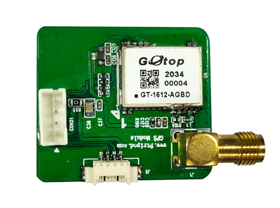
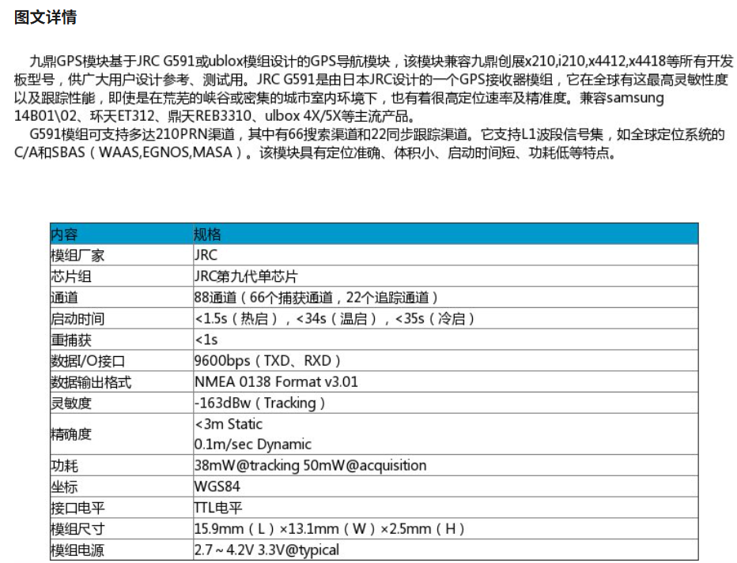
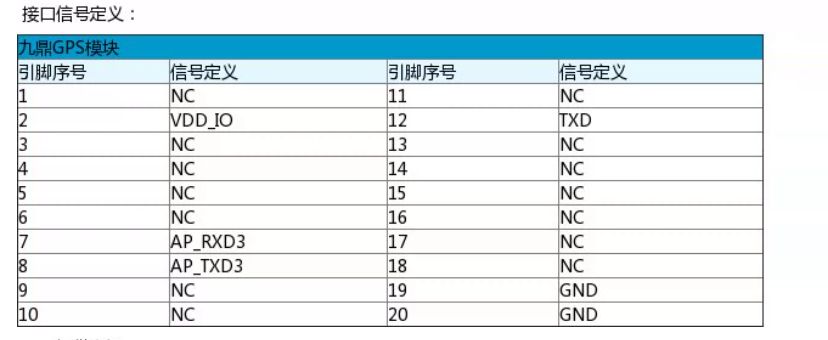

# GPS 模块

## 产品概述

九鼎 GPS 模块基于 JRC G591 或 ublox 模组设计，可用于九鼎创展 x210、i210、x4412、x4418 等开发板，供设计参考和测试使用。

资料说明中提到，JRC G591 由日本 JRC 设计，支持全球较高灵敏度的卫星定位，在宽阔峡谷、城市高楼区域等环境中仍具有较高定位速率和精度；兼容 Samsung 14B0102、环球 ET312、再天 RB310、ublox 4X/5X 等主流方案。

## 产品图片

## 主要参数

| 项目 | 参数 |
| --- | --- |
| 模组厂商 | JRC |
| 芯片组 | JRC 第九代单芯片 |
| 通道 | 88 通道（66 个捕获通道，22 个追踪通道） |
| 启动时间 | < 1.5 s（热启），< 34 s（温启），< 35 s（冷启） |
| 重捕获 | < 1 s |
| 数据 / IO 接口 | 9600 bps（TXD、RXD） |
| 数据输出格式 | NMEA 0138 Format v3.01 |
| 灵敏度 | -163 dBw（Tracking） |
| 精确度 | < 3 m Static；0.1 m/sec Dynamic |
| 功耗 | 38 mW @ tracking；50 mW @ acquisition |
| 坐标系 | WGS84 |
| 接口电平 | TTL 电平 |
| 模组尺寸 | 15.9 mm (L) × 13.1 mm (W) × 2.5 mm (H) |
| 模组电源 | 2.7 V ～ 4.2 V，3.3 V @ typical |

## 主要特性

- 支持多达 210 PRN 通道。
- 其中包含 66 个搜索通道和 22 个同步跟踪通道。
- 支持 L1 波段信号集。
- 支持 C/A 和 SBAS（WAAS、EGNOS、MASA）。
- 具有定位准确、体积小、启动时间短、功耗低等特点。

## 接口定义

| 引脚序号 | 信号定义 | 引脚序号 | 信号定义 |
| ---: | --- | ---: | --- |
| 1 | NC | 11 | NC |
| 2 | VDD_IO | 12 | TXD |
| 3 | NC | 13 | NC |
| 4 | NC | 14 | NC |
| 5 | NC | 15 | NC |
| 6 | NC | 16 | NC |
| 7 | AP_RXD3 | 17 | NC |
| 8 | AP_TXD3 | 18 | NC |
| 9 | NC | 19 | GND |
| 10 | NC | 20 | GND |

其中 AP_RXD3 / AP_TXD3 为与主控连接的串口信号，TXD 为 GPS 模块输出串口信号。

## 资料原图

### 参数说明图

### 接口定义图

