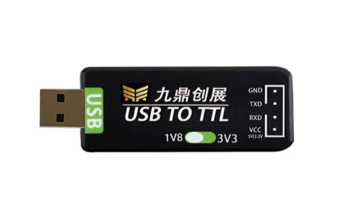

# USB TO TTL 串口调试板

## 产品概述

USB TO TTL 串口调试板是九鼎创展提供的工业级 USB 转 TTL 串口调试工具，适用于嵌入式开发调试、单片机烧录、路由器配置、PLC 调试等场景。

该产品支持 1.8V / 3.3V 双电压输出，可通过拨码开关一键切换，接口定义为标准 GND、TXD、RXD、VCC 排针接口，支持杜邦线直连。

## 产品图片

## 主要参数

| 项目 | 参数说明 |
| --- | --- |
| 产品名称 | USB TO TTL 串口调试板 |
| 品牌 | 九鼎创展 |
| 产品定位 | 工业级 USB 转 TTL 串口调试工具 |
| 核心芯片 | 高性能转换芯片 |
| 支持电压 | 1.8V / 3.3V 双电压输出，拨码开关一键切换 |
| 接口定义 | 标准 GND、TXD、RXD、VCC 排针接口，支持杜邦线直连 |
| 防护设计 | 内置 TVS 二极管 + 自恢复保险丝，防静电、防浪涌冲击 |
| 系统兼容性 | 免驱设计，完善兼容 Windows / Linux / MacOS 系统 |
| 传输性能 | 数据传输稳定无丢包，支持多种波特率自适应调节 |
| 供电规格 | 支持 USB 供电，适配多类嵌入式设备的供电需求 |
| 应用场景 | 嵌入式开发调试、单片机烧录、路由器配置、PLC 调试 |
| 外观工艺 | 工业级阻燃外壳封装，透明外壳；镀金接口，抗插拔、抗氧化 |

