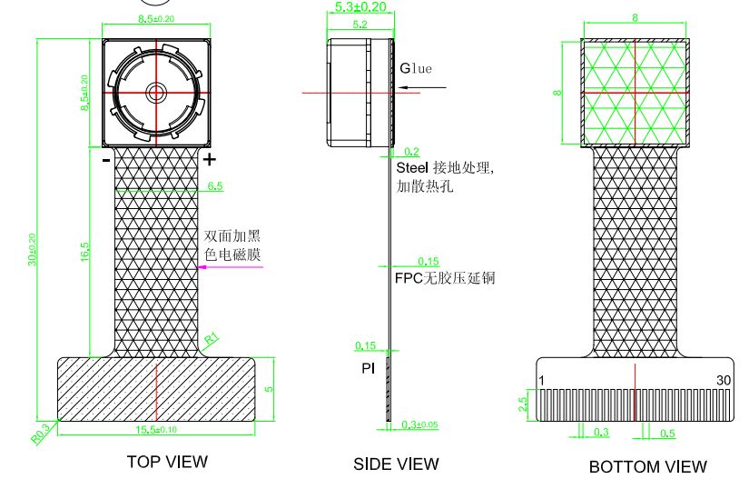

# OV5695 摄像头模组

## 产品概述

RF-OV5695-JD01 V1.0 摄像头模组采用 OmniVision OV5695 彩色 CMOS 图像传感器，提供 500 万像素图像输出。

模组图纸显示该模组使用 30PIN FPC 接口，实际连接 2 Lane MIPI 数据通道，并引出 MIPI 时钟、I2C、MCLK、PWDN 和三路传感器电源。

## 主要参数

| 项目 | 参数 |
| --- | --- |
| 模组型号 | RF-OV5695-JD01 V1.0 |
| 图像传感器 | OmniVision OV5695 |
| 传感器类型 | 彩色 CMOS，滚动快门 |
| 有效像素 | 2592 × 1944 |
| 像素数量 | 约 500 万像素 |
| 光学尺寸 | 1/4 英寸 |
| 像素尺寸 | 1.4 μm × 1.4 μm |
| 像素技术 | OmniBSI+ |
| 输出格式 | 10-bit RGB RAW |
| 数据接口 | MIPI |
| MIPI Lane | 1 Lane 或 2 Lane；当前模组接出 2 Lane |
| 控制接口 | SCCB / I2C |
| HDR | 支持 Interleave Row HDR |
| 图像功能 | 支持镜像、翻转、裁剪、窗口和 2 × Binning |
| OTP | 用户可用 16 Byte OTP |
| 图纸输出说明 | RGB Output |

## 分辨率与帧率

| 输出模式 | 分辨率 | 最大帧率 |
| --- | ---: | ---: |
| 全分辨率 | 2592 × 1944 | 30 fps |
| Quad HD | 2560 × 1440 | 具体帧率取决于寄存器配置 |
| Full HD | 1920 × 1080 | 具体帧率取决于寄存器配置 |
| HD | 1280 × 720 | 具体帧率取决于寄存器配置 |
| VGA | 640 × 480 | 具体帧率取决于寄存器配置 |

## 镜头参数

| 项目 | 参数 |
| --- | --- |
| 对焦范围 | 10 cm ～ Infinity |
| 焦距 | 3.75 mm |
| 光圈 | F2.8 |
| 对角视场角 | 70° |
| TV 畸变 | 小于 1% |

## 电气参数

| 电源 | 参数 |
| --- | --- |
| AVDD | 2.8 V，传感器允许范围 2.7 V ～ 3.0 V |
| DVDD | 1.2 V，传感器允许范围 1.14 V ～ 1.26 V |
| DOVDD | 1.8 V，传感器允许范围 1.7 V ～ 1.9 V |
| AF-VDD | 2.8 V |
| MCLK | 外部主时钟输入 |
| PWDN | 硬件掉电控制 |
| RESET | 图纸标为 NC，实际使用前应核对模组原理图 |
| SCL / SDA | I2C 控制总线 |

## 30PIN 接口定义

| PIN | 信号 | 说明 |
| ---: | --- | --- |
| 1 | GND | 地 |
| 2 | MCP | MIPI 时钟正 |
| 3 | MCN | MIPI 时钟负 |
| 4 | GND | 地 |
| 5 | MDP0 | MIPI 数据0正 |
| 6 | MDN0 | MIPI 数据0负 |
| 7 | GND | 地 |
| 8 | MDP1 | MIPI 数据1正 |
| 9 | MDN1 | MIPI 数据1负 |
| 10 | GND | 地 |
| 11 | MDP2 (NC) | 未连接 |
| 12 | MDN2 (NC) | 未连接 |
| 13 | GND | 地 |
| 14 | MDP3 (NC) | 未连接 |
| 15 | MDN3 (NC) | 未连接 |
| 16 | GND | 地 |
| 17 | NC | 未连接 |
| 18 | NC | 未连接 |
| 19 | AF-VDD 2.8 V | 对焦马达电源 |
| 20 | SCL | I2C 时钟 |
| 21 | SDA | I2C 数据 |
| 22 | MCLK | 传感器主时钟 |
| 23 | NC | 未连接 |
| 24 | PWDN | 掉电控制 |
| 25 | NC | 未连接 |
| 26 | RESET (NC) | 图纸标为未连接 |
| 27 | NC | 未连接 |
| 28 | DOVDD 1.8 V | IO 电源 |
| 29 | AVDD 2.8 V | 模拟电源 |
| 30 | DVDD 1.2 V | 核心电源 |

## 结构参数

| 项目 | 参数 |
| --- | --- |
| FPC 引脚数量 | 30PIN |
| FPC 引脚间距 | 0.3 mm |
| FPC 补强区宽度 | 15.5 ± 0.10 mm |
| FPC 补强区高度 | 5 mm |
| 模组总长度 | 30 ± 0.20 mm |
| 镜头座尺寸 | 8.5 ± 0.20 mm × 8.5 ± 0.20 mm |
| 侧视高度 | 5.3 ± 0.20 mm，主体标注 5.2 mm |
| FPC 主体宽度 | 6.5 mm |
| FPC 有效长度 | 16.5 mm |
| 背面双面胶区域 | 8 mm × 8 mm |
| 钢片厚度 | 0.2 mm |
| PI 厚度 | 0.15 mm |
| 补强区总厚度 | 0.3 ± 0.05 mm |

### 模组结构与接口图

