# 引脚定义

扩展接口定义

核心板引脚定义1

### 核心板引脚定义1

| 引脚编号 | 信号 | 说明 |
| --- | --- | --- |
| 1 | VCC_SYS | 核心板主电源输出，4.2V |
| 2 | CIF_PDN0 | GPIO3_D7，普通GPIO口 |
| 3 | PWM0 | GPIO0_D2，复用PWM0 |
| 4 | PWM1 | GPIO0_D3，复用PWM1 |
| 5 | PWM2 | GPIO0_D4，复用PWM2 |
| 6 | UART0_RTS | GPIO0_C1，复用UART0 |
| 7 | UART0_RXD | GPIO2_D3，复用UART0 |
| 8 | UART0_CTS | GPIO2_D5，复用UART0 |
| 9 | UART0_TXD | GPIO2_D2，复用UART0 |
| 10 | IR_RX | GPIO3_D2，复用红外接收口 |
| 11 | SPDIF_TX | GPIO3_D3，复用光纤输出 |
| 12 | TX_C- | HDMI差分对 |
| 13 | TX_C+ | HDMI差分对 |
| 14 | TX_0- | HDMI差分对 |
| 15 | TX_0+ | HDMI差分对 |
| 16 | TX_1- | HDMI差分对 |
| 17 | TX_1+ | HDMI差分对 |
| 18 | TX_2- | HDMI差分对 |
| 19 | TX_2+ | HDMI差分对 |
| 20 | VDAC_OUTP | 数模转换输出 |
| 21 | OTG_ID | OTG ID脚 |
| 22 | OTG_DET | OTG检测脚 |
| 23 | HOST_DP | HOST差分对 |
| 24 | HOST_DM | HOST差分对 |
| 25 | OTG_DP | OTG差分对 |
| 26 | OTG_DM | OTG差分对 |
| 27 | SDMMC_DET | SDMMC0引脚对 |
| 28 | SDMMC_CMD | SDMMC0引脚对 |
| 29 | SDMMC_D0 | SDMMC0引脚对 |
| 30 | SDMMC_D1 | SDMMC0引脚对 |
| 31 | SDMMC_D2 | SDMMC0引脚对 |
| 32 | SDMMC_D3 | SDMMC0引脚对 |
| 33 | SDMMC_CLK | SDMMC0引脚对 |
| 34 | I2C3_SDA | GPIO0_A7，复用I2C3_SDA |
| 35 | I2C3_SCL | GPIO0_A6，复用I2C3_SCL |
| 36 | VCC_IO | 3.3V DC-DC输出 |

核心板引脚定义2

### 核心板引脚定义2

| 引脚编号 | 信号 | 说明 |
| --- | --- | --- |
| 37 | VCC_IO | 3.3V DC-DC输出 |
| 38 | HDMI_HPD | GPIO0_B7，复用HDMI |
| 39 | HDMI_CEC | GPIO0_C4，复用HDMI1 |
| 40 | UART1_TX | GPIO1_B1，复用UART1 |
| 41 | UART1_RX | GPIO1_B2，复用UART1 |
| 42 | UART1_RTS | GPIO1_B3，复用UART1 |
| 43 | SPI_CLK | GPIO0_B1，复用SPI |
| 44 | SPI_CSn0 | GPIO0_B6，复用SPI |
| 45 | SPI_TXD | GPIO0_B3，复用SPI |
| 46 | SPI_RXD | GPIO0_B5，复用SPI |
| 47 | SPI_CSn1 | GPIO1_B4，复用SPI |
| 48 | SDMMC1_CLK | SDMMC1数据对 |
| 49 | SDMMC1_D3 | SDMMC1数据对 |
| 50 | SDMMC1_D2 | SDMMC1数据对 |
| 51 | SDMMC1_D1 | SDMMC1数据对 |
| 52 | SDMMC1_D0 | SDMMC1数据对 |
| 53 | SDMMC_PWR | SDMMC1数据对 |
| 54 | I2C1_SDA/SDMMC1_CMD | SDMMC1数据对，复用I2C1 |
| 55 | I2C1_SCL | GPIO0_A2，复用I2C1 |
| 56 | I2C0_SCL | GPIO0_A0，复用I2C0 |
| 57 | I2C0_SDA | GPIO0_A1，复用I2C0 |
| 58 | GSENSOR_INT | GPIO0_B4，复用I2S接口 |
| 59 | TP_INT | GPIO1_B0，复用UART1 |
| 60 | SPK_CTL | GPIO0_D6，普通GPIO |
| 61 | TP_RST | GPIO0_D1，利用UART2 |
| 62 | HP_CTL | GPIO3_C4，普通GPIO |
| 63 | LCD_RST | GPIO0_D0，复用UART2 |
| 64 | GPIO3_C7 | GPIO3_C7，普通GPIO |
| 65 | GPIO1_C7 | GPIO1_C7，普通GPIO |
| 66 | GPIO2_A2 | GPIO2_A2，普通GPIO |
| 67 | GPIO1_A7 | GPIO1_A7，普通GPIO |
| 68 | GPIO2_A0 | GPIO2_A0，复用SPI |
| 69 | GPIO2_A1 | GPIO2_A1，普通GPIO |
| 70 | GPIO0_C7 | GPIO0_C7，普通GPIO |
| 71 | GPIO2_A6 | GPIO2_A6，普通GPIO |
| 72 | GND | GND |

核心板引脚定义3

### 核心板引脚定义3

| 引脚编号 | 信号 | 说明 |
| --- | --- | --- |
| 73 | GND | 大地 |
| 74 | GPIO2_A4 | GPIO2_A4，普通GPIO |
| 75 | GPIO3_C6 | GPIO3_C6，普通GPIO |
| 76 | GPIO2_A3 | GPIO2_A3，普通GPIO |
| 77 | GPIO1_A3 | GPIO1_A3，复用I2S |
| 78 | GPIO3_C5 | GPIO3_C5，普通GPIO |
| 79 | CODEC_AOL | 音频输出 |
| 80 | CODEC_AOR | 音频输出 |
| 81 | MICBIAS | MIC偏置 |
| 82 | MICIN-P | 音频输入 |
| 83 | MICIN-N | 音频输入 |
| 84 | HP_DET | 耳机检测脚 |
| 85 | LCD_D23 | GPIO2_D1，复用LCD，MAC |
| 86 | LCD_D22 | GPIO2_D0，复用LCD，MAC |
| 87 | LCD_D21 | GPIO2_C7，复用LCD，MAC |
| 88 | LCD_D20 | GPIO2_C6，复用LCD，MAC |
| 89 | I2C2_SCL_LCD_19 | GPIO2_C5，复用LCD，MAC，I2C2 |
| 90 | I2C2_SDA_LCD_18 | GPIO2_C4，复用LCD，MAC，I2C2 |
| 91 | LCD_D17 | GPIO2_C3，复用LCD，MAC |
| 92 | LCD_D16 | GPIO2_C2，复用LCD，MAC |
| 93 | LCD_D15 | GPIO2_C1，复用LCD，MAC |
| 94 | LCD_D14 | GPIO2_C0，复用LCD，MAC |
| 95 | LCD_D13 | GPIO2_B7，复用LCD，MAC |
| 96 | LCD_D12 | GPIO2_B6，复用LCD，MAC |
| 97 | LCD_D11 | GPIO2_B5，复用LCD，MAC |
| 98 | LCD_D10 | GPIO2_B4，复用LCD，MAC |
| 99 | LCD_D9 | 复用RGB，LVDS，MIPI口，不能作为独立的GPIO |
| 100 | LCD_D8 | 复用RGB，LVDS，MIPI口，不能作为独立的GPIO |
| 101 | LCD_D7 | 复用RGB，LVDS，MIPI口，不能作为独立的GPIO |
| 102 | LCD_D6 | 复用RGB，LVDS，MIPI口，不能作为独立的GPIO |
| 103 | LCD_D5 | 复用RGB，LVDS，MIPI口，不能作为独立的GPIO |
| 104 | LCD_D4 | 复用RGB，LVDS，MIPI口，不能作为独立的GPIO |
| 105 | LCD_D3 | 复用RGB，LVDS，MIPI口，不能作为独立的GPIO |
| 106 | LCD_D2 | 复用RGB，LVDS，MIPI口，不能作为独立的GPIO |
| 107 | LCD_D1 | 复用RGB，LVDS，MIPI口，不能作为独立的GPIO |
| 108 | LCD_D0 | 复用RGB，LVDS，MIPI口，不能作为独立的GPIO |

核心板引脚定义4

### 核心板引脚定义4

| 引脚编号 | 信号 | 说明 |
| --- | --- | --- |
| 109 | GND | 大地 |
| 110 | GND | 大地 |
| 111 | LCD_HSYNC | GPIO2_B1，复用LCD |
| 112 | LCD_VSYNC | GPIO2_B2，复用LCD |
| 113 | LCD_CLK | GPIO2_B0，复用LCD |
| 114 | LCD_DEN | GPIO2_B3，复用LCD |
| 115 | VCC_RK816IN | 核心板电源输入，4.8到5.5V |
| 116 | VCC_RK816IN | 核心板电源输入，4.8到5.5V |
| 117 | VCC_RK816IN | 核心板电源输入，4.8到5.5V |
| 118 | PWRON | PMU上电管脚，低电平有效 |
| 119 | VCC_RTC | RTC供电管脚，3V输入 |
| 120 | BAT_P | 电池输入管脚 |
| 121 | BAT_N | 电池输入管脚 |
| 122 | RTC_CLKOUT | 32768Hz时钟输出 |
| 123 | VCC28_CIF | PMU LDO1输出，电压可调 |
| 124 | VCC18_CIF | PMU LDO2输出，电压可调 |
| 125 | VCC_TP | PMU LDO6输出，电压可调 |
| 126 | VCCA_CODEC | PMU LDO5输出，电压可调 |
| 127 | RESET | CPU复位脚，低电平有效 |
| 128 | ADCIN2 | ADC输入管脚，3.3V基准源 |
| 129 | ADCIN1 | ADC输入管脚，3.3V基准源 |
| 130 | ADCIN0 | ADC输入管脚，3.3V基准源 |
| 131 | CIF_CLKOUT | BT656/BT601摄像头数据对，无法当作普通GPIO使用 |
| 132 | CIF_CLKIN | BT656/BT601摄像头数据对，无法当作普通GPIO使用 |
| 133 | CIF_HREF | BT656/BT601摄像头数据对，无法当作普通GPIO使用 |
| 134 | CIF_VSYNC | BT656/BT601摄像头数据对，无法当作普通GPIO使用 |
| 135 | CIF_D7 | BT656/BT601摄像头数据对，无法当作普通GPIO使用 |
| 136 | CIF_D6 | BT656/BT601摄像头数据对，无法当作普通GPIO使用 |
| 137 | CIF_D5 / | BT656/BT601摄像头数据对，无法当作普通GPIO使用 |
| 138 | CIF_D4 | BT656/BT601摄像头数据对，无法当作普通GPIO使用 |
| 139 | CIF_D3 | BT656/BT601摄像头数据对，无法当作普通GPIO使用 |
| 140 | CIF_D2 | BT656/BT601摄像头数据对，无法当作普通GPIO使用 |
| 141 | CIF_D1 | BT656/BT601摄像头数据对，无法当作普通GPIO使用 |
| 142 | CIF_D0 | BT656/BT601摄像头数据对，无法当作普通GPIO使用 |
| 143 | CIF_PDN1 | GPIO3_D7，普通GPIO |
| 144 | VCC_SYS | 核心板主电源输出 |

硬件接口

电源开关和插座

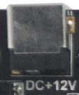

x3128bv2采用12V直流电源供电，图中黑色插座为12V直流电源输入插座。

调试串口

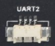

x3128预留一个串口UART2作为调试，以及2个普通串口分别为UART0和UART1。注意，默认使用UART2作为调试串口，需要配合串口小板将电平转化为RS232电平后使用。

HDMI接口

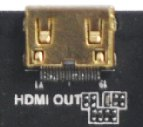

x3128开发板采用miniHDMI接口，配合miniHDMI的延长线，可以将音视频信号完美的呈现在支持HDMI2.0协议的监控终端，如电视机，显示器等。注意，由于RK3128为低成本方案的芯片，HDMI不能和液晶屏同时使用。

camera接口

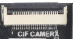

该接口为通用的24PIN摄像头接口，支持OV全系列摄像头，省去camera转接板。针对不同型号的摄像头，只需按照摄像头的规格，调整一下输出电压就行了。

以太网接口

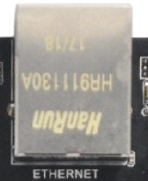

x3128支持千兆有线以太网接口，板载RTL8211E，用户可以通过有线以太网上网，体验极速网络。

耳机接口

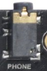

将耳机接入该接口，可以实现耳机输出。当然也可以直接通过该接口送到功放输入，如家庭影院的音频输入口，实现将开发板的音源信号通过家庭影院展现出来。注意该接口需要接3线的耳机，如果耳机带MIC，输出的音频将会严重失真。

喇叭接口

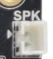

开发板直接支持扬声器输出，将喇叭接到上图接口，可实现扬声器输出。

录音接口

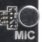

开发板支持录音输入。耳麦已经直接载载到开发板上，无须通过外置的耳麦输入了。

TF卡槽

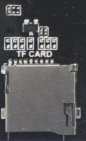

x3128引出一个外置TF卡，可以通过该通道存放一些数据文件。

独立按键

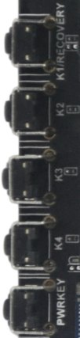

X3128除了复位和电源开关外，还有四个独立的按键，在原理图中，对应关系如下：

| 开关 | 功能 |
| --- | --- |
| Recovery/K1 | 独立按键/recovery键 |
| K2 | 独立按键 |
| K3 | 独立按键 |
| K4 | 独立按键 |

USB OTG接口

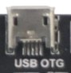

该接口用于程序烧写，同步等。它还能通过OTG线实现HOST的功能。

USB HOST接口

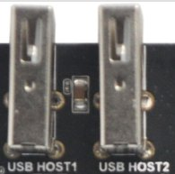

RK3128为了节省成本，仅自带1路USB HOST接口。x3128开发板通过HUB芯片扩展出了四路HOST接口，其中两路用于连接USB WIFI/蓝牙和PCIE接口，另两路通过标准的USB接口引出。

开机按钮

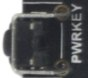

接上外部电源适配器后，开发板会自动开机。进入android系统后，轻触POWER键休眠，再次按POWER键实现唤醒。长按POWER键实现出现关机界面，按照屏幕提示关机。

复位按钮

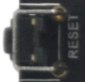

在系统运行时，轻按RESET键开发板重启，实现硬复位的功能。

Recovery按钮

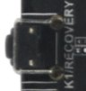

刷机时需要按下该键进入recovery模式。

LCD接口

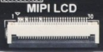

x3128开发板默认留有一个30PIN的LCD接口，通过软排线将LCD数据信号连接到LCD控制板上，进而控制LCD。同时，这个30PIN接口含有一个PWM脚，用于控制LCD的背光，通过PWM实现多级背光亮度调节。VGA、 LVDS、MIPI接口都通过该接口实现。

后备电池

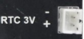

后备电池用于保证断电后RTC仍然能够工作，确保系统时间不丢失。

蜂鸣器

该蜂鸣器为有源蜂鸣器，有直流电时会鸣叫，通过三极管控制电源的导通与截止。

红外一体化接收头

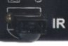

这里采用HS0038B一体化接收头，它具有灵敏度高，使用方便等优点。利用它我们可以实现无线遥控，将x3128开发板作为一个高性能的四核机顶盒。

PCIE接口

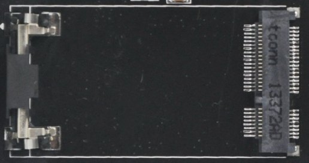

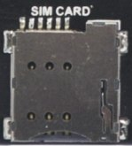

在x3128开发板上已经板载有PCIE接口，安装3G/4G卡后可实现移动上网。
