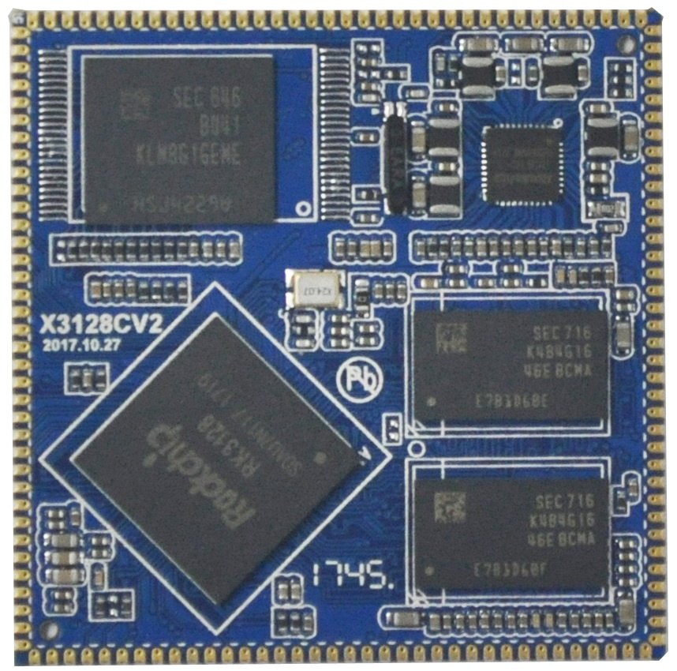
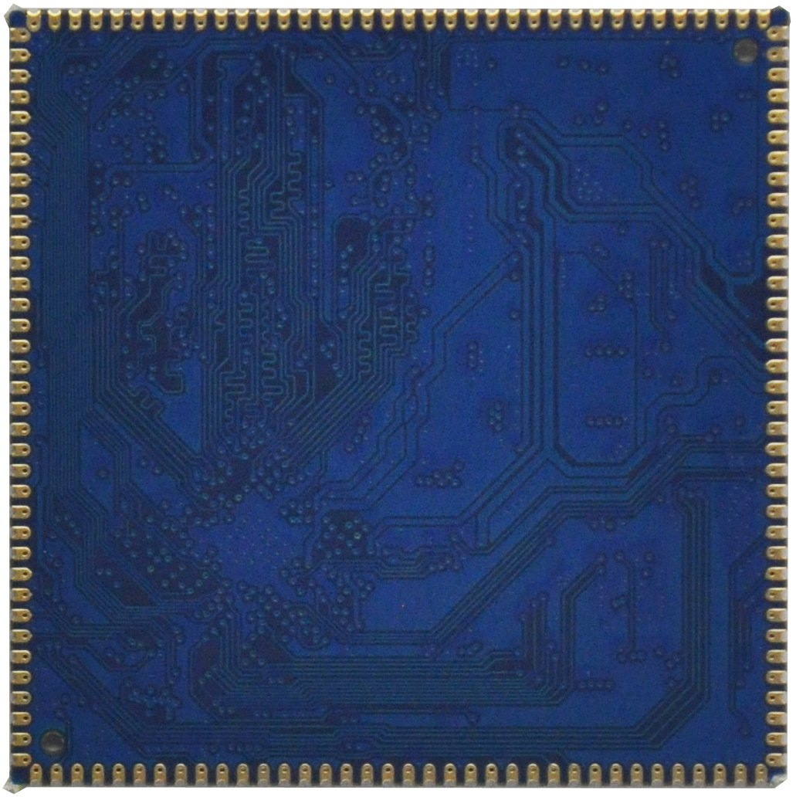
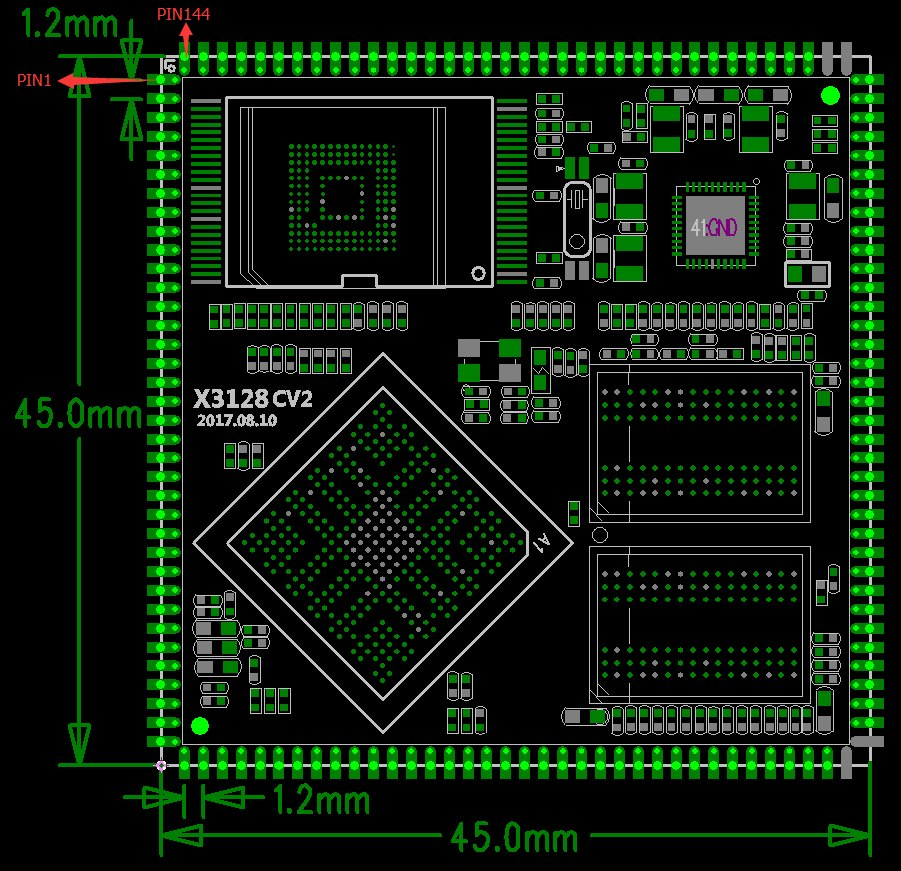
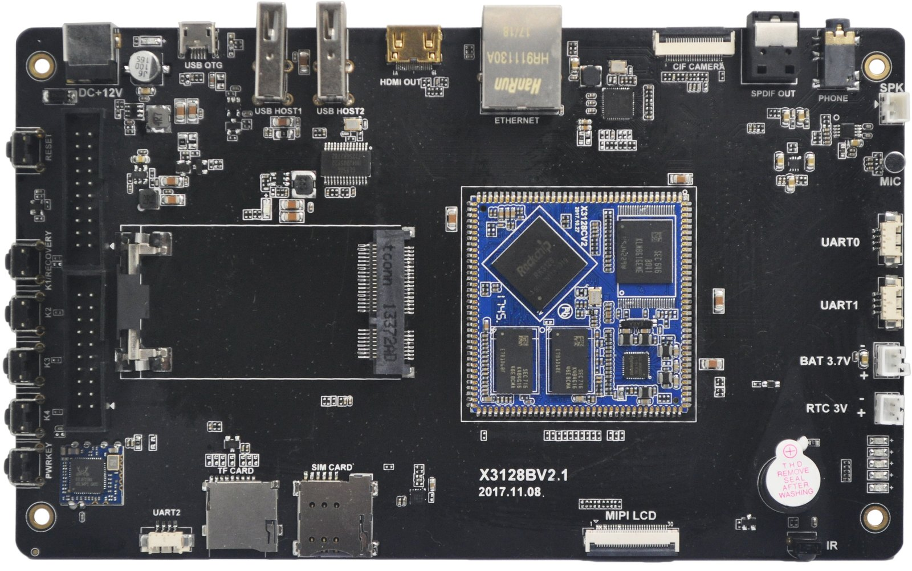
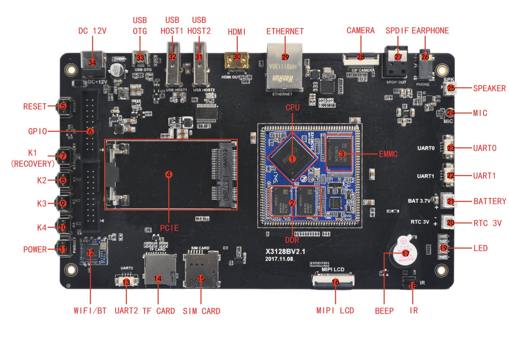

# 尺寸与结构

核心板外观

核心板正面图

核心板背面图

核心板结构图

核心板结构尺寸及管脚排列：

### 结构参数

| 项目 | 参数 |
| --- | --- |
| 外观 | 邮票孔方式 |
| 核心板尺寸 | 45mm*45mm*3mm |
| 引脚间距 | 1.2mm |
| 引脚焊盘尺寸 | 1.8mm*0.7mm |
| 引脚数量 | 144PIN |
| 板层 | 6层 |

底板外观

产品功能特性

内核：ARM Cortex-A7四核；

主频：1.3GHz*4；

内存：1GB DDR3，可兼容256M/512M/2GB DDR3；

Flash：支持4GB/8GB/16GB emmc可选，标配8GB emmc，兼容nand flash；

LVDS/MIPI接口，核心板可支持24位RGB接口；

2路USB HOST接口；

USB OTG接口；

2路TTL串口；

1路TF卡接口（复用调试串口UART2）；

复位按钮；

软件开关机按钮；

四路独立按键；

支持外接扬声器；

MIC输入；

耳机输出接口；

支持SPDIF光纤音频输出；

支持背光无级调节；

支持HDMI接口（HDMI和LCD二选一，不能同时显示）；

支持5点电容触摸；

板载RT8723 WIFI/BT模块；

支持G-sensor；

支持多种SPI，I2C，UART，PWM等外围器件扩展；

支持MPEG4，H.263，H.264，MJPEG视频编码；

支持几乎全格式视频解码；

支持2D，3D高性能图形加速；

支持RTC时钟实时保存；

支持千兆有线以太网RTL8211E；

支持BT656/BT601摄像头接口；

支持GPS接口；

支持GPRS接口；

支持PCIE接口3G、4G模块；

支持USB鼠标，键盘；

支持红外一体化接收头；

软件资源

x3128开发板支持android6.0操作系统，linux系统即将支持，详细的驱动支持列表如下：

### x3128开发板驱动支持列表

| system / driver | linux3.10+ / android6.0 | linux3.10+ / QT |
| --- | --- | --- |
| 7寸MIPI LCD(1024*600) | ● | ● |
| PMIC驱动(RK816) | ● | ● |
| 电容触摸 | ● | ● |
| EMMC驱动 | ● | ● |
| SD卡驱动 | ● | ● |
| 独立按键 | ● | ● |
| Gsensor | ● | no need |
| 蜂鸣器驱动 | ● | ● |
| 红外遥控 | ● | ● |
| 开关机 | ● | ● |
| 休眠唤醒 | ● | no need |
| 2路USB HOST驱动 | ● | ● |
| 1路USB OTG驱动 | ● | ● |
| 音频 | ● | coming soon |
| 录音 | ● | coming soon |
| USB WIFI/BT4.0（RT8723BU） | ● | coming soon |
| 并口摄像头驱动 | ● | coming soon |
| USB口摄像头驱动 | ● | ● |
| 串口 | ● | ● |
| HDMI | ● | coming soon |
| 3G模块(3G dongle) | ● | no need |
| 3G模块(PCIE接口) | ● | no need |
| GPS模块 | ● | ● |
| 千兆以太网 | ● | ● |
| USB鼠标键盘 | ● | ● |

硬件资源

硬件接口描述

### 硬件接口介绍

| 标号 | 名称 | 说明 |
| --- | --- | --- |
| 【1】 | CPU | RK3128，ARM Cortex A7,4*1.3GHz |
| 【2】 | DDR3 | H5TQ4G63AFR，DDR3，1GBytes |
| 【3】 | eMMC | THGBMBG6D1KBAIL，8GB MLC EMMC |
| 【4】 | PCIE接口 | 3G、4G通信模块接口 |
| 【5】 | RESET | 复位按键 |
| 【6】 | GPIO | GPIO扩展口 |
| 【7】 | 独立按键 | Recovery刷机键，按键K1 |
| 【8】 | 独立按键 | 按键K2 |
| 【9】 | 独立按键 | 按键K3 |
| 【10】 | 独立按键 | 按键K4 |
| 【11】 | POWER | 电源按键 |
| 【12】 | WIFI/BT | RT8723BU WIFI/BT二合一模块 |
| 【13】 | UART2 | 串口2，TTL电平，默认调试串口 |
| 【14】 | TF卡 | TF卡座 |
| 【15】 | SIM卡座 | 3G、4G通信模块手机卡接口 |
| 【16】 | MIPI/LVDS接口 | 接MIPI或LVDS接口的屏 |
| 【17】 | 蜂鸣器 | 直流蜂鸣器 |
| 【18】 | 红外接收头 | HS0038红外一体化接收头 |
| 【19】 | LED | 四路独立LED口 |
| 【20】 | RTC电池插座 | RTC电池座，3V |
| 【21】 | 锂电池接口 | 3.7V锂电池接口 |
| 【22】 | UART1 | 串口1，TTL电平 |
| 【23】 | UART0 | 串口0，TTL电平 |
| 【24】 | 麦克风 | 麦克风输入 |
| 【25】 | 喇叭接口 | 外置扬声器接口 |
| 【26】 | 耳机座 | 耳机输出，需接标准3线耳机 |
| 【27】 | SPDIF | 光纤音频输出 |
| 【28】 | 摄像头接口 | 标准 24PIN 摄像头接口 |
| 【29】 | 千兆网口 | RT8211E 接口 |
| 【30】 | HDMI | HDMI输出接口 |
| 【31】 | USB HOST | HUB芯片扩展，HOST |
| 【32】 | USB HOST | HUB芯片扩展，HOST |
| 【33】 | USB OTG | USB OTG接口 |
| 【34】 | DC座 | 12V DC电源输入 |
