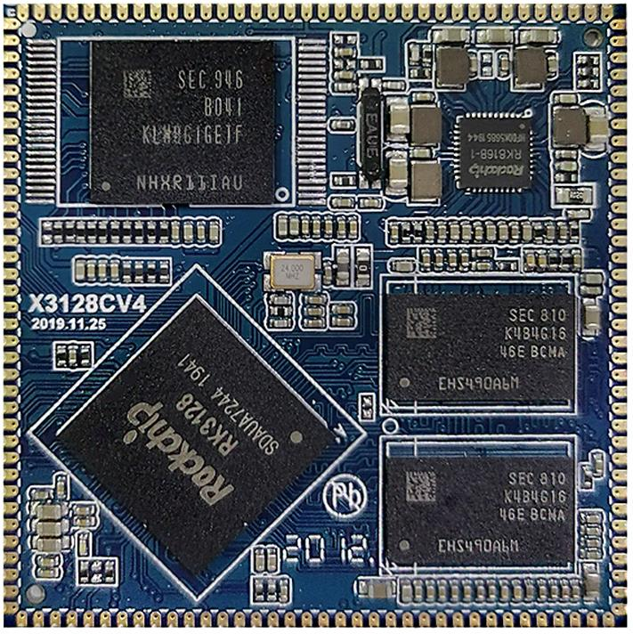
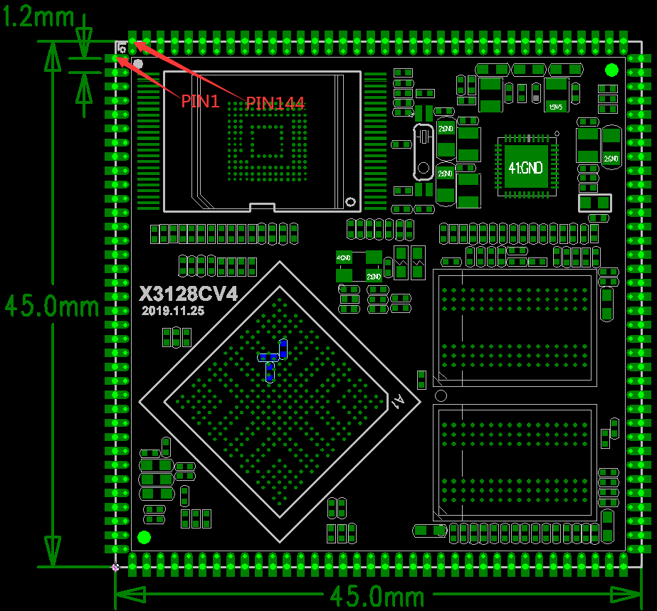

# 产品介绍

## 产品简介

X3128CV4 是基于瑞芯微RK3128 的一款高性价比核心板，它由深圳市九鼎创展科技有限公司自主研发，生产并销售。它是一款低成本A7 四核，主频1.3GB 的高性价比核心板。RK3128 集成Mali-400 MP2 图形处理器，支持OpenGL ES1.1/2.0，内嵌高性能2D 硬件加速，并能实现1080P 的H.265 视频硬解码和H.264 视频编码，安兔兔跑分超过14000 分，拥有不俗的性能，而其极低的成本，凸显其超高的性价比。X3128CV4 核心板广泛应用于人机交互，智能控制系统，便携手持投影仪，机顶盒，医疗，车载，POS 等领域，尤其适合于对成本敏感，性能又有较高要求的应用场景。

## 核心板特性

- 最佳尺寸，即保证精悍的体积又保证足够的GPIO 口，仅45mm*45mm
- 使用瑞芯微的RK816 作为电源管理设计，成本低廉，性能可靠
- 支持多种品牌，多种容量的emmc，默认使用东芝8GB emmc，可兼容nand flash
- 使用单通道DDR3 设计，默认支持1GB 容量，可定制2GB，512MB 容量
- 支持电源休眠唤醒
- 支持android6.0，linux 操作系统
- 支持千兆有线以太网
- 产品稳定可靠，拷机7 天7 夜不死机

## 外观与结构

## 特性参数

### 系统配置

| CPU | RK3128 |
|---|---|
| 主频 | A7四核1.3GHz |
| 内存 | 标配1GB，可定制2GB及512MB |
| 存储器 | 标配8GB EMMC，可选配nand flash |
| 电源IC | 使用RK816，支持动态调频 |

### 接口参数

| LCD接口 | TTL、LVDS、MIPI接口三选一 |
|---|---|
| Touch接口 | 电容触摸，可使用USB或串口扩展电阻触摸 |
| 音频接口 | AC97/IIS接口，支持录放音 |
| SD卡接口 | 2路SDIO输出通道 |
| emmc接口 | 板载emmc接口，管脚不另外引出 |
| 以太网接口 | 支持千兆以太网 |
| USB HOST接口 | 1路HOST2.0 |
| USB OTG接口 | 1路OTG2.0 |
| UART接口 | 3路串口，2路带流控，1路用于DEBUG |
| PWM接口 | 3路PWM输出 |
| IIC接口 | 4路IIC输出 |
| SPI接口 | 1路SPI输出 |
| ADC接口 | 3路ADC输入 |
| Camera接口 | 1路BT656/BT601 |
| HDMI接口 | 高清音视频输出接口，LCD和HDMI二选一 |
| 启动配置接口 | 无需启动配置，核心板自动适配 |

### 电气特性

| 输入电压 | 4.8~5.5V(推荐使用5V输入) |
|---|---|
| 输出电压 | 3.3V/4.2V(可用于底板供电及电池充电) |
| 工作温度 | -10~70度 |
| 储存温度 | -10~80度 |

### 结构参数

| 外观 | 邮票孔方式 |
|---|---|
| 核心板尺寸 | 45mm*45mm*3mm |
| 引脚间距 | 1.2mm |
| 引脚焊盘尺寸 | 1.8mm*0.7mm |
| 引脚数量 | 144PIN |
| 板层 | 6层 |

### x3128开发板驱动支持列表

| 驱动 | linux3.10+ android6.0 | linux3.10+ QT |
|---|---|---|
| 7寸MIPI LCD(1024*600) | ● | ● |
| PMIC驱动(RK816) | ● | ● |
| 电容触摸 | ● | ● |
| EMMC驱动 | ● | ● |
| SD卡驱动 | ● | ● |
| 独立按键 | ● | ● |
| Gsensor | ● | no need |
| 蜂鸣器驱动 | ● | ● |
| 红外遥控 | ● | ● |
| 开关机 | ● | ● |
| 休眠唤醒 | ● | no need |
| 2路USB HOST驱动 | ● | ● |
| 1路USB OTG驱动 | ● | ● |
| 音频 | ● | ● |
| 录音 | ● | no need |
| USB WIFI/BT4.0（RT8723BU） | ● | ● |
| 并口摄相头驱动 | ● | no need |
| USB口摄相头驱动 | ● | ● |
| 串口 | ● | ● |
| HDMI | ● | no need |
| 3G模块(3G dongle) | ● | no need |
| 3G模块(PCIE接口) | ● | no need |
| GPS模块 | ● | ● |
| 千兆以太网 | ● | ● |
| USB鼠标键盘 | ● | ● |

## 相关章节

- [引脚定义](./x3128cv4-pin-definition)
- [硬件设计](./x3128cv4-hardware-design)
