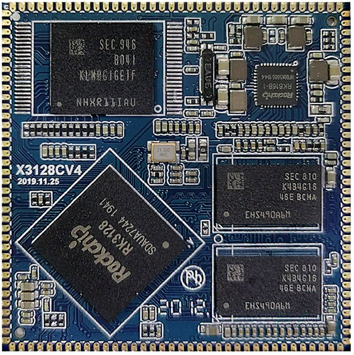
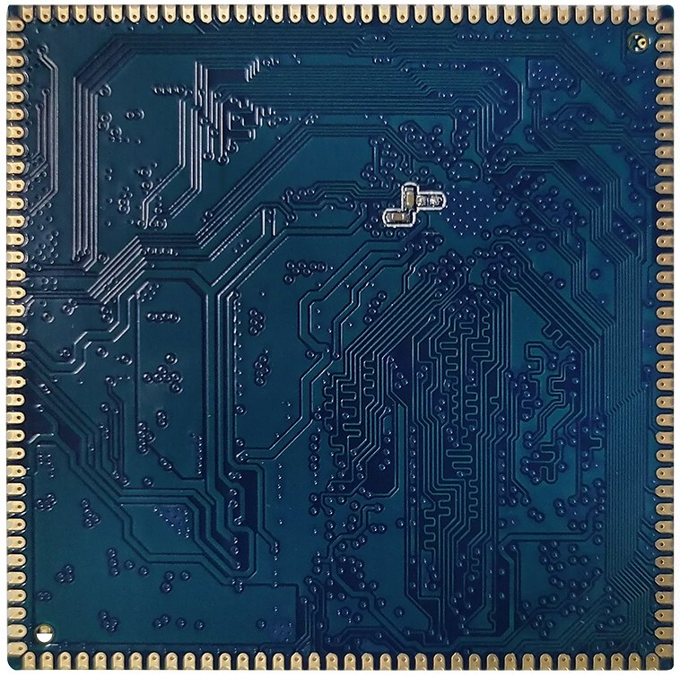
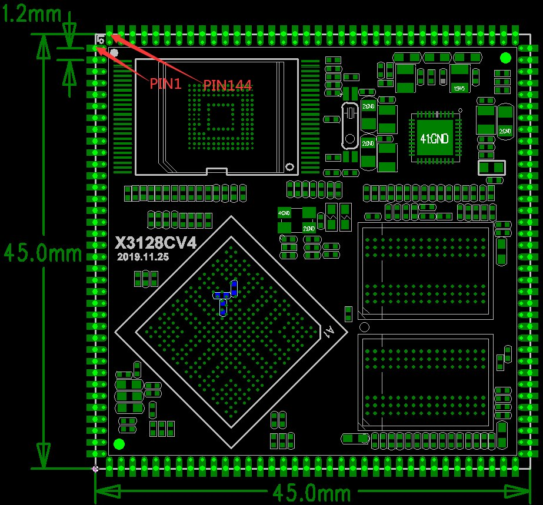
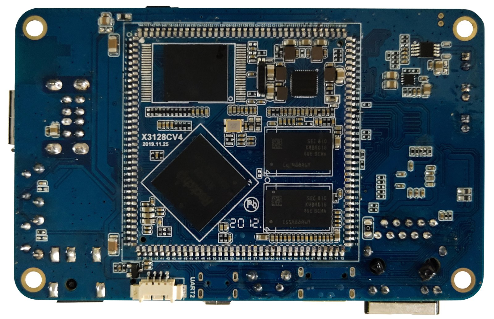
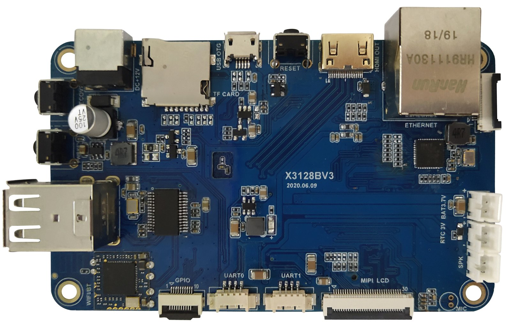

# 尺寸与结构

核心板外观

核心板正面图

核心板背面图

核心板结构图

核心板结构尺寸及管脚排列：

### 结构参数

| 项目 | 参数 |
| --- | --- |
| 外观 | 邮票孔方式 |
| 核心板尺寸 | 45mm*45mm*3mm |
| 引脚间距 | 1.2mm |
| 引脚焊盘尺寸 | 1.8mm*0.7mm |
| 引脚数量 | 144PIN |
| 板层 | 6层 |

底板外观

软件资源

x3128开发板支持android6.0以及linux系统，详细的驱动支持列表如下：

### x3128开发板驱动支持列表

| system / driver | linux3.10+ / android6.0 | linux3.10+ / QT |
| --- | --- | --- |
| 7寸MIPI LCD(1024*600) | ● | ● |
| PMIC驱动(RK816) | ● | ● |
| 电容触摸 | ● | ● |
| EMMC驱动 | ● | ● |
| SD卡驱动 | ● | ● |
| 独立按键 | ● | ● |
| Gsensor | ● | no need |
| 蜂鸣器驱动 | ● | ● |
| 红外遥控 | ● | ● |
| 开关机 | ● | ● |
| 休眠唤醒 | ● | no need |
| 2路USB HOST驱动 | ● | ● |
| 1路USB OTG驱动 | ● | ● |
| 音频 | ● | ● |
| 录音 | ● | no need |
| USB WIFI/BT4.0（RT8723BU） | ● | ● |
| 并口摄像头驱动 | ● | no need |
| USB口摄像头驱动 | ● | ● |
| 串口 | ● | ● |
| HDMI | ● | no need |
| 3G模块(3G dongle) | ● | no need |
| 3G模块(PCIE接口) | ● | no need |
| GPS模块 | ● | ● |
| 千兆以太网 | ● | ● |
| USB鼠标键盘 | ● | ● |

硬件资源
