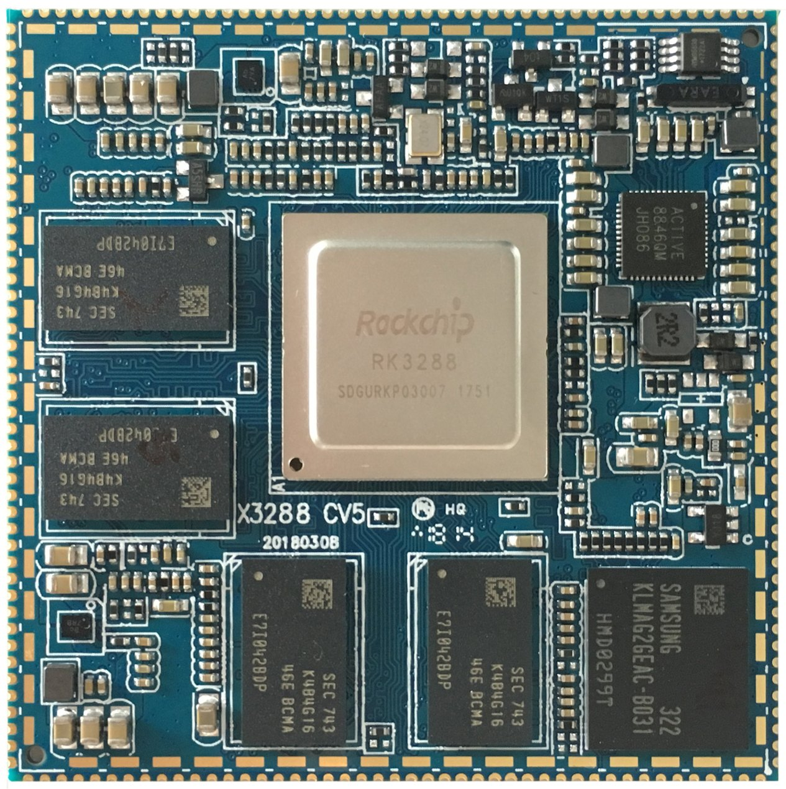
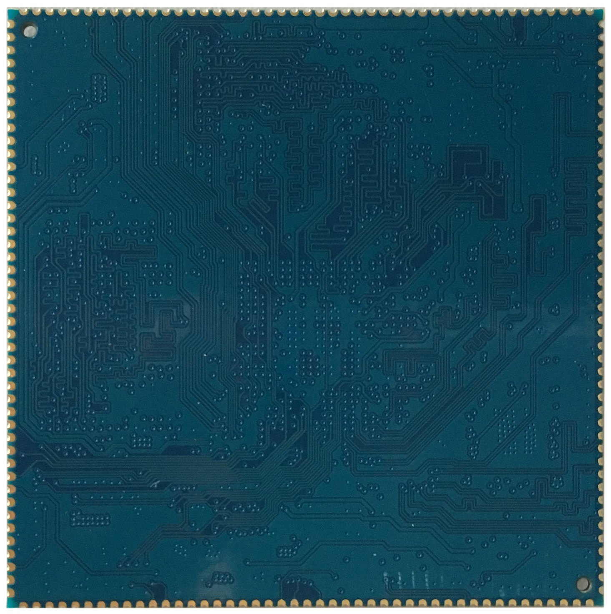
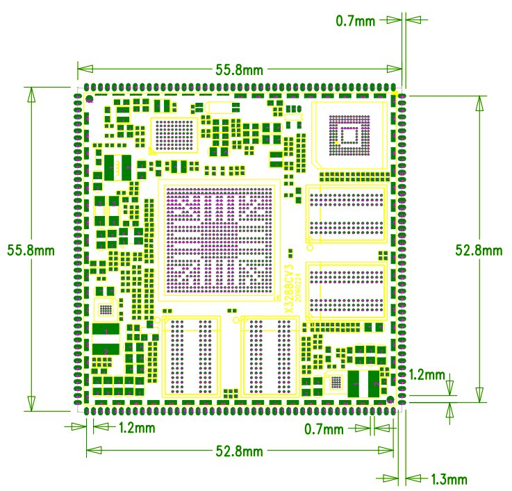
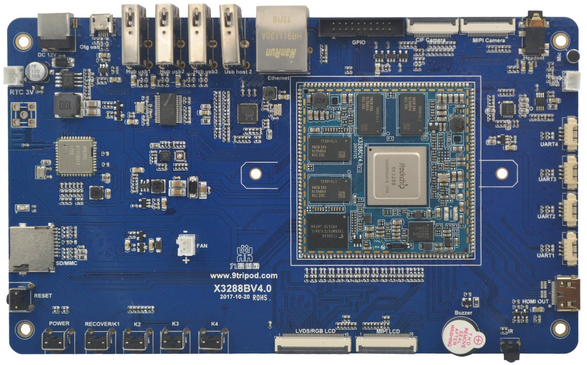

# 尺寸与结构

核心板外观

核心板正面图

核心板背面图

核心板结构图

核心板结构尺寸及管脚排列：

### 结构参数

| 项目 | 参数 |
| --- | --- |
| 外观 | 邮票孔方式 |
| 核心板尺寸 | 55.8mm*55.8mm*3mm |
| 引脚间距 | 1.2mm |
| 引脚焊盘尺寸 | 1.8mm*0.7mm |
| 引脚数量 | 180PIN |
| 板层 | 8层 |

底板外观

详细参数请参考x3288开发板相关文档。

