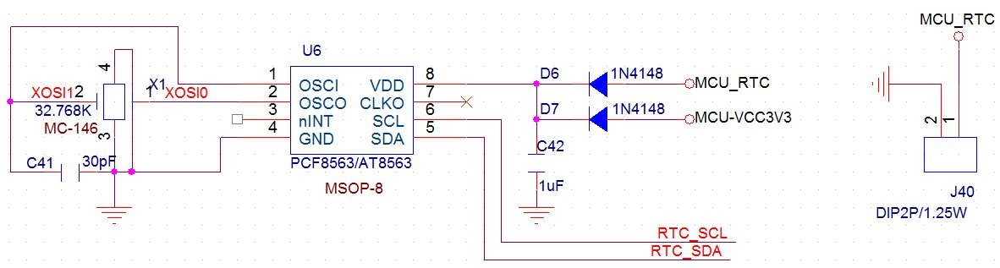
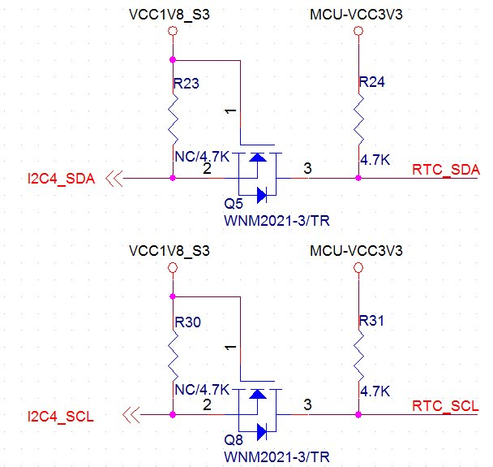

# 硬件设计

硬件设计

电源设计

X3399CV3、X3399CV4、X3399CV5核心板在底板硬件设计上没有任何区别，采用3.3V供电的方式，用户需要给第51、52管脚供3.3V/4.3A的直流电，给第42脚供3.3V/300mA的直流电，给第37脚的RTC管脚供2.5到3V的电，核心板即可以正常工作。注意，第51、52脚的3.3V供电和第42脚的3.3V供电不能合并，否则会出现关机状态未知的现象。详细的电源管脚定义如下：

37脚：核心板RTC供电端，默认输入2.5到3V/5uA；

42脚：3.3V/300mA电源输入接口，42脚在任何情况下，3.3V都需要常供电，以保证核心板上的PMU永远处于工作或是待命状态；

51、52脚：3.3V/4.3A电源输入接口，这两个管脚只有在开机时才需要3.3V输入，当关机后，3.3V电压为0；

53、84、182脚：核心板公共地；

120脚：1.8V/1.5A电源输出，它可以用于给底板上1.8V的外设供电，在休眠、关机后电压为0；

USB设计

RK3288有两路HOST口和两路TYPEC口，其中一路TPYEC接口核心板通过USB3.0接口引出，另一路通过TYPEC接口引出。其中TYPEC口即可作HOST口也可作DEVICE用，它除了具备标准的OTG口外，还能驱动VGA、HDMI、DP屏。USB3.0接口用于连接普通的HOST3.0外设。

默认USB2.0接口能达到480Mbps的速度，而USB3.0最快能达到5Gbps的带宽，比USB2.0要快10倍，因此，对PCB走线的要求更高。以下为USB接口的差分对，在PCB走线时，务必走等长差分线，阻抗匹配为90欧，而且需要有完整的参考平面。

| 差分管脚编号 | 差分管脚名称 |
| --- | --- |
| 114、115 | USB3_DM、USB3_DP |
| 116、117 | HOST0_DM、HOST0_DP |
| 118、119 | HOST1_DM、HOST1_DP |
| 109、110 | USB3_SSRXP、USB3_SSRXN |
| 107、108 | USB3_SSTXP、USB3_SSTXN |
| 105、106 | TYPEC0_DM、TYPEC0_DP |
| 103、104 | TYPEC0_TX2P、TYPEC0_TX2N |
| 101、102 | TYPEC0_RX2N、TYPEC0_RX2P |
| 99、100 | TYPEC0_TX1P、TYPEC0_TX1N |
| 97、98 | TYPEC0_RX1N、TYPEC0_RX1P |

HDMI设计

RK3399芯片自带HDMI控制器，支持HDMI2.0协议。核心板上第85到92共8个管脚，4对差分线，必须走等长差分线，且阻抗匹配为100欧，否则会出现HDMI画面丢色，断断续续等问题。

EDP设计

RK3399芯片自带EDP接口的LCD控制器，EDP为差分信号线，适合驱动分辨率较高的液晶屏。它包括5组差分对，对应核心板的135和144管脚。

EDP接口的数据传输总容量可以达到21.6Gbps，是LVDS接口的3倍，它能够驱动更高分辨率的液晶屏，如2K、4K屏等。在走线时，5组差分对必须走等长差分线，且阻抗匹配为100欧。

MIPI设计

MIPI是2003年由ARM，Nokia，ST，TI等公司成立的一个联盟，目的是把手机内部的接口如摄像头、显示屏、射频基带接口等标准化，从而减少手机的设计复杂度，增加设计的灵活性。MIPI是一个比较新的标准，目前比较成熟的应用有DSI（显示接口）和CSI（摄像头接口）。

RK3399支持DSI和CSI，DSI对应核心板的第74到83脚，用于接MIPI接口的显示屏；CSI对应核心板的第74到73脚，用于接MIPI接口的摄像头。另外RK3399还有一路MIPI接口，即可以做DSI也可以做CSI，对应核心板的第54到63管脚，用户可以根据自己的需求灵活选用。MIPI接口的数据传输率要远大于LVDS接口，在走线时一定要走等长差分线，且阻抗匹配为100欧。

RTC设计

默认瑞芯微提供的PMU RK808或RK818均已自带RTC功能，但是它的RTC工作电流达到了30uA以上。用一颗常规的CR1220的纽扣电池，一个月内电量就耗尽了。如产品设计对RTC工作时间有要求，推荐使用武汉芯景科技的AT8563或AT8563S，它的RTC工作维持电流仅需要0.6uA，电池使用寿命延长了50倍。推荐参考电路如下：

对应的I2C接口接到RK3399的I2C口，参考如下：

