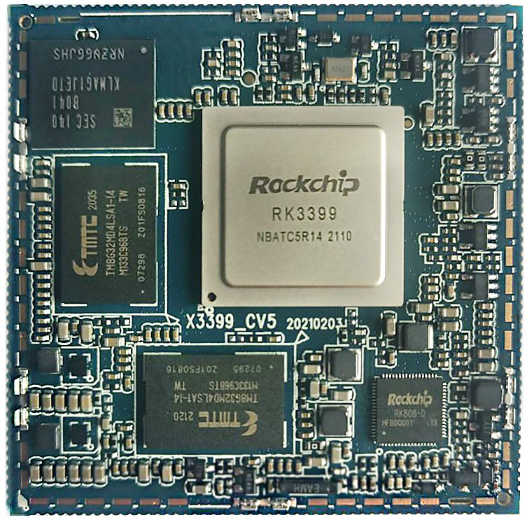
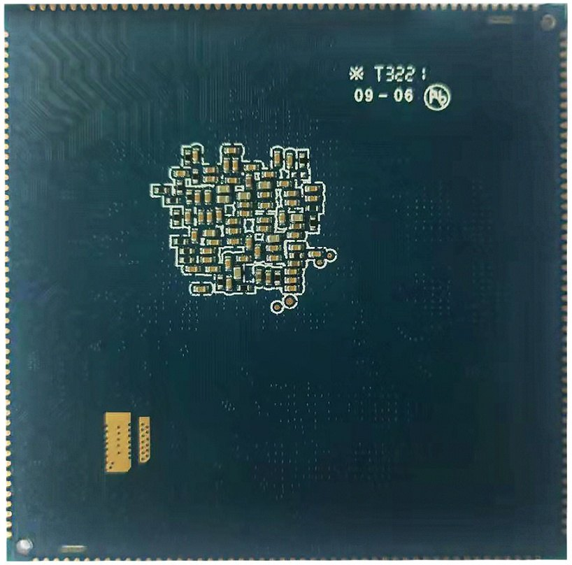
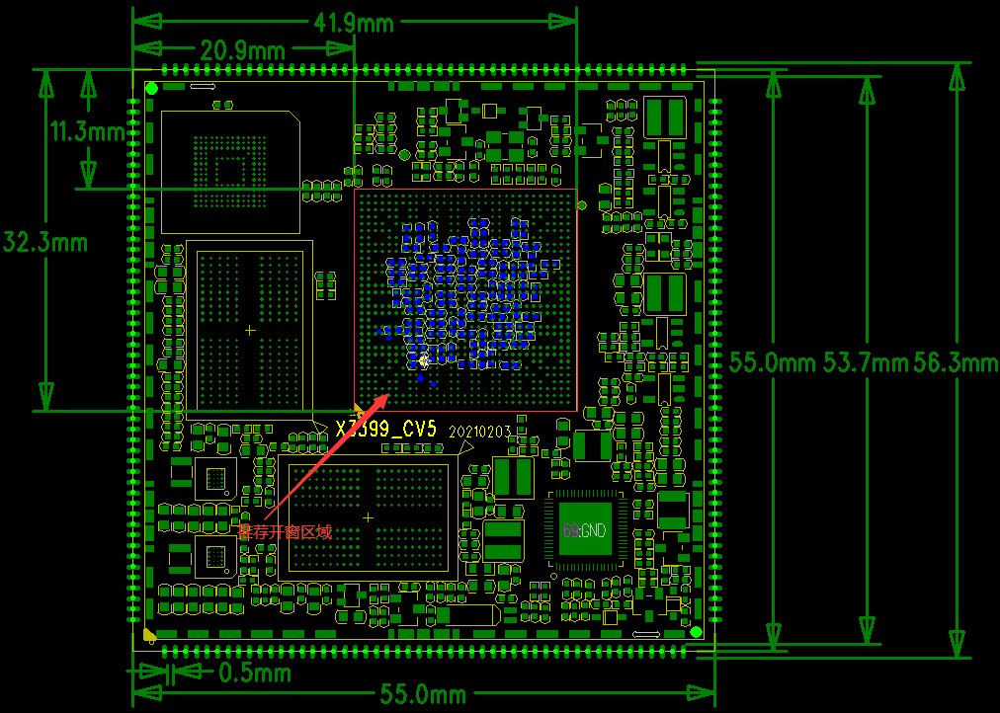

# 尺寸与结构

核心板外观

核心板正面图

核心板背面图

核心板结构图

核心板结构尺寸及管脚排列：

### 结构参数

| 项目 | 参数 |
| --- | --- |
| 外观 | 邮票孔方式 |
| 核心板尺寸 | 55mm*55mm*3mm |
| 引脚间距 | 1.0mm |
| 引脚焊盘尺寸 | 0.5mm*1.8mm，封装以中心对称 |
| 引脚数量 | 200PIN |
| 板层 | X3399CV3：10层 X3399CV4：8层 / X3399CV5：8层 |
| 翘曲度 | 小于0.5% |
| 开窗区域 | 上图中红色部分为推荐底板封装开窗区域 |
