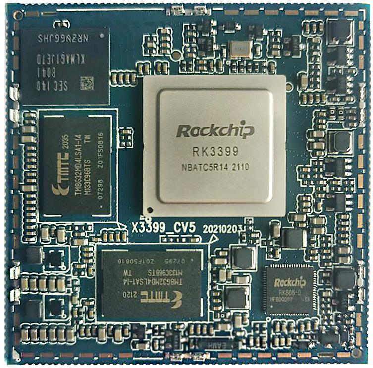

# 产品介绍

## 产品简介

X3399CV6 是基于瑞芯微RK3399 的一款核心板，它由深圳市九鼎创展科技有限公司自主研发，生产并销售。RK3399 代表了国产芯片的顶尖水平，它是一款由四核A53，双核A72 大小核组合而成的六核高性能CPU，主频高达2GB。RK3399 在CPU 与GPU 方面均堪称怪兽级。双Cortex-A72 大核+四Cortex-A53 小核结构的CPU，对整数、浮点、内存等作了大幅优化，在整体性能、功耗及核心面积三个方面都具革命性提升。GPU 采用四核ARM 新一代高端图像处理器Mali-T860，集成更多带宽压缩技术：如智能迭加、ASTC、本地像素存储等，还支持更多的图形和计算接口，总体性能比上一代提升45%。尽管这些能力均被同类解决芯片方案标榜为“顶级”能力，但对RK3399 来讲，这并不是重点。极具看点的是，Type-C 接口、内置PCI-e 接口、双摄像头支持手势识别三大特性，这对游戏盒子产品的体验将是颠覆性的，还有支持LPDDR4 内存等诸多新特性，均领先于目前主流产品。得益于高配置和整体性能的提升，以及全面型布局，使得RK3399 天生就是一位多面能手。除了平板电脑、VR、TV-BOX、笔记本之外，RK3399 的应用还涵盖了工业及消费领域各类终端，包括智能家电、广告机/一体机、金融POS 机、车载控制终端、瘦客户机、VOIP视频会议、安防/监控/警务及IoT 物联网等领域。

## 核心板特性

- 最佳尺寸，即保证精悍的体积又保证足够的GPIO 口，仅55mm*55mm
- 使用RK 自身的RK808 PMU，在保证工作稳定可靠的同时，成本足够低廉
- 支持多种品牌，多种容量的emmc，默认使用东芝16GB emmc
- 使用双通道LPDDR4 设计，默认支持2GB 容量，可定制4GB 容量
- 支持电源休眠唤醒
- 支持android6.0、android7.0、linux、debain9、ubuntu 等操作系统
- 支持千兆有线以太网
- 引出高达200PIN 管脚，几乎囊括CPU 所有管脚
- 产品稳定可靠，经过大量高低温，反复重启，安卓稳定性测试，安兔兔测试等可靠性实验，拷机7 天7 夜不死机；X3399CV4/X3399CV6 核心板相对原来的X3399CV3 的基础上，将LPDDR3 调整为LPDDR4，管脚完全兼容。针对android7.0 及以上操作系统，代码完全兼容。注意，目前android6.0 版本不支持LPDDR4，需要使用X3399CV4/X3399CV6 核心板的用户，请谨慎选择。

## 外观与结构

## 特性参数

### 系统配置

| CPU | RK3399 |
|---|---|
| 主频 | 四核A53(1.4GHz) + 双核A72(2GHz) |
| 内存 | 标配2GB，无缝兼容4GB |
| 存储器 | 标配16GB，其他容量可选 |
| 电源IC | 使用RT808，支持动态调频等 |

### 接口参数

| LCD接口 | 同时支持MIPI、EDP、HDMI接口输出 |
|---|---|
| Touch接口 | 电容触摸，可使用USB或串口扩展电阻触摸 |
| 音频接口 | AC97/IIS接口，支持录放音 |
| SD卡接口 | 2路SDIO输出通道 |
| emmc接口 | 板载emmc接口，管脚不另外引出 |
| 以太网接口 | 支持千兆以太网 |
| USB HOST2.0接口 | 2路HOST2.0 |
| USB HOST3.0接口 | 2路TYPE3.0 |
| UART接口 | 5路串口，支持带流控串口 |
| PWM接口 | 4路PWM输出 |
| IIC接口 | 7路IIC输出 |
| SPI接口 | 1路SPI输出 |
| ADC接口 | 1路ADC输出 |
| Camera接口 | 1路BT656/BT601，1路MIPI输出 |
| HDMI接口 | 高清音视频输出接口，音视频同步输出 |

### 电气特性

| 主3.3V输入电压 | 3.3V/4.3A(推荐使用3.3V/5A输入) |
|---|---|
| 副3.3V输入电压 | 3.3V/300mA(不能和主3.3V混用) |
| RTC输入电压 | 2.5到3V/100uA |
| 输出电压 | 1.8V(可用于底板供电，休眠后为0V) |
| 工作温度 | 0~70度 |
| 储存温度 | -10~50度 |

### 结构参数

| 外观 | 邮票孔方式 |
|---|---|
| 核心板尺寸 | 55mm*55mm*3mm |
| 引脚间距 | 1.0mm |
| 引脚焊盘尺寸 | 0.5mm*1.8mm，封装以中心对称 |
| 引脚数量 | 200PIN |
| 板层 | X3399CV3：10层 X3399CV4：8层 X3399CV5：8层 |
| 翘曲度 | 小于0.5% |
| 开窗区域 | 上图中红色部分为推荐底板封装开窗区域 |

## 相关章节

- [引脚定义](./x3399cv5-pin-definition)
- [硬件设计](./x3399cv5-hardware-design)
