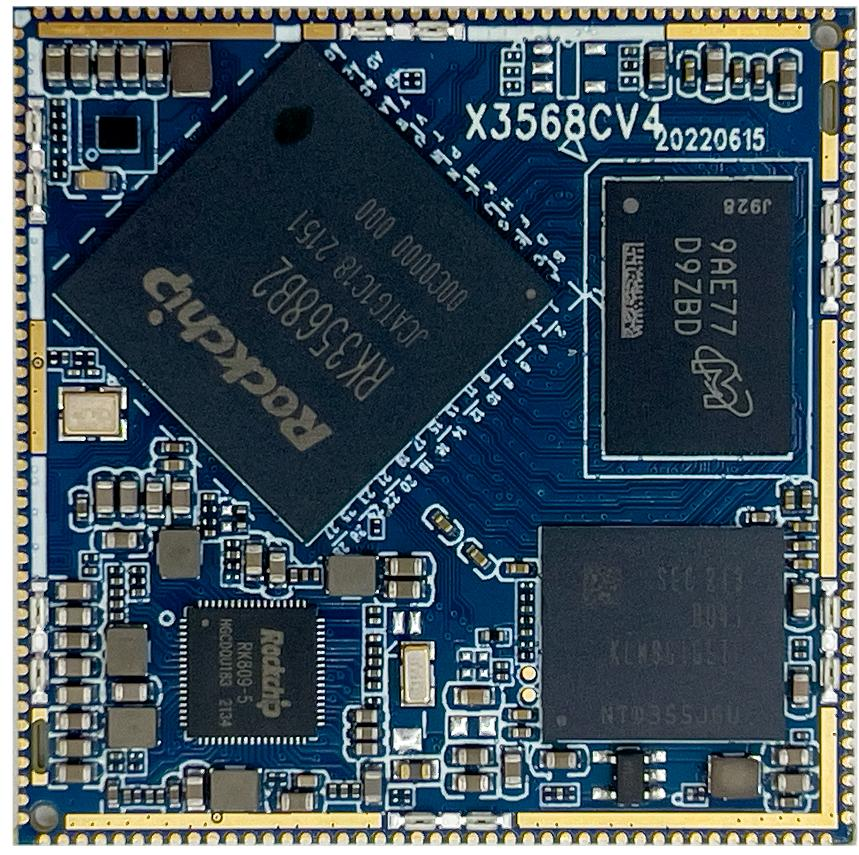
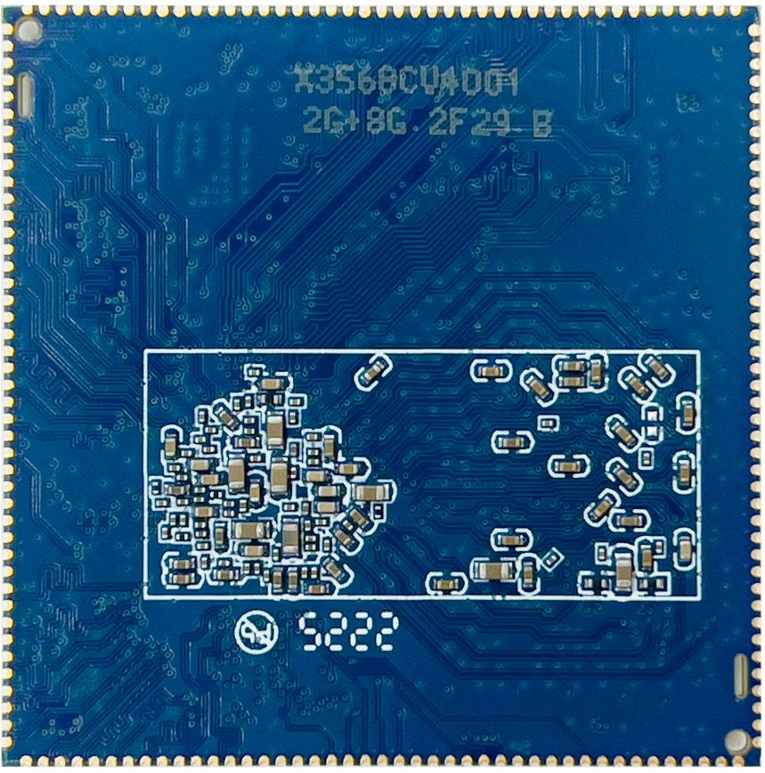

# 产品介绍

## 产品简介

X3568 核心板采用8 层板沉金工艺设计，确保稳定可靠，可以批量用于平板电脑，车机，学习机，POS 机，游戏机，行业监控等多种领域。核心板对应有用于评估测试用的底板，上面留有丰富的外设，几乎可以演示X3568 芯片的全部功能。板载百兆以太网接口、CSI接口、DSI 接口、RGB 接口、LVDS 接口、OTG 接口、USB2.0 接口、音频接口、红外一体化接收头；同时硬件电路基于平板方案，支持软件开关机，休眠唤醒等。液晶板默认采用7寸MIPI 液晶屏，或7 寸RGB 屏，用户也可以根据自己的需要接其他尺寸的屏幕。X3568 核心板适用于工控，电力，通讯，医疗，媒体，安防，车载，金融，消费电子，手持设备，游戏机，显示控制，教学仪器等多种领域。可广泛用于POS，游戏机，教学实验平台，多媒体终端，PDA，点菜机，广告机等领域。

## 核心板特性

- 最佳尺寸，即保证精悍的体积又保证足够的GPIO 口，仅45mm*45mm
- 使用RK 自身的RK809 PMU，在保证工作稳定可靠的同时，成本足够低廉
- 支持多种品牌，多种容量的EMMC，默认使用三星EMMC，分别为8GB 版本和16GB 版本
- 使用双通道LPDDR4X 或DDR4 设计，拥有1GB/2GB/4GB/8GB 版本
- 支持电源休眠唤醒
- 支持android8.1、linux、debain9、ubuntu 等操作系统
- 支持双路千兆有线以太网
- 引出200PIN 管脚，基本满足各种应用需求
- 产品稳定可靠，经过大量高低温，反复重启，安卓稳定性测试，安兔兔测试等可靠性实验，拷机7 天7 夜不死机

## 外观与结构

## 特性参数

### 系统配置

| CPU | RK3568/RK3568B2 |
|---|---|
| 主频 | 四核A55(2GHz) |
| 内存 | 标配2GB，硬件兼容4GB，8GB |
| 存储器 | 8GB/16GBEMMC可选，标配16GB |
| 电源IC | 使用RK809，支持动态调频等 |

### 接口参数

| LCD接口 | 支持DSI/LVDS/EDP/HDMI接口输出 |
|---|---|
| Touch接口 | 电容触摸 |
| 音频接口 | 支持耳机喇叭直接输出，支持录放音 |
| SD卡接口 | 2路SDIO输出通道 |
| EMMC接口 | 板载EMMC接口，管脚不另外引出 |
| 以太网接口 | 支持2路千兆以太网 |
| USBHOST2.0接口 | 2路HOST2.0 |
| USBHOST3.0接口 | 2路HOST3.0 |
| OTG接口 | 1路OTG接口（和其中一路USB3.0复用） |
| UART接口 | 10路串口，支持带流控串口 |
| PWM接口 | 16路PWM输出 |
| IIC接口 | 6路IIC输出 |
| SPI接口 | 4路SPI输出 |
| ADC接口 | 2路ADC输出（有6路未引出） |
| Camera接口 | CSI/BT601/BT656/BT1120/RAW输入 |

### 电气特性

| 3.3V输入电压 | 3.3V/2A |
|---|---|
| RTC输入电压 | 3V/0.6uA |
| 输出电压 | 3.3V/1.5A(可用于底板供电) |
| 工作温度 | 商规：-10~70度 工规 ：-40~85度 |
| 储存温度 | -10~40度 |

### 结构参数

| 外观 | 邮票孔方式 |
|---|---|
| 核心板尺寸 | 45mm*45mm*3mm |
| 引脚间距 | 1.0mm |
| 引脚焊盘尺寸 | 1.3mm*0.6mm |
| 引脚数量 | 172PIN |
| 板层 | 8层 |
| 翘曲度 | 不超过0.5% |

## 相关章节

- [引脚定义](./x3568cv4-pin-definition)
- [硬件设计](./x3568cv4-hardware-design)
