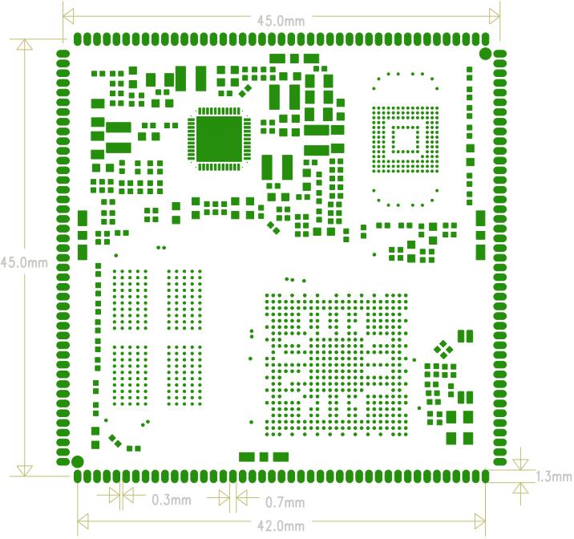

# 产品介绍

## 产品简介

X507CV1核心板是基于全志 T507 CPU 研发的一款核心板，支持 Android 和 Linux 系统。

T507 集成 4 核 Cortex-A53 CPU，主频最高 1.5GHz。核心板采用 LPDDR4 内存和板载 eMMC，适用于工业控制、商业显示、多媒体终端、网关和嵌入式人机交互等应用。

## 核心板特性

- 尺寸为 **45mm × 45mm**，在较小尺寸下引出主要 GPIO 和高速接口。
- 使用 AXP853T PMU 进行电源管理。
- 支持 Android 和 Linux。
- 采用 LPDDR4，支持 1GB 或 2GB 容量。
- 支持休眠与唤醒。
- 支持千兆以太网。
- 采用 172PIN 邮票孔封装。
- 原手册记录该产品通过 7 天 7 夜连续稳定性测试。

## 外观与结构

### 核心板正面图

### 核心板背面图

### 核心板结构尺寸图

## 特性参数

### 系统配置

| CPU | T507（4 × Cortex-A53） |
|---|---|
| 主频 | 1.5GHz |
| RAM | 1GB / 2GB LPDDR4 |
| ROM | 4GB / 8GB / 16GB eMMC |
| 电源IC | AXP853T，支持动态调频 |

### 接口参数

| LCD接口 | RGB / LVDS |
|---|---|
| 触摸接口 | 电容触摸，I2C接口 |
| 音频接口 | IIS / PCM / PDM / SPDIF |
| SD卡接口 | 2路SDIO输出 |
| eMMC接口 | 板载eMMC，管脚不单独引出 |
| 以太网接口 | 1路千兆以太网 |
| USB HOST2.0接口 | 3路 |
| USB OTG接口 | 1路 |
| UART接口 | 6路 |
| PWM接口 | 6路 |
| I2C接口 | 6路 |
| SPI接口 | 2路 |
| ADC接口 | 5路 |
| Camera接口 | 1路MIPI CSI输入，1路BT.656输入 |

### 电气特性

| 输入电压/电流 | 5V / 2A |
|---|---|
| RTC输入 | 3V / 0.6µA |
| 3.3V输出 | 3.3V / 1.5A |
| 工作温度 | -40℃～85℃ |
| 储存温度 | -10℃～40℃ |

### 结构参数

| 外观 | 邮票孔封装 |
|---|---|
| 核心板尺寸 | 45mm × 45mm × 3mm |
| 引脚间距 | 1.0mm |
| 引脚数量 | 172PIN |
| 板层 | 8层 |

## 相关章节

- [引脚定义](./x507-pin-definition)
- [硬件设计](./x507-hardware-design)
