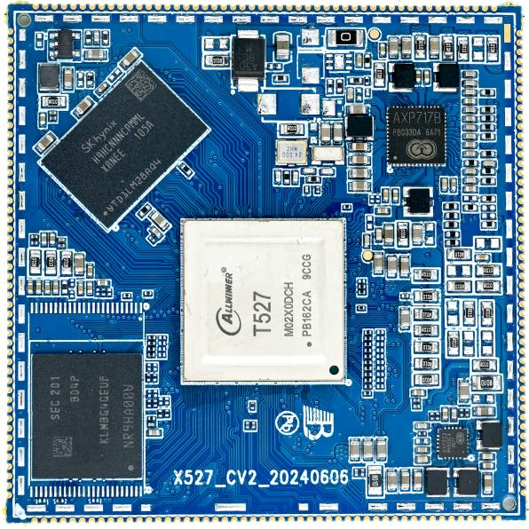
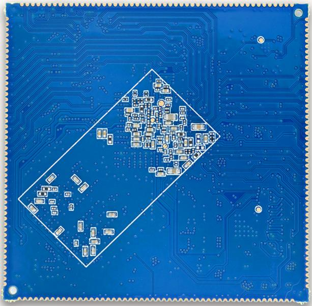
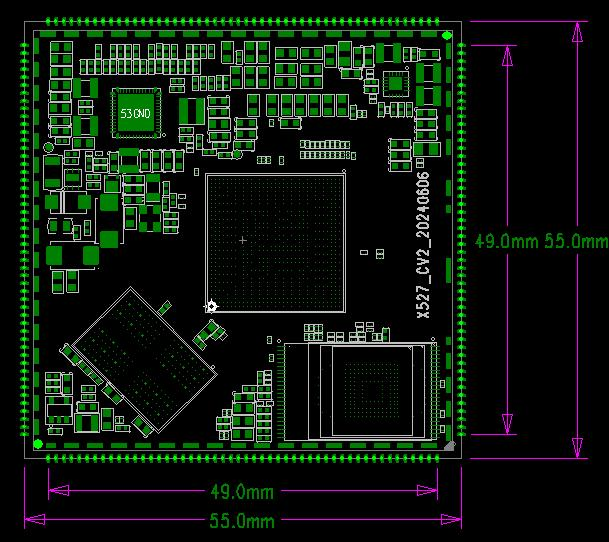
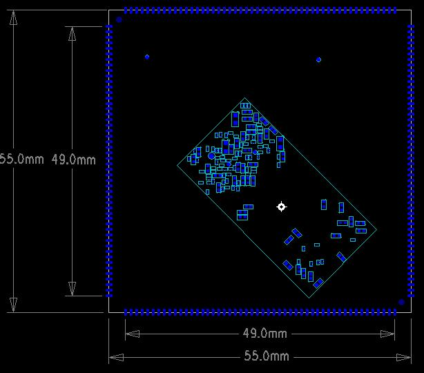

# 产品介绍

## 产品简介

X527CV2是基于全志 T527/A527 系列 CPU 研发的八核 Cortex-A55 核心板系列。核心板可搭配 T527N、T527、A527H 和 A527M，不同型号之间管脚兼容。

527系列支持 DDR3、LPDDR3、DDR4 和 LPDDR4(X)，CPU主频最高 2GHz。该平台面向智能座舱、360环视、智能泊车、边缘计算、商业显示、工业控制和汽车电子等应用。

### 芯片型号差异

| 型号 | CPU / NPU | 主要特性 | 温度规格 |
|---|---|---|---|
| T527N | 8核 Cortex-A55 2.0GHz，2TOPS NPU | 全功能 | 工规，-40℃～85℃ |
| T527 | 8核 Cortex-A55 2.0GHz | 无NPU | 工规，-40℃～85℃ |
| A527H | 8核 Cortex-A55 2.0GHz | HDMI 4K + 1080P双异显；无NPU；少一路CAN和DSP | 商规，-20℃～75℃ |
| A527M | 8核 Cortex-A55 1.8GHz | 商规型号 | 商规，-20℃～75℃ |
| A523H | 8核 Cortex-A55 2.0GHz | 商规型号 | 商规，-20℃～75℃ |
| A523M | 8核 Cortex-A55 1.8GHz | 商规型号 | 商规，-20℃～75℃ |

## 核心板特性

- 尺寸为 **55mm × 55mm**。
- 使用 PMU 进行电源管理。
- 支持多种品牌和容量的 eMMC。
- 采用 LPDDR4X，最高支持 4GB。
- 支持休眠与唤醒。
- 支持千兆以太网、MIPI-CSI、MIPI-DSI、LVDS、RGB888、eDP、HDMI、PCIe和USB3.0。
- 采用 200PIN 邮票孔封装。
- T527N、T527、A527H和A527M核心板管脚兼容。

## 外观与结构

### 核心板正面图

### 核心板背面图

### 核心板TOP层结构尺寸图

### 核心板BOT层结构尺寸图

## 特性参数

### 系统配置

| CPU | T527 / A527（Cortex-A55） |
|---|---|
| 主频 | 2GHz |
| RAM | 2GB / 4GB LPDDR4X |
| ROM | 4GB / 8GB / 16GB / 32GB / 64GB / 128GB / 256GB eMMC |
| 电源IC | AXP717B，支持动态调频 |

### 接口参数

| LCD接口 | 2路LVDS、1路eDP、2路MIPI（需通过电阻选配） |
|---|---|
| 音频接口 | IIS / PCM / PDM / SPDIF |
| SD卡接口 | 2路SDIO输出 |
| eMMC接口 | 板载eMMC，管脚不单独引出 |
| 以太网接口 | 1路千兆以太网 |
| USB HOST2.0接口 | 3路 |
| USB HOST3.0接口 | 1路 |
| UART接口 | 16路 |
| I2C接口 | 原手册参数表未填写数量 |
| Camera接口 | 参数表记录1路MIPI-CSI输入 |
| HDMI接口 | 1路HDMI2.0 TX |
| PCIe接口 | 1路PCIe2.0 |

### 电气特性

| 输入电压/电流 | VCC-SYS，5V / 3A |
|---|---|
| 3.3V输出 | DCDC4：3.3V / 3A；CLDO3：3.3V / 500mA |
| 工作温度 | -20℃～85℃，可选-40℃～85℃ |
| 储存温度 | -10℃～50℃ |

### 结构参数

| 外观 | 邮票孔封装 |
|---|---|
| 核心板尺寸 | 55mm × 55mm × 1.2mm |
| 引脚间距 | 1.0mm |
| 引脚数量 | 200PIN |
| 板层 | 8层 |
| 翘曲度 | 小于0.5% |

## 相关章节

- [引脚定义](./x527-pin-definition)
- [硬件设计](./x527-hardware-design)
