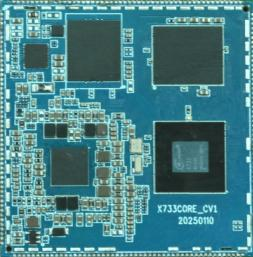
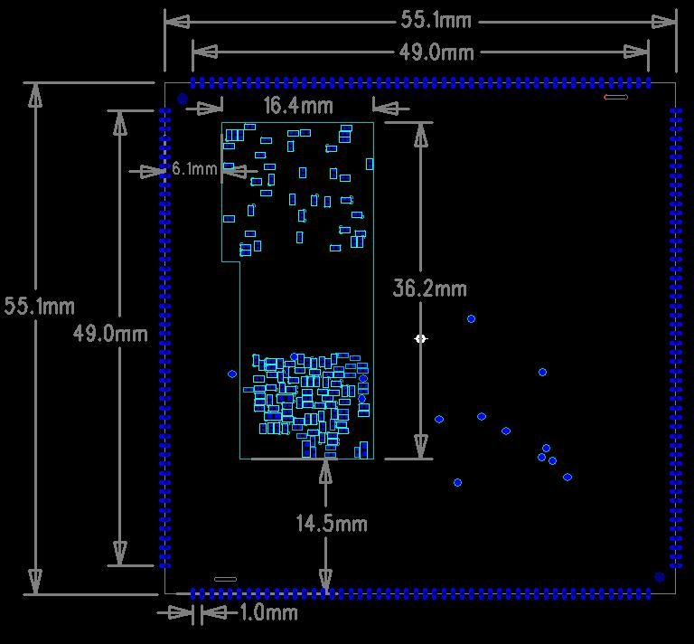

# 产品介绍

## 产品简介

X733核心板是基于全志 A733 CPU 研发的一款核心板。

A733采用 Cortex-A76 + Cortex-A55 八核架构，并集成 RISC-V E902 核心，可选3TOPS NPU。平台最高支持16GB内存，面向平板电脑、笔记本电脑、智能终端和Android 15设备等应用。

## 核心板特性

- 尺寸为 **55mm × 55mm**。
- 使用 PMU 进行电源管理。
- 支持多种品牌和容量的 eMMC。
- 采用 LPDDR5，平台最高支持16GB。
- 支持休眠与唤醒。
- 支持千兆以太网、MIPI-CSI、MIPI-DSI、PCIe和USB3.0。
- 采用 200PIN 邮票孔封装。

## 外观与结构

### 核心板正面图

### 核心板TOP层结构尺寸图

### 核心板BOT层结构尺寸图

## 特性参数

### 系统配置

| CPU | A733（Cortex-A76 + Cortex-A55） |
|---|---|
| 主频 | 2GHz |
| RAM | 2GB / 4GB / 8GB；产品概述称平台最高支持16GB |
| ROM | 4GB / 8GB / 16GB / 32GB / 64GB eMMC |
| 电源IC | AXP318W，支持动态调频 |

### 接口参数

| eMMC接口 | 板载eMMC |
|---|---|
| USB接口 | 参数表记录3路USB2.0 / 2路USB3.0 |
| LCD接口 | 2路MIPI DSI / 1路eDP / 1路LVDS / 1路RGB |
| SPI接口 | 5路 |
| I2C接口 | 16路 |
| UART接口 | 9路 |
| GMAC接口 | 1路 |
| PWM接口 | 20路 |
| MIPI CSI接口 | 4 + 4 + 2 lane |

### 电气特性

| 输入电压/电流 | PS，5V / 4A |
|---|---|
| 工作温度 | 0℃～70℃ |
| 储存温度 | -10℃～50℃ |

### 结构参数

| 外观 | 邮票孔封装 |
|---|---|
| 核心板尺寸 | 55mm × 55mm × 1.2mm |
| 引脚间距 | 1.0mm |
| 引脚数量 | 200PIN |
| 板层 | 8层 |
| 翘曲度 | 小于0.5% |

## 相关章节

- [引脚定义](./x733-pin-definition)
- [硬件设计](./x733-hardware-design)
