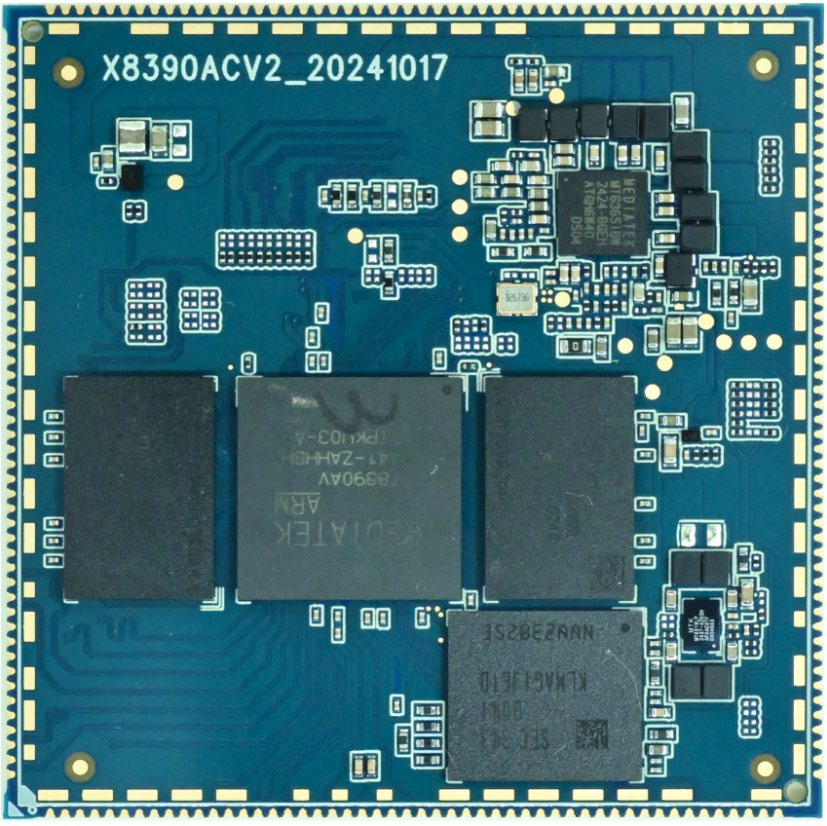
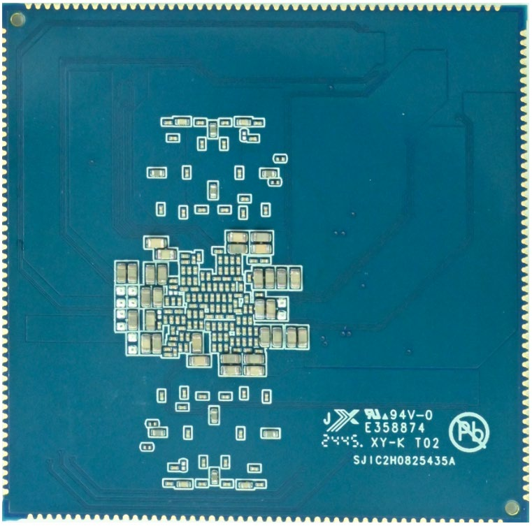
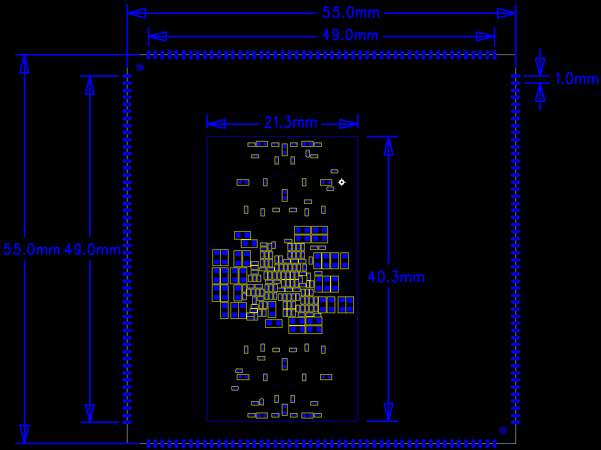

# 核心板介绍

## 产品概述

X8390CV2核心板基于MediaTek MT8390设计，并兼容PIN to PIN的MT8370。MT8390采用2个Cortex-A78与6个Cortex-A55，MT8370采用2个Cortex-A78与4个Cortex-A55。两种方案面向边缘AI、工业设备、智能终端和多媒体应用。

## 核心板特性

- 55mm × 55mm邮票孔核心板。
- MT6365 PMIC电源管理。
- LPDDR4X，提供2GB / 4GB / 8GB配置。
- 板载4GB～64GB eMMC。
- 支持休眠与唤醒。
- 提供USB3.0、USB2.0、PCIe Gen2、DisplayPort、MIPI DSI、MIPI CSI、HDMI、eDP、SDIO和千兆以太网等资源。
- 引脚定义表为1～200，共200PIN。

## 核心板外观

### 正面

### 背面

## 结构尺寸

### TOP层

### BOT层

## 系统配置

| 项目 | 参数 |
| --- | --- |
| CPU | MT8390；兼容MT8370 |
| MT8390架构 | 2 × Cortex-A78 + 6 × Cortex-A55 |
| 主频 | Cortex-A78 2.2GHz；Cortex-A55 2.0GHz |
| RAM | 2GB / 4GB / 8GB LPDDR4X |
| ROM | 4GB / 8GB / 16GB / 32GB / 64GB eMMC |
| 电源IC | MT6365 |

## 接口参数

| 接口 | 参数 |
| --- | --- |
| USB | 1路USB3 OTG/Device，2路USB2 OTG/Device |
| PCIe | 1路PCIe Gen2，1 Lane |
| DisplayPort | 1路，4 Lane |
| MIPI DSI | 2路，4 Lane |
| HDMI | 1路HDMI TX |
| eDP | 1路，2 Lane |
| MIPI CSI | 2路，4 Lane |
| SDIO | 2路SDIO 3.0 |
| SPI | 3路 |
| PWM | 4路 |
| UART | 2路 |
| I2C | 3路 |
| SPMI | 1路SPMI V2.0 |
| 音频 | 4 × I2S、8 × DMIC、1 × PCM、4 × SPDIF、6 × AUXADC |
| 以太网 | 1路千兆以太网 |
| DPI | 1路 |

## 电气特性

| 项目 | 参数 |
| --- | --- |
| 主电源输入 | VSYS 5V / 3A |
| VCN33_1_PMU | 3.3V，最高800mA，用于同电压域外设 |
| VIO18_PMU | 1.8V，资料参数表标注500mA，用于IO上拉等 |
| 工作温度 | 0℃～70℃ |
| 储存温度 | -10℃～50℃ |

## 结构参数

| 项目 | 参数 |
| --- | --- |
| 外观 | 邮票孔封装 |
| 核心板尺寸 | 55mm × 55mm × 1.2mm |
| 引脚间距 | 1.0mm |
| 引脚数量 | 200PIN |
| PCB层数 | 8层 |
| 翘曲度 | 小于0.5% |

本资料按结构参数表和完整的1～200引脚定义整理为200PIN。
