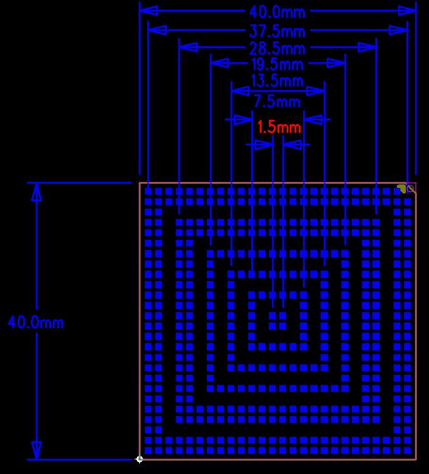

# 产品介绍

## 产品简介

Z3576 是基于瑞芯微科技RK3576 CPU 的一款核心板，它由深圳市九鼎创展科技有限公司自主研发，生产并销售。RK3576 是瑞芯微第二代8nm 高性能AIOT 平台，它集成了独立的6TOPS（TeraOperations Per Second，每秒万亿次操作）NPU（神经网络处理单元），用于处理人工智能相关的任务。此外，RK3576 还支持UFS（Universal Flash Storage，通用闪存存储）存储，提供了高效的数据存储和读取能力。适用于多种应用场景，尤其是商业显示设备、视频直播设备、工业控制主机/工控板、汽车电子等嵌入式系统和智能设备的迭代升级。RK3576 是继RK3399 之后的集大成者，他弥补了RK3399 上的全方位短板，在制程上，由28nm 工艺提升到8nm 工艺，在安兔兔跑分提高超过2 倍的前提下，核心模块功耗能做到5W 以下；在算力上，由未集成NPU 到直接内置6TOPS 算力的NPU；在内存颗粒上，由仅支持DDR3 和LPDDR4，升级到全方位支持DDR3，LPDDR4，LPDDR4X，LPDDR5；在存储上，支持UFS 颗粒；在编码性能上，能追平RK3588，支持4K@60fps，而在成本上，只有RK3588 的一半。

## 核心板特性

- 最佳尺寸，保证引出全部GPIO 口的同时，尺寸仅40mm*40mm
- 系统供电使用PMU，在保证工作稳定可靠的同时，成本足够低廉
- 支持多种品牌，多种容量的emmc
- 使用LPDDR4x 设计，最高支持16GB
- 支持电源休眠唤醒
- 支持千兆以太网、MIPI-CSI、MIPI-DSI、PCIE、USB3.0 等高速总线
- 采用447PIN LGA 封装

## 外观与结构

## 特性参数

### 系统配置

| CPU | RK3576(QuadA72+QuadA53) |
|---|---|
| 主频 | 2.2GHz |
| RAM | 2GB/4GB/8GB/16GB |
| ROM | 8GB/16GB/32GB/64GB/128GB/256GB/512GB |
| 电源IC | 使用 RK806-S，支持动态调频 |

### 接口参数

| LCD 接口 | 1 路 MIPI-DSI(MAX2K@60Hz) |
|---|---|
| Touch 接口 | 电容触摸，I2C 接口 |
| 音频接口 | IIS/PCM/PDM/SPDIF |
| SD卡接口 | 1 路 SDIO 输出通道 |
| Emmc接口 | 板载 emmc 接口，管脚不另外引出 |
| 以太网接口 | 支持1路千兆以太网接口 |
| USBHOST2.0接口 | 2 路 |
| USBHOST3.0接口 | 2路 |
| UART接口 | 11路 |
| PWM | 16路 |
| IIC接口 | 10路 |
| Camera接口 | 3 路 MIPI-CSI 输入 |
| HDMI接口 | 1 路 HDMI2.0TX |
| PCIE接口 | 1 路 PCIE2.0 |

### 电气特性

| 输入电压/电流 | VCC5V0_SYS_S5/3A |
|---|---|
| 输出电压/电流 | VCC_3V3_S0/1A（用于同电压域外设供电）； VCC_1V8_S3/500MA(用于同电压域 IO 上 拉)； |
| 工作温度 | 0~70度 |
| 储存温度 | -10~50度 |

### 结构参数

| 外观 | BGA封装 |
|---|---|
| 核心板尺寸 | 40mm*40mm*1.2mm |
| 引脚间距 | 1.5mm |
| 引脚数量 | 447PIN |
| 板层 | 14层 |
| 翘曲度 | 小于0.5% |

## 相关章节

- [引脚定义](./z3576-pin-definition)
- [硬件设计](./z3576-hardware-design)
