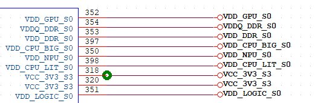

# 硬件设计

硬件设计

管脚描述

Z3576除上述不可用作GPIO 口、电源引脚和系统地外的信号引脚的其他 GPIO 口都可以复用作其他功能,如I2C、UART、SPI、I2S、PWM 等等。因篇幅有限,本文描述不尽详细，如有需要，可以通过仔细阅读核心板原理图或Z3576的规格书中相关引脚描述获取更多信息。

核心板GPIO电平

GPIO电源域的电源脚描述如下：

| 电源域 | GPIO供电电压 | 描述 | 核心板IO电平 |
| --- | --- | --- | --- |
| PMUIOO | 1.8V | IO 电压域只有1.8V | 1.8V |
| PMUIO1 | 1.8V/3.3V | IO 电压域可配置成1.8V或3.3V,核心板管脚引出，由底板供电 | 由底板给核心板PMUIO1管脚供电电压决定 |
| VCCIO0 | 1.8V | IO 电压域只有1.8V | 1.8V |
| VCCIO1 | 1.8V/3.3V | IO 电压域可配置成1.8V 或3.3V, 由底板供电 | 由底板给核心板VCCIO1管脚供电电压决定 |
| VCCIO2 | 1.8V/3.3V | IO 电压域可配置成1.8V或3.3V,由底板供电 | 由底板给核心板VCCIO2管脚供电电压决定 |
| VCCIO3 | 1.8V/3.3V | IO 电压域可配置成1.8V 或3.3V,由底板供电 | 由底板给核心板VCCIO3管脚供电电压决定 |
| VCCIO4 | 1.8V/3.3V | IO 电压域可配置成1.8V 或3.3V,由底板供电 | 由底板给核心板VCCIO4管脚供电电压决定 |
| VCCIO5 | 1.8V/3.3V | IO 电压域可配置成1.8V 或3.3V,由底板供电 | 由底板给核心板VCCIO5管脚供电电压决定 |
| VCCIO6 | 1.8V/3.3V | IO 电压域可配置成1.8V 或3.3V,由底板供电 | 由底板给核心板VCCIO6管脚供电电压决定 |
| VCCIO7 | 1.2V/1.8V | IO 电压域可配置成1.2V或1.8V,我司核心板统一配置为1.8V | 1.8V |

在做底板设计时，注意外设芯片的IO电平要与核心板的IO电平保持一致，否则会烧坏CPU。

电源设计

Z3576核心板仅需要主电源供电即可正常使用。详细的电源管脚定义如下：

144、146、147、148脚：5V/3A电源输入接口，为确保CPU稳定可靠工作，务必保证提供足额电流且保证电源纹波电压控制在100MV以下，另外电源走线尽可能宽（大于2MM），换层过孔不小于5个；

301脚：3.3V/0.5A电源输出，可用于接口板电源供电（部分外设上电时序有要求，可参考上述核心板引脚定义的描述给对应外设供电）；

318、319、320、321脚：3.3V/5A电源输出，可用于底板电流要求较高的电源供电。

下图为给CPU，NPU，GPU，DDR供电的核心电源管脚，核心板对外引出，在底板设计时，需在底板上增加电容滤波，以增强稳定性；

USB设计

Z3576 核心板有2路USB2.0 和2路 USB3.0口。其中 USB2.0口在开发板上设计为固件升级(device)和USB HOST 复用,通过外部 USB 5V 插入做检测并切换为DEVICE 而升级固件用。

默认USB2.0接口能达到480Mbps的速度, 而USB3.0最快能达到5Gbps的带宽,, 因此，对PCB 走线的要求做特性阻抗匹配。USB 接口的差分对在 PCB 走线时，务必走等长差分线，特性阻抗为90欧-/+10%，而且需要有完整的参考平面。

HDMI设计

Z3576芯片自带一路HDMI OUT控制器，支持HDMI2.0协议。核心板上相应的HDMI差分对，必须走等长差分线，且阻抗匹配为100欧-/+10%，否则会出现HDMI画面丢色，断断续续等问题。

MIPI设计

MIPI是2003年由ARM，Nokia，ST，TI等公司成立的一个联盟，目的是把手机内部的接口如摄像头、显示屏、射频基带接口等标准化，从而减少手机的设计复杂度，增加设计的灵活性。MIPI是一个比较新的标准，目前比较成熟的应用有DSI（显示接口）和CSI（摄像头接口）。

Z3576支持1路MIPI DSI和2路MIPI CSI接口，其中DSI用于驱动MIPI显示屏，CSI可以外接MIPI摄像头。MIPI接口的数据传输率较高，在走线时一定要走等长差分线，且阻抗匹配为100欧 -/+10%。
