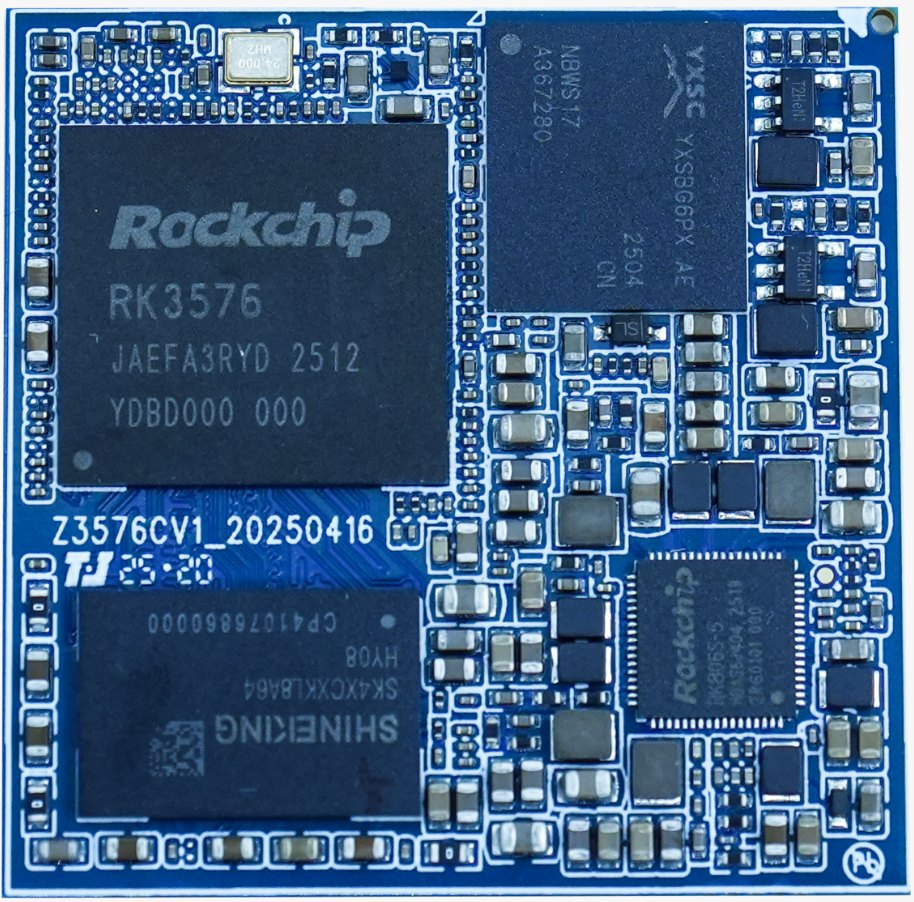
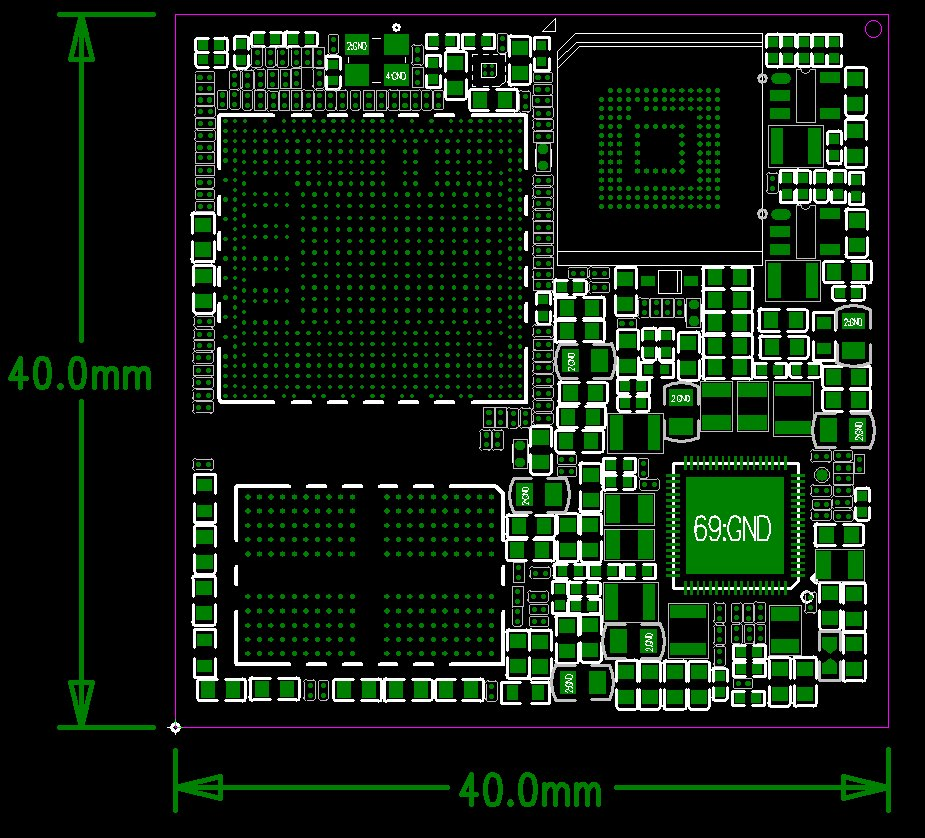
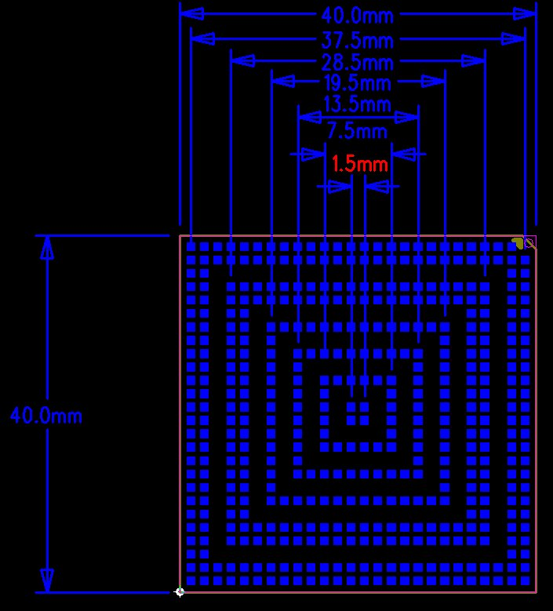

# 尺寸与结构

核心板外观

核心板正面图

核心板结构图

核心板结构尺寸及管脚排列：

TOP层

BOT层

核心板结构参数

### 结构参数

| 项目 | 参数 |
| --- | --- |
| 外观 | BGA封装 |
| 核心板尺寸 | 40mm*40mm*1.2mm |
| 引脚间距 | 1.5mm |
| 引脚数量 | 447PIN |
| 板层 | 14层 |
| 翘曲度 | 小于0.5% |
