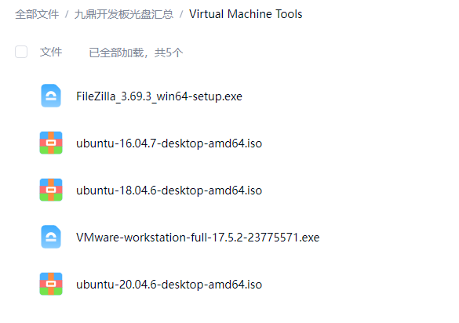
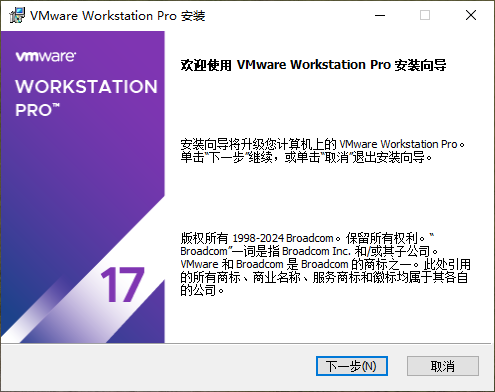
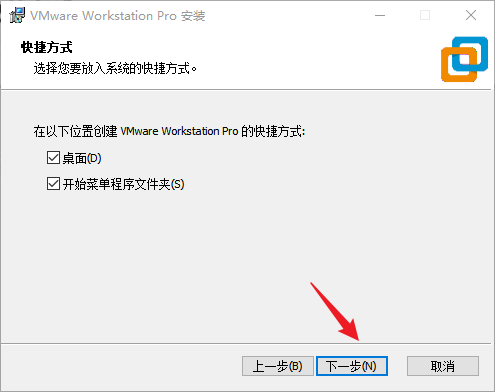
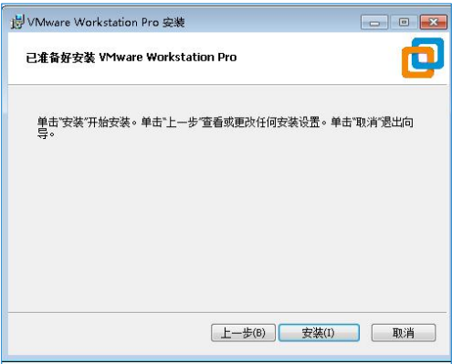

# VMware 安装

本文档以 VMware Workstation 17.5.2 为例，在 Windows 主机上搭建 Ubuntu 虚拟机环境。其他 VMware Workstation 17.x 版本的安装流程基本一致。

## 获取安装程序

### 虚拟机搭建工具下载

虚拟机环境搭建所需的 VMware、Ubuntu 镜像及相关工具可以通过下面的网盘获取：

- 网盘名称：Virtual Machine Tools
- 下载链接：[百度网盘下载](https://pan.baidu.com/s/1fBd--CaDgS18s0UzGsW7xw?pwd=m5g6)
- 提取码：`m5g6`

网盘中的工具主要用于完成 VMware 安装、Ubuntu 虚拟机创建以及开发环境基础配置。

内部网盘可提供 VMware 安装程序和 Ubuntu 镜像。使用其他来源时，应从可信渠道获取安装包，并按软件许可要求完成授权。



## 安装步骤

以管理员身份运行：

```text
VMware-workstation-full-17.5.2-23775571.exe
```

进入安装向导后点击“下一步”。



阅读并接受许可协议后继续。


选择安装位置。没有特殊要求时可使用默认目录；系统盘空间不足时可安装到其他磁盘。


用户体验设置中的更新检查和客户体验计划可按实际需求选择。


选择是否创建桌面和开始菜单快捷方式。



确认设置后开始安装。



等待安装完成。


完成安装，并按合法授权方式配置许可证。


启动 VMware Workstation 后应能进入主界面。


