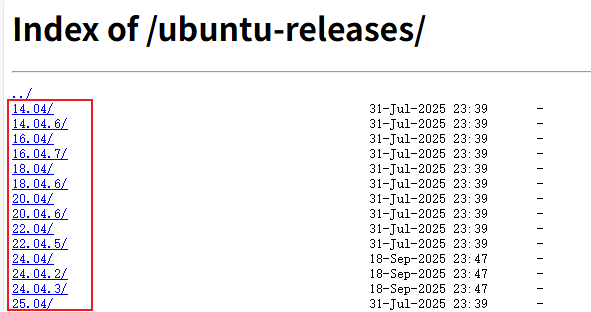
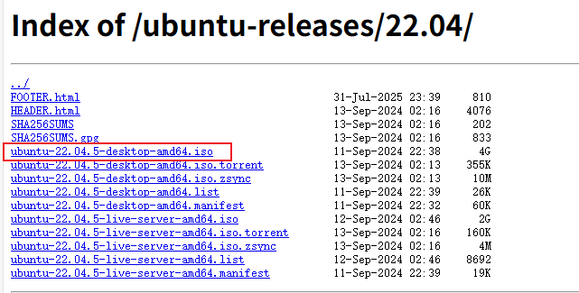
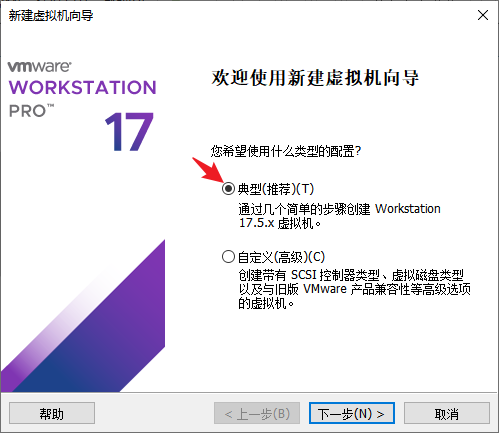
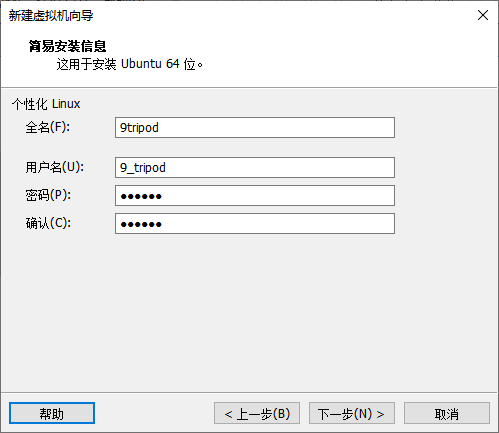
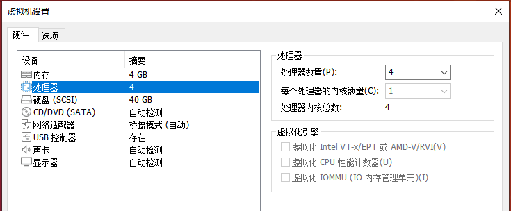
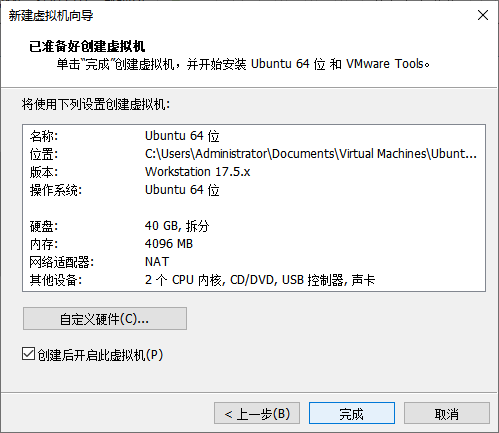
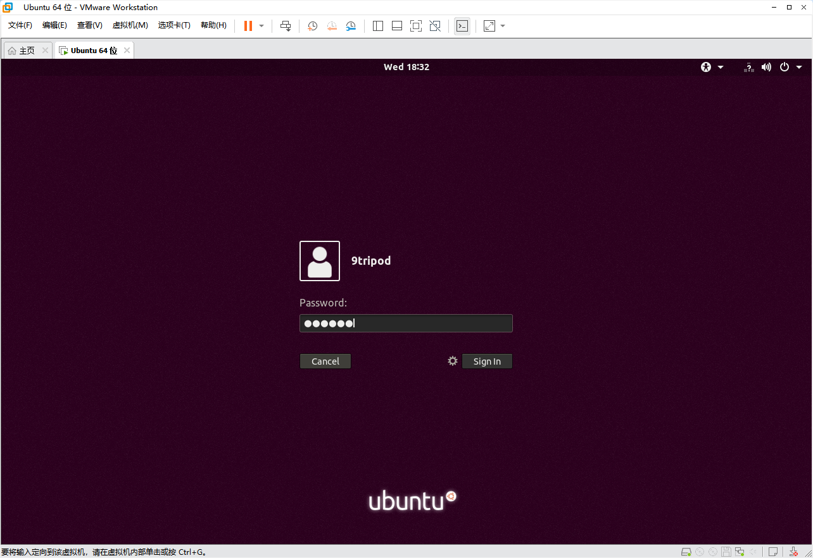

# Ubuntu 虚拟机安装

服务器中已验证的编译环境为 **Ubuntu 20.04.5 LTS amd64**。为了减少软件包和工具版本差异，建议优先使用 Ubuntu 20.04.x 64 位桌面版。

## 获取 Ubuntu ISO

内部网盘可提供不同 Ubuntu 版本的 ISO 镜像。


也可以从 Ubuntu 官方或可信镜像站下载。选择对应版本目录后，下载文件名包含：

```text
desktop-amd64.iso
```





## 创建虚拟机

在 VMware 主界面点击“创建新的虚拟机”，选择“典型”配置。



选择刚下载的 Ubuntu ISO。原文中的“ios 镜像”应为 **ISO 镜像**。


填写用户名和密码。建议使用普通用户，不要将日常编译环境直接配置为 root 用户。



设置虚拟机名称和保存位置。SDK 文件较大，建议将虚拟机放在空间充足的 SSD 上。


## 资源配置建议

原始示例中的 4 GB 内存和 40 GB 磁盘只能用于演示 Ubuntu 安装，**不适合完整编译 Android、Rockchip 或 Allwinner SDK**。

| 项目 | 最低建议 | 推荐配置 |
| --- | ---: | ---: |
| CPU | 4 核 / 8 线程 | 8 核 / 16 线程以上 |
| 内存 | 16 GB | 32 GB 或以上 |
| 系统与工具磁盘 | 100 GB | 150 GB 或以上 |
| SDK 工作磁盘 | 300 GB | 500 GB～1 TB |
| 存储介质 | SATA SSD | NVMe SSD |

为虚拟磁盘预留足够空间。


点击“自定义硬件”进一步配置。


内存不要超过宿主机可用内存。宿主机还需要为 Windows 和其他程序保留足够空间。


可以在 Windows 任务管理器中查看宿主机 CPU 和内存配置。


处理器数量与每个处理器的内核数量相乘，不能超过宿主机可用逻辑处理器数量。



## 网络模式

需要让局域网内其他设备直接访问虚拟机时，可选择桥接模式。仅需要虚拟机访问互联网时，NAT 模式通常更省事。


确认虚拟机配置后开始安装。




安装完成后，使用创建虚拟机时设置的普通用户登录。


