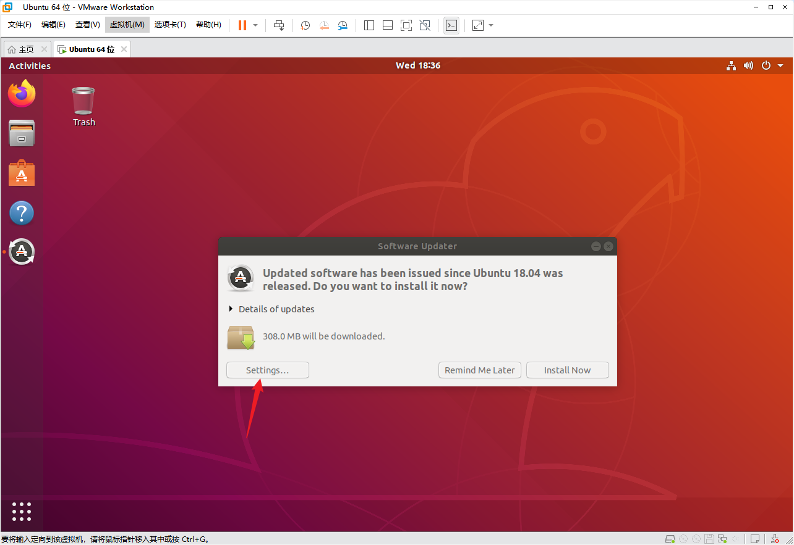
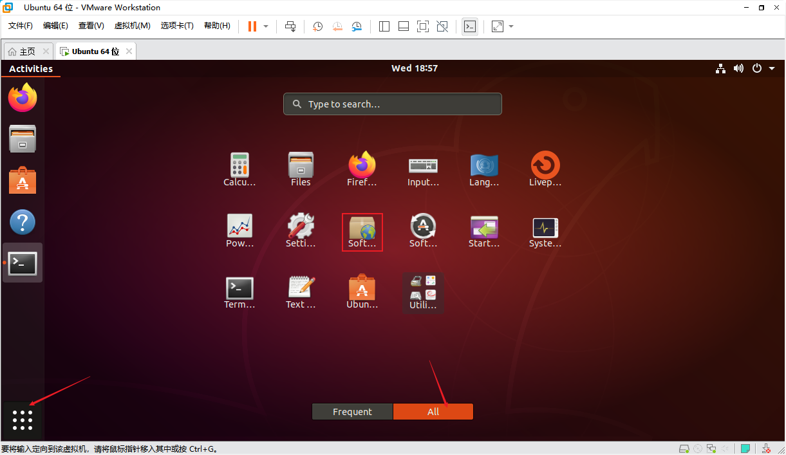
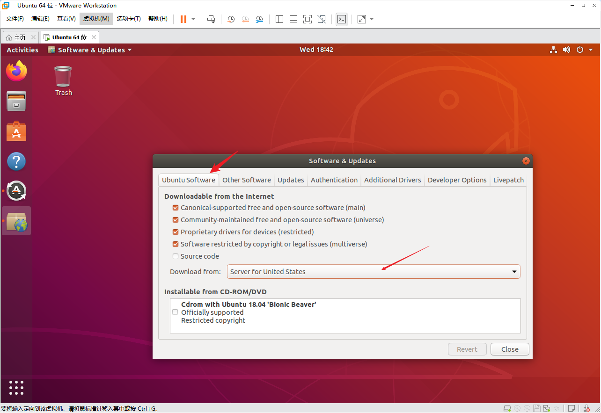
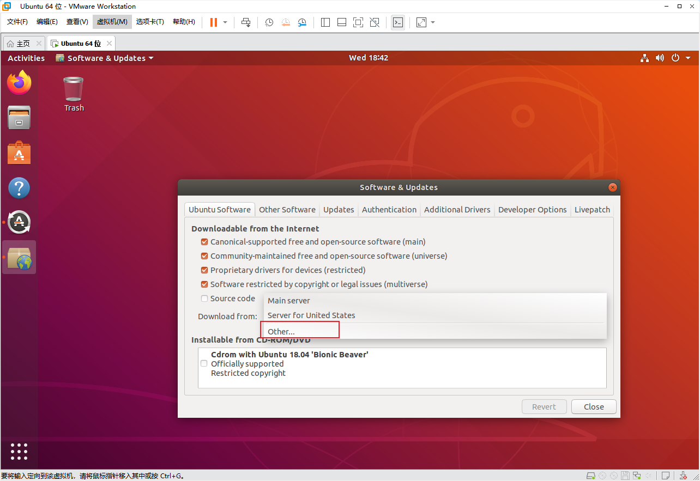
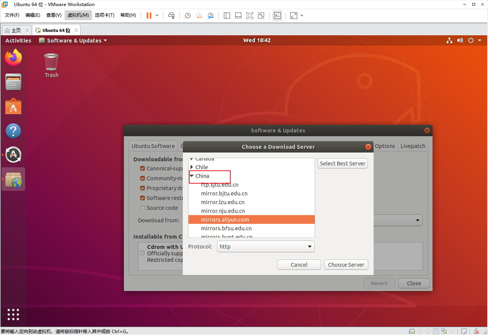
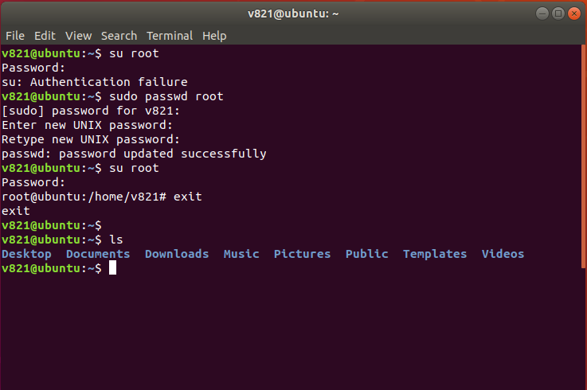
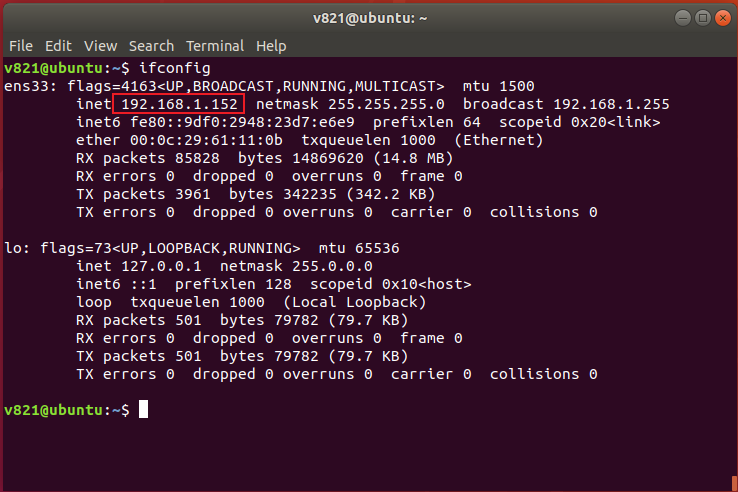
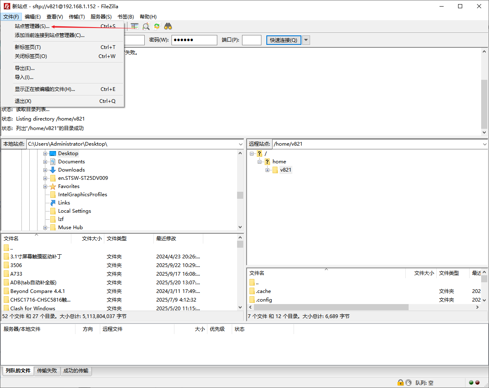
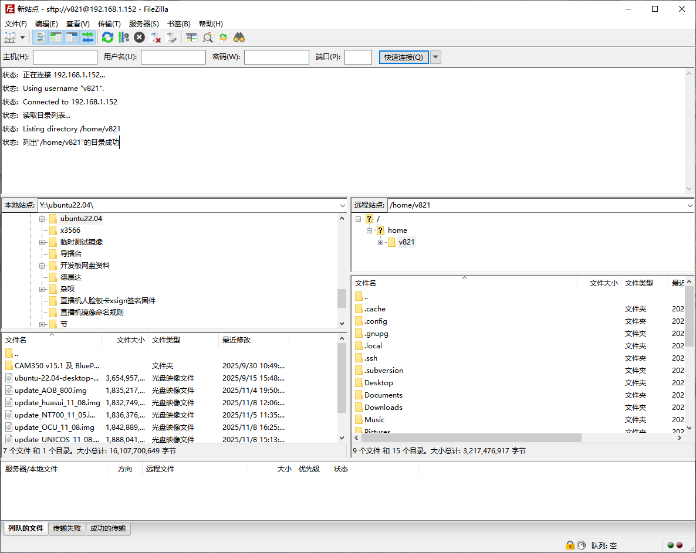

# Ubuntu 基础工具

## 切换软件源

Ubuntu 默认软件源在部分网络环境下速度较慢，可以通过“软件和更新”切换到国内镜像。

首次启动时可从更新提示进入设置，也可以从应用程序列表打开“软件和更新”。





进入 Ubuntu Software 页面，打开下载服务器选择窗口。





在 China 节点下选择稳定可用的镜像站，然后确认。




更新软件包索引：

```bash
sudo apt-get update
```

不建议在搭建 SDK 环境前直接执行无差别的系统大版本升级。确有需要时再执行：

```bash
sudo apt-get upgrade
```

修复依赖关系：

```bash
sudo apt-get -f install
```

## 普通用户与 root

日常编译请使用普通用户。需要管理员权限时使用 `sudo`，通常没有必要启用 root 登录。

确实需要设置 root 密码时，正确命令是：

```bash
sudo passwd root
```

原文中的：

```text
su passwd root
```

不是有效的设置命令。



## 常用基础工具

安装 `ifconfig`：

```bash
sudo apt-get install -y net-tools
```

安装 Vim：

```bash
sudo apt-get install -y vim
```

原文中的 `apt-get upgrade vim` 已修正为安装命令。


## Windows 与 Ubuntu 文件传输

### 安装 SSH 服务

在 Ubuntu 中安装 OpenSSH Server：

```bash
sudo apt-get install -y openssh-server
sudo systemctl enable --now ssh
sudo systemctl status ssh
```

默认使用创建虚拟机时的普通用户登录，不建议开启 SSH root 登录。保持：

```text
PermitRootLogin prohibit-password
```

或设置为：

```text
PermitRootLogin no
```

比改成 `PermitRootLogin yes` 更安全。


旧系统也可以通过下面的命令重启 SSH：

```bash
sudo service ssh restart
```


查询虚拟机 IP：

```bash
ip -4 addr
```

也可以在安装 `net-tools` 后使用：

```bash
ifconfig
```



### 使用 FileZilla

在 Windows 安装 FileZilla Client。


新建站点并使用 SFTP：

| 项目 | 设置 |
| --- | --- |
| 协议 | SFTP - SSH File Transfer Protocol |
| 主机 | Ubuntu 虚拟机 IP |
| 端口 | 22 |
| 登录类型 | 正常 |
| 用户名 | Ubuntu 普通用户名 |
| 密码 | 对应用户密码 |




连接成功后，可以通过拖拽传输文件。


