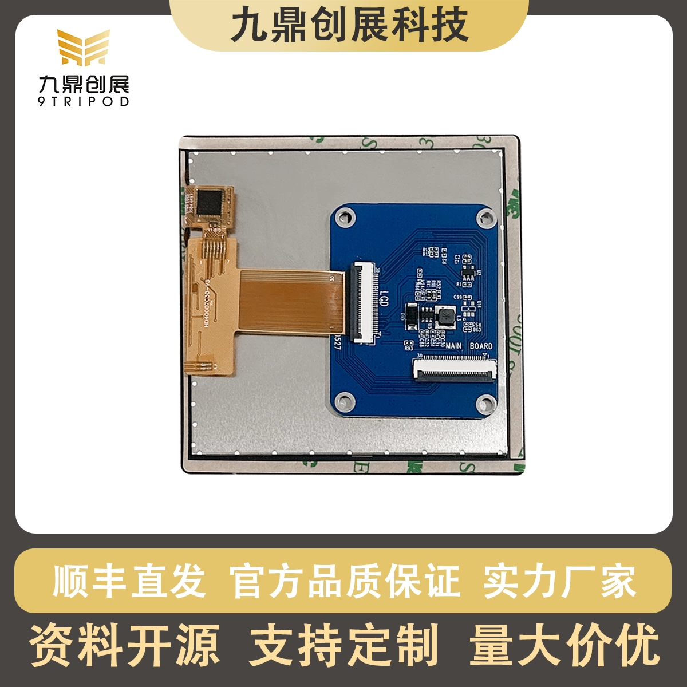

# LCD040D25MM 显示模组

## 一、产品外观

## 二、产品参数
| 类别 | 参数 |
|---- | ---- |
| 型号 | LCD040D25MM |
| 产品名称 | 7寸MIPI高清屏幕 |
| 分辨率 | 1920*1200 |
| 屏幕类型 | 电容屏（五点触摸） |
| 接线方式 | FPC |
| 工作电压 | 5V |
| 适用产品 | I3399开发板、I3566开发板、I3566开发板、I3588开发板、I3588S开发板 |

## 三、产品链接
[淘宝店铺：LCD040D25MM](https://item.taobao.com/item.htm?id=746219733223)
