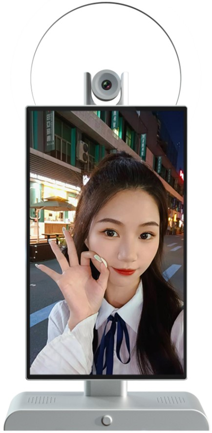
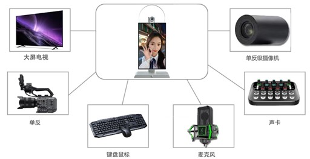
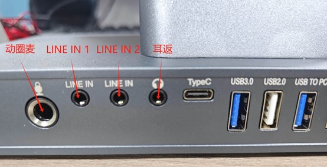
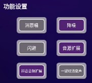

# 产品规格书

## 版本说明
| 版本号 | 日期       | 作者 | 描述     |
|--------|------------|------|----------|
| Rev.01 | 2025-03-18 | jdcz | 原始版本 |
| Rev.02 | 2025-06-18 | jdcz | V54      |

---

## 第1章 直播机简介
### 1.1 产品外观

*正面图*

*侧面图*

### 1.2 产品参数
#### 基本参数
| 项目          | 规格                                                               |
|---------------|--------------------------------------------------------------------|
| SOC           | RockChip RK3588S                                                  |
| CPU           | 八核64位(4×Cortex-A76+4×Cortex-A55) 8nm先进工艺，主频高达2.4GHz    |
| GPU           | ARM Mali-G610 MP4四核                                             |
| NPU           | 6TOPS                                                             |
| 安兔兔跑分    | 58W                                                               |
| ISP           | 集成48MP ISP with HDR&3DNR                                        |
| 内存&存储     | 8GB&128GB 或 16GB&256GB                                           |

#### 硬件参数
| 项目             | 规格                                                                 |
|------------------|----------------------------------------------------------------------|
| 型号             | G5                                                                   |
| 品牌             | 中性                                                                 |
| 工艺             | CNC工艺                                                              |
| 显示屏           | 15.6寸1920×1080显示输出                                             |
| 摄像头           | 标配索尼5000W IMX766 MIPI摄像头，支持PDAF极速对焦、手动调焦、定焦    |
| 扩展摄像头       | 可支持通过USB2.0、USB3.0、HDMI IN外扩超高清专业直播摄像头、单反相机等 |
| 声卡             | 内置麦克风，内置声卡，可用于知识分享、才艺表演、游戏直播、唱歌直播、直播带货 |
| 扩展声卡         | 可通过LINE IN、3.5mm耳机孔以及USB接口外扩领夹麦、专业娱乐唱歌声卡等   |
| 以太网           | 千兆以太网                                                           |
| 无线网络         | 2.4G/5G双频WIFI6                                                     |
| 扩展视频输出     | 1×HDMI2.1(8K@60fps或4K@120fps)                                      |
| 扩展视频输入     | 1×HDMI-IN(1080P@60fps)                                               |
| 音频             | 2×Speaker喇叭输出 1×Phone输出 1×HDMI音频输出 3×Line-In输入 1×MIC输入 |
| 触摸             | 1×10点电容触摸                                                       |
| 外置USB          | 1×USB3.0 1×USB2.0 1×USB3.0采集卡输出 1×TypeC                |
| 补光灯           | 默认不带补光灯，可选配                                               |
| 电源             | DC12V输入(DC5.5×2.1mm)                                              |

#### 系统软件
| 项目             | 规格                                                                 |
|------------------|----------------------------------------------------------------------|
| 系统             | Android 12.0                                                         |
| 国内直播平台     | 支持抖音、快手、拼多多、淘宝、小红书、微信、京东、百度视频、YY等近百种 |
| 国外直播平台     | 支持Tiktok、Facebook、youtube、instagram、twitter等                  |
| 导播台           | Guide_station.apk                                                    |

#### 其他参数
| 项目             | 规格                                                                 |
|------------------|----------------------------------------------------------------------|
| 尺寸             | 525mm×270mm                                                          |
| 重量             | 约3.4千克                                                            |
| 散热             | 内置专业散热器，极限测试温度不超过60度                                |
| 功耗             | 典型功耗：约6.6W(12V/550mA)                                          |
| 环境             | 工作温度：-10℃~40℃ 存储温度：-20℃~70℃ 存储湿度：10%~80%       |

---

## 第2章 使用指引
### 2.1 外设支持

### 2.2 系统说明
#### 2.2.1 导播台

导播台V5.0版本主界面如上图所示，导播软件界面简洁，但支持的功能较为复杂，详细功能清单如下：

| 功能需求 | 支持清单 |
| :--- | :--- |
| 摄像头预览 | 当前支持4K、5000W等多款高清摄像头预览 |
| 摄像头全屏预览 | 支持 |
| 摄像头主镜头旋转 | 支持0度、90度、180度、270度、360度 |
| 摄像头主镜像 | 支持 |
| 摄像头主镜头开关 | 支持 |
| 摄像头对焦模式 | 支持相位极速对焦、手动调焦、定焦 |
| 虚拟镜头 | 支持关闭主镜头，用背景图片填充功能 |
| 画中画 | 支持虚拟背景、镜头1、镜头2三种场景自由组合 |
| 摄像头主镜头画面放大缩小 | 支持 |
| 外置USB摄像头 | 支持 |
| 外置HDMI摄像头 | 支持 |
| 外置单反相机 | 支持，型号过多，需指定型号适配验证 |
| 外置笔记本电脑 | 支持笔记本电脑画面传输至直播间 |
| 支持国内直播平台 | 抖音、快手、拼多多、淘宝、微信、小红书、百度视频、YY、全民K歌、京东等。（如有期望支持国内其他直播平台，请联系我们） |
| 支持国外直播平台 | Tiktok、instagram、Facebook、Twitter、Youtube |
| 虚拟视频抠图 | 支持绿幕、蓝幕（优先绿幕） |
| 虚拟视频抠图区域保护 | 支持 |
| 虚拟视频背景 | 支持静态图片、动态视频；支持九鼎服务器选择、支持本地U盘拷贝、支持android\鸿蒙手机无线上传 |
| 虚拟视频前景 | 支持静态图片、动态视频；支持九鼎服务器选择、支持本地U盘拷贝、支持android\鸿蒙手机无线上传 |
| 虚拟视频文字叠加 | 支持文字叠加、文字颜色、文字描边、文字背景颜色选择 |
| 虚拟音频3.5mm4级耳机耳麦 | 支持 |
| 内置麦克风 | 支持 |
| 虚拟音频USB接口麦克风 | 支持 |
| 虚拟音频线性音乐录制 | 支持 |
| 虚拟音频麦克风音量调节 | 支持 |
| 虚拟音频第三方专业声卡 | 支持 |
| 虚拟音频5V/48V电容麦 | 支持 |
| 虚拟音频动圈麦 | 支持 |
| 虚拟音频输出音量调节 | 支持 |
| 虚拟音频输出到直播间 | 支持 |
| 虚拟音频输出到直播机外置喇叭 | 支持 |
| 虚拟音频输出到外置声卡（监听功能） | 支持 |
| 虚拟音频同时输出到直播间和喇叭 | 支持 |
| 虚拟音频同时输出到直播间和外置声卡 | 支持 |
| QQ音乐、酷狗音乐、网易云音乐等第三方音乐软件播放在线音乐、本地音乐输出到直播间、外置喇叭及外置声卡 | 支持 |
| 手机遥控 | 支持 |
| 手机屏幕投屏到直播间 | 支持 |
| 手机摄像头投屏到直播间 | 支持 |
| 手机遥控上传图片视频 | 支持 |
| 提词器 | 支持手动敲写提词器，支持从U盘导入记事本到提词器，支持AI提词器 |
| AI托管 | 支持 |
| 直播相机 | 支持无线局域网直播推流到PC端，通过PC版本直播伴侣或OBS推流软件长时间稳定可靠直播；支持通过USB接口直连到PC，将音视频画面推送到PC端OBS或直播伴侣 |
| 手游直播 | 支持手机屏幕，各种手游通过无线局域网推流到直播机直播，支持手机直播机声音混流 |
| 场景 | 支持设置场景保存，方便下次开播时随时调用 |
| 屏幕录制 | 支持定向录制直播窗口视频 |

---

## 第3章 声音部分
### 3.1 接口说明

| 接口名称 | 功能说明 |
| :--- | :--- |
| **动圈麦** | 支持接入6.5mm的有线麦克风，导播台对应打开【外置麦】开关，可调节音量。 |
| **LINE IN 1** | 支持接入3.5mm的线性乐器伴奏输入，导播台对应打开乐器开关，可调节伴奏音量。同时兼容其它3.5mm接口的声音输入。 |
| **LINE IN 2** | 支持接入3.5mm的领夹麦，导播台对应打开【领夹麦】开关，可调节音量。 |
| **耳返** | 支持有线耳机。无需设置，即插即用。支持监听动圈麦、LINE IN 1、LINE IN 2输出声音。 |
| **TypeC** | 支持接入TypeC设备，例如：声卡、领夹麦等。 |
| **USB3.0** | 支持接入USB设备，例如：U盘、鼠标、键盘等。 |
| **USB2.0** | 支持接入USB设备，例如：U盘、鼠标、键盘等。 |
| **USB TO PC** | 支持接入USB设备，例如：U盘、鼠标、键盘等。支持使用双头USB3.0数据线，开启导播台采集卡模式，支持同显、异显，实现直播画面采集。 |
| **LAN** | 网线接口，支持以太网网络。 |
| **HDMI OUT** | 支持HDMI画面输出。 |
| **HDMI IN** | 支持HDMI画面输入。 |
| **DC** | 充电接口，DC直流电，12V/5A。 |

### 3.2 声音设置

#### 3.2.1 声卡选择
默认选中G5内置声卡`G5 USB Sound Card`，当接入外置声卡、USB领夹麦、TypeC领夹麦等，会自动弹出对应的设备选项，选中即可使用外接设备。

#### 3.2.2 模式选择
- **[平板模式]**：直播机喇叭声音**打开**，麦克风声音**关闭**，不可调节麦克风音量。日常刷视频、听音乐等不使用麦克风的场景下使用。
- **[直播模式]**：直播机喇叭声音**关闭**，麦克风声音**打开**，可以调节麦克风音量。喇叭声音关闭，系防止直播机声音二次传到直播间形成回音，产生啸叫，在直播的场景下使用。

#### 3.2.3 声音设置
- **[音量]**：喇叭外放音量，长按+号，音量增大，长按-号，音量减少。建议音量调至最大后，再调小一点点。
- **[混响]**：话筒声音加入混响效果，长按+号，效果增强，长按-号，效果减弱。

#### 3.2.4 话筒设置

- **[内置麦]**：内置麦克风，打开即可使用。需要在**直播模式**下，先打开开关，才能调节音量。
- **[外置麦]**：外置麦开关，对应**动圈麦**接入的设备，如图**红色**箭头部分所示。
- **[领夹麦]**：领夹麦开关，对应**LINE IN 2**接入的设备，如图**绿色**箭头部分所示。
- **[伴奏]**：伴奏音量，选中对应伴奏设置后调节。乐器伴奏使用**LINE IN 1**接口，接入对应的3.5mm音频输入线，如图**蓝色**箭头部分所示。
- **[变声]**：变声调节至中间为正常声音，向左边调节为男性声音，向右边调节为女性声音。

#### 3.2.5 伴奏设置
- **[HDMI]**：支持HDMI声音输入，使用HDMI IN接口。机位支持HDMI输入画面显示。
- **[蓝牙]**：内置蓝牙，蓝牙设备名称：G5。可以使用手机连接，支持播放手机的音乐，当作伴奏使用。
- **[乐器]**：支持电吉他、电子琴等线性乐器输入，3.5mm音频输入线，使用LINE IN 1接口。**支持与麦克风同时输出**。

#### 3.2.6 功能设置

- **[消原声]**：播放人声音乐时，开启该功能可以将人声消弱，充当伴奏。
- **[降噪]**：内置麦声音降噪开关，开启可消除一定的环境噪音，建议默认开启。
- **[闪避]**：在播放音乐或伴奏时，麦克风说话，音乐或伴奏会自动降低音量，人声优先。
- **[音源拓展]**：该功能主要将直播机的音量，如背景视频、音效等声音，传输到直播间。当直播间发现无直播机播放的声音时，通常需要检查该按钮是否已打开，建议默认开启。
- **[抖音音源拓展]**：抖音底噪的处理方式切换开关。请勿关闭，默认打开即可。
- **[一键取消变声]**：点击一下变声自动调节至中间，恢复正常声音。点按按钮无颜色变化。

### 3.3 声音测试
#### 3.3.1 内置麦测试
使用内置麦时，测试内置麦声音是否正常。使用有线耳机，可以直接监听内置麦是否有声音。如果没有有线耳机，在直播模式下，音量旋钮调节最大音量，打开内置麦，调节音量最大。开启视频录制，对着直播机摄像头处录音10秒左右后停止录音，切换到平板模式，打开视频录制文件夹，播放刚才录制的视频，点击底部音量按钮放大音量，视频如果有声音，则内置麦声音正常。

#### 3.3.2 圆孔麦测试
使用3.5mm和6.5mm接口的麦克风时，测试麦克风声音是否正常。测试步骤与内置麦声音测试相似，但要打开正确的声音开关，参考3.2.4话筒设置。

#### 3.3.3 TypeC领夹麦测试
使用TypeC领夹麦时，测试领夹麦声音是否正常。声卡选择TypeC领夹麦声卡，模式切换直播模式，在使用TypeC领夹麦时，声音由领夹麦接管，内置麦、外置麦、领夹麦三个开关用不到，可以关闭。音量旋钮调节最大音量，开启视频录制，对着领夹麦录音10秒左右后停止录音，切换`G5 USB Sound Card` + `平板模式`，打开视频录制文件夹，播放刚才录制的视频，点击底部音量按钮放大音量，视频如果有声音，则领夹麦声音正常。

> 本文档由深圳市九鼎创展科技有限公司提供，更多产品信息请访问[淘宝店铺](https://armeasy.taobao.com)。
