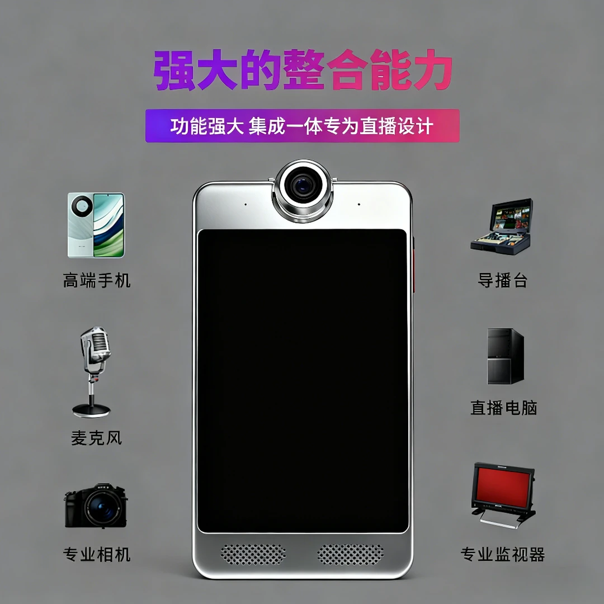
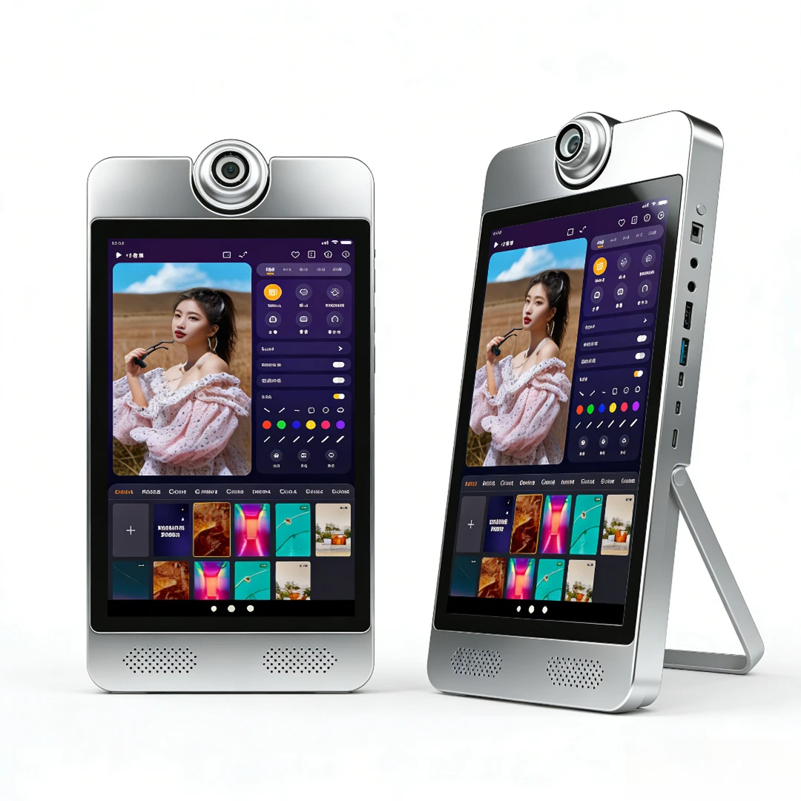
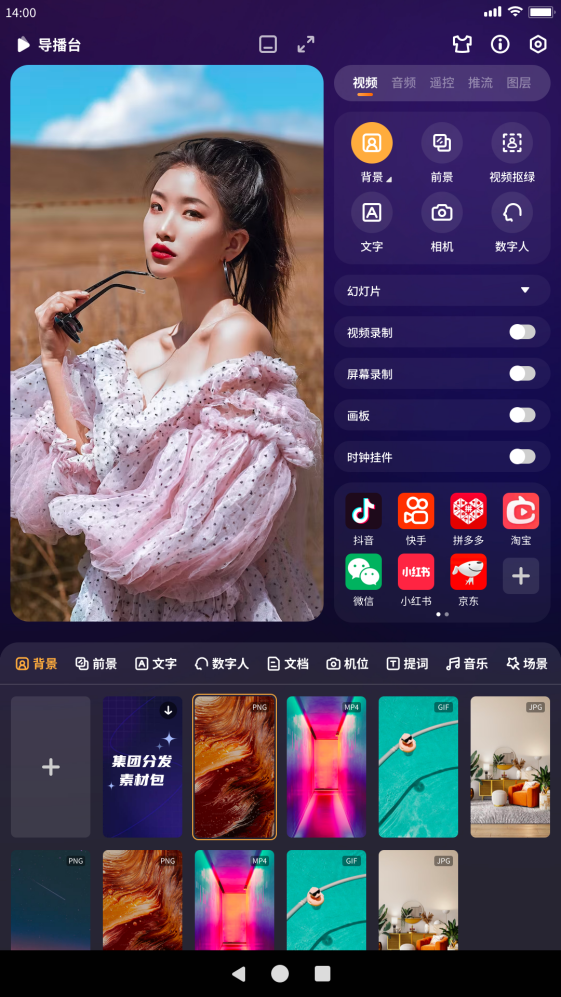
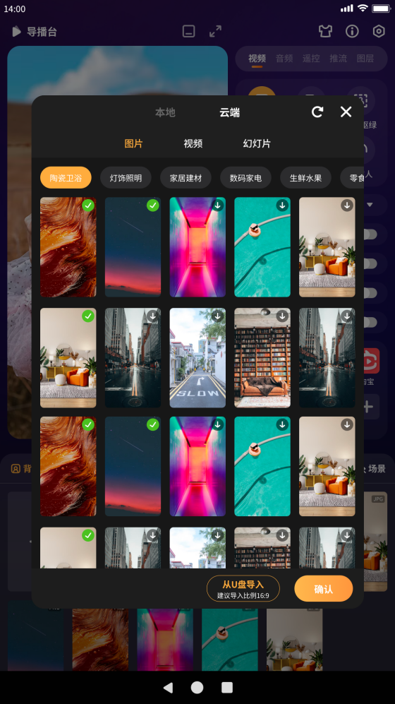

# 产品规格书

## 版本说明

| 版本号 | 日期       | 作者     | 描述     |
|--------|------------|----------|----------|
| Rev.01 | 2023-12-29 | 九影科技 | 原始版本 |

---

## 第1章 直播机简介

### 1.1 产品外观

下图展示了九影X3 10.1寸直播一体机的产品外观：

### 1.2 产品参数

#### 基本参数

| 项目            | 规格描述                                                   |
|-----------------|------------------------------------------------------------|
| SOC             | RockChip RK3588S                                           |
| CPU             | 八核64位（4×Cortex-A76 + 4×Cortex-A55），8nm先进工艺，主频高达2.4GHz |
| GPU             | ARM Mali-G610 MP4 四核                                     |
| NPU             | 6TOPS                                                      |
| 安兔兔跑分      | 57W                                                        |
| ISP             | 集成48MP ISP with HDR & 3DNR                               |
| 内存            | 8GB，可选配16GB                                            |
| 存储            | 128GB，可选配256GB                                         |

#### 硬件参数

| 项目            | 规格描述                                                   |
|-----------------|------------------------------------------------------------|
| 型号            | X3                                                      |
| 品牌            | 中性                                                       |
| 工艺            | 纯CNC工艺                                                  |
| 显示屏          | 10.1寸 1920×1200 显示输出                                  |
| 摄像头          | 标配索尼5000W IMX766 MIPI摄像头，PDAF极速对焦              |
| 扩展摄像头      | 可支持通过USB2.0、HDMI IN外扩超高清专业直播摄像头、单反相机等 |
| 声卡            | 内置麦克风，可用于知识分享，直播带货                       |
| 扩展声卡        | 可通过LINE IN，3.5mm耳机孔以及USB接口外扩领夹麦，专业娱乐唱歌声卡等 |
| 无线网络        | 2.4G/5G双频 WIFI6                                          |
| 扩展视频输出    | 1× HDMI2.1（8K@60fps 或 4K@120fps）                       |
| 扩展视频输入    | 1× HDMI-IN（1080P@60fps）                                  |
| 音频            | 2× Speaker喇叭输出、1× Phone输出、1× HDMI音频输出、1× Line-In输入、1× MIC输入 |
| 触摸            | 1× 10点电容触摸                                            |
| 外置USB         | 2× USB2.0、1× TypeC                                        |
| 电源            | DC12V输入（DC5.5×2.1mm）                                   |

#### 系统软件

| 项目            | 规格描述                                                   |
|-----------------|------------------------------------------------------------|
| 系统            | Android 12.0                                               |
| 国内直播平台    | 支持抖音、快手、拼多多、淘宝、小红书、微信、京东、百度视频、YY等近百种 |
| 国外直播平台    | 支持Tiktok、Facebook、Youtube、Instagram、Twitter等        |
| 导播台          | Guide_station.apk                                          |

#### 其他参数

| 项目            | 规格描述                                                   |
|-----------------|------------------------------------------------------------|
| 尺寸            | 30cm × 16cm × 2.5cm                                       |
| 重量            | 约3千克                                                    |
| 散热            | 内置专业散热器，极限测试温度不超过60度                     |
| 功耗            | 典型功耗：约6.6W（12V/550mA）                              |
| 环境            | 工作温度：-10℃ ~ 40℃ 存储温度：-20℃ ~ 70℃ 存储湿度：10% ~ 80% |

---

## 第2章 使用指引

### 2.1 外设支持

下图展示了设备的外设接口说明：

### 2.2 系统说明

#### 导播台

导播台操作界面如下所示：

导播台V4.0版本主界面如上图所示，导播软件界面简洁，但支持的功能比较复杂，详细功能清单如下表所示：

#### 导播软件V4.0功能清单

| 功能需求 | 支持清单 |
|----------|----------|
| 摄像头预览 | 当前支持4K、5000W等多款高清摄像头预览 |
| 摄像头全屏预览 | 支持 |
| 摄像头主镜头旋转 | 支持0度、90度、180度、270度、360度 |
| 摄像头主镜像镜像 | 支持 |
| 摄像头主镜头开关 | 支持 |
| 虚拟镜头 | 支持关闭主镜头，用背景图片填充功能 |
| 画中画 | 支持虚拟背景、镜头1、镜头2三种场景自由组合 |
| 摄像头主镜头画面放大缩小 | 支持 |
| 外置USB摄像头 | 支持 |
| 外置HDMI摄像头 | 支持 |
| 外置单反相机 | 支持，型号过多，需指定型号适配验证 |
| 外置笔记本电脑 | 支持笔记本电脑画面传输至直播间 |
| 支持国内直播平台 | 抖音、快手、拼多多、淘宝、微信、小红书、百度视频、YY、全民K歌、京东等。（如有期望支持国内其他直播平台，请联系我们） |
| 支持国外直播平台 | Tiktok、Instagram、Facebook、Twitter、Youtube |
| 虚拟视频抠图 | 支持绿幕、蓝幕（优先绿幕） |
| 虚拟视频抠图区域保护 | 支持 |
| 虚拟视频背景 | 支持静态图片、动态视频；支持九鼎服务器选择、支持本地U盘拷贝、支持Android/鸿蒙手机无线上传 |
| 虚拟视频前景 | 支持静态图片、动态视频；支持九鼎服务器选择、支持本地U盘拷贝、支持Android/鸿蒙手机无线上传 |
| 虚拟视频文字叠加 | 支持文字叠加、文字颜色、文字描边、文字背景颜色选择 |
| 虚拟音频3.5mm 4级耳机耳麦 | 支持 |
| 内置麦克风 | 支持 |
| 虚拟音频USB接口麦克风 | 支持 |
| 虚拟音频线性音乐录制 | 支持 |
| 虚拟音频麦克风音量调节 | 支持 |
| 虚拟音频第三方专业声卡 | 支持 |
| 虚拟音频5V/48V电容麦 | 支持 |
| 虚拟音频动圈麦 | 支持 |
| 虚拟音频输出音量调节 | 支持 |
| 虚拟音频输出到直播间 | 支持 |
| 虚拟音频输出到直播机外置喇叭 | 支持 |
| 虚拟音频输出到外置声卡（监听功能） | 支持 |
| 虚拟音频同时输出到直播间和喇叭 | 支持 |
| 虚拟音频同时输出到直播间和外置声卡 | 支持 |
| QQ音乐、酷狗音乐、网易云音乐等第三方音乐软件播放在线音乐、本地音乐输出到直播间、外置喇叭及外置声卡 | 支持 |
| 手机遥控 | 支持 |
| 手机屏幕投屏到直播间 | 支持 |
| 手机摄像头投屏到直播间 | 支持 |
| 手机遥控上传图片视频 | 支持 |
| 提词器 | 支持手动敲写提词器，支持从U盘导入记事本到提词器，支持AI提词器 |
| AI托管 | 支持 |
| 场景 | 支持设置场景保存，方便下次开播时随时调用 |
| 屏幕录制 | 支持定向录制直播窗口视频 |

> 本文档由深圳市九鼎创展科技有限公司提供，更多产品信息请访问[淘宝店铺](https://armeasy.taobao.com)。
