# 接口说明

本页按主板外部接口整理说明，不重复核心板 200PIN 引脚表。

## 电源开关和插座

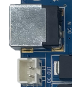

I3399 主板采用 12V 直流电源供电，DC 插座为 12V 直流电源输入。左下角白色 PH 座为 12V 直流电源输出座，可用于外设取电。

## 调试串口

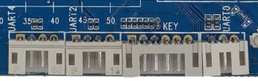

I3399 默认使用 UART2 作为调试串口，通过 4PIN PH 座引出。UART0 和 UART4 也通过 PH 座引出，用户可根据软件配置调整调试串口。

## HDMI 接口

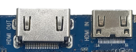

I3399 预留标准 Type-A HDMI 接口和 mini Type-C 型 HDMI 接口，其中 Type-A 为 HDMI OUT，Type-C 为 HDMI IN。

## Camera 接口

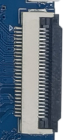

主板右下角 FPC 座为 26PIN 摄像头接口，支持 OV 系列摄像头。更换不同型号摄像头时，需要按摄像头规格调整供电和驱动配置。

## 以太网接口

I3399 支持千兆有线以太网，板载 YT8521，可用于有线联网和高速数据传输。

## 音频接口

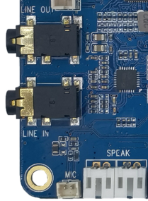

主板提供耳机输出、LINE IN、双路 2W 喇叭输出和 MIC 输入。耳机输出也可送到功放输入端使用。

## TF 卡槽

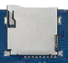

外置 TF 卡槽可用于升级、存放多媒体文件或作为外部存储。

## TYPE-C 接口

TYPE-C 接口兼容 USB OTG，可用于程序烧写和数据同步，同时也具备高速传输和扩展显示能力。

## USB HOST 接口

RK3399 提供多路 USB HOST。I3399 上引出 USB3.0、USB HOST2.0 以及多路 PH 座 HOST2.0 接口，便于外接鼠标、键盘、U 盘和其他 USB 外设。

## USB HOST2.0 扩展

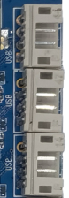

最右侧白色 PH 座为多路 USB HOST2.0 扩展接口，适合接入内部 USB 模块或转接线。

## 开关机、复位、独立按键

I3399 背面预留复位和烧录相关贴片按键，其他开关机和独立按键信号通过 6PIN PH 座引出。

## LCD / DSI / EDP 接口

主板预留 30PIN DSI 接口和 20PIN 插针 DSI 接口，可按屏幕硬件形态选择。主板还预留 EDP 接口，可驱动高分辨率屏幕。

## GPIO 扩展接口

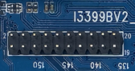

GPIO 扩展接口可用于连接外部控制、电平检测或低速外设。实际功能以设备树和复用配置为准。

## 后备电池座

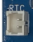

后备电池座用于连接 RTC 备份电池，保证断电后系统时间不丢失。

## 蜂鸣器

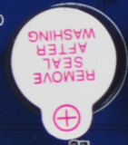

蜂鸣器为有源蜂鸣器，通过三极管和 PWM 控制，可用于 PWM 测试或声音提示。

## 红外接收头

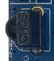

红外一体化接收头采用 HS0038B，可用于遥控器输入和机顶盒类应用。

## SIM 卡接口

SIM 卡槽配合 PCIE 4G 通讯模块使用。使用 4G 网络时需插入对应运营商 SIM 卡。

## PCIE 接口

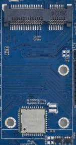

板载 PCIE 座可用于连接 PCIE 接口 4G 模块或其他 PCIE 扩展设备。

## WIFI/BT 模块

I3399 标配 2.4G/5G 双频 SDIO 接口 WIFI/BT 模块。

