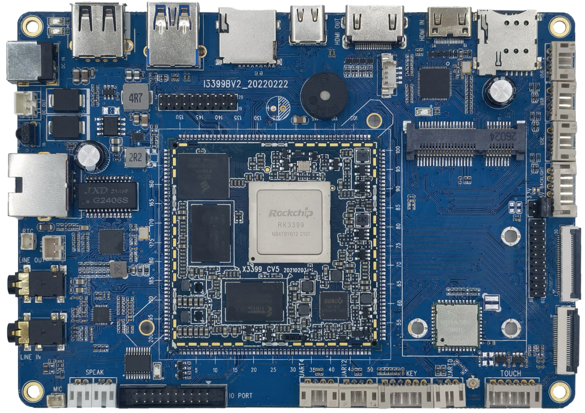
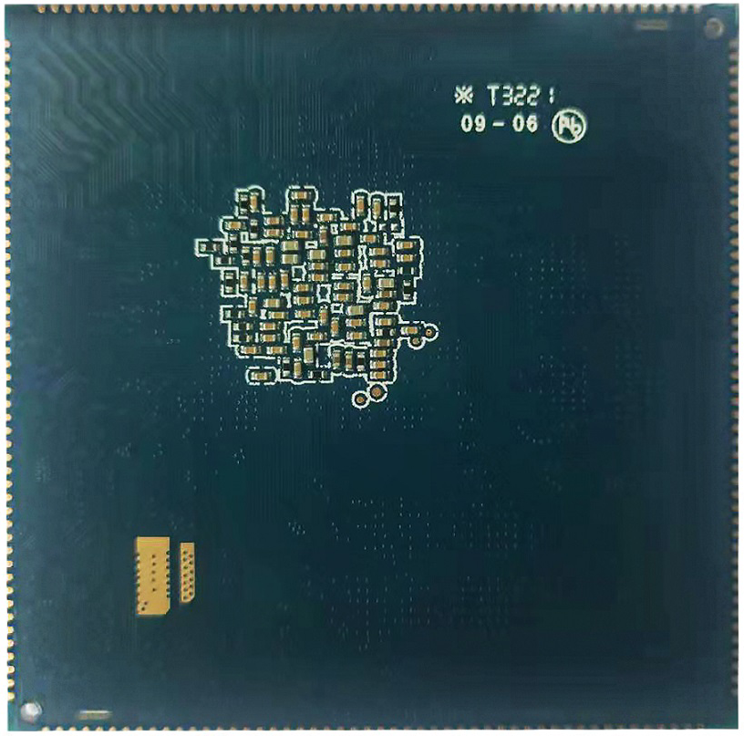

# 产品介绍

I3399 主板基于瑞芯微 RK3399 平台，由 X3399CV5 邮票孔核心板和底板组成。RK3399 采用双 Cortex-A72 大核 + 四 Cortex-A53 小核结构，GPU 为 Mali-T860，适用于工控、媒体、安防、车载、金融、消费电子、显示控制和教学仪器等场景。

I3399 主板通过底板将 HDMI、Camera、千兆以太网、USB、LCD/DSI/EDP、音频、按键、PCIE、SIM、WIFI/BT 等接口引出，适合系统移植、驱动调试、应用验证和产品集成。主板还默认增加一组单片机监控逻辑，用于处理器死机后的断电重启，适合长期运行场景。

## 功能特性

- 内核：ARM Cortex-A53 四核 + Cortex-A72 双核；
- 主频：1.4GHz*4 + 1.8GHz*2；
- 内存：2GB/4GB LPDDR4；
- Flash：标配 16GB eMMC；
- 4 路 USB HOST2.0 接口；
- 1 路 USB HOST3.0 接口；
- 1 路 TYPE-C 接口，兼容 OTG 功能；
- 3 路 TTL 串口，UART2 默认用于 debug；
- 1 路 TF 卡接口；
- 复位、开关机以及独立按键信号通过 6PIN PH 座引出；
- 双声道外置扬声器、MIC 输入、耳机输出、LINE IN；
- 支持 HDMI OUT、HDMI IN、DSI/EDP 显示接口；
- 板载 6221A-SRC 双频 WIFI/BT；
- 支持千兆有线以太网、MIPI 摄像头、PCIE 模块、红外一体化接收头。

## 核心板特性

- 核心板尺寸 55mm*55mm，引出高达 200PIN 管脚。
- 使用 RK808 PMU，支持动态调频和稳定电源管理。
- 支持多品牌、多容量 eMMC，默认东芝 16GB eMMC。
- 双通道 LPDDR4，默认 2GB，可定制 4GB。
- 支持电源休眠唤醒。
- 支持 Android 6.0/7.0、Linux、Debian9 等操作系统。
- 产品经过高低温、反复重启、安卓稳定性、安兔兔等可靠性测试。

## 产品外观

## 核心板外观

## 核心板结构图

## 系统配置

| CPU | RK3399 |
| --- | --- |
| 主频 | 四核A53(1.4GHz) + 双核A72(1.8GHz) |
| 内存 | 2GB或4GB，最大4GB |
| 存储器 | 4GB/8GB/16GB emmc可选，标配16GB |
| 电源IC | 使用RT808，支持动态调频等 |

## 接口参数

| LCD接口 | 同时支持MIPI、EDP、HDMI接口输出 |
| --- | --- |
| Touch接口 | 电容触摸 |
| 音频接口 | AC97/IIS接口，支持录放音 |
| SD卡接口 | 2路SDIO输出通道 |
| emmc接口 | 板载emmc接口，管脚不另外引出 |
| 以太网接口 | 支持千兆以太网 |
| USB HOST2.0接口 | 2路HOST2.0 |
| USB HOST3.0接口 | 2路TYPE3.0 |
| UART接口 | 5路串口，支持带流控串口 |
| PWM接口 | 4路PWM输出 |
| IIC接口 | 7路IIC输出 |
| SPI接口 | 1路SPI输出 |
| ADC接口 | 1路ADC输出 |
| Camera接口 | 1路BT656/BT601，1路MIPI输出 |
| HDMI接口 | 高清音视频输出接口，音视频同步输出 |

## 电气特性

| 主3.3V输入电压 | 3.3V/4.3A(推荐使用3.3V/5A输入) |
| --- | --- |
| 副3.3V输入电压 | 3.3V/300mA(不能和主3.3V混用) |
| 输出电压 | 1.8V(可用于底板供电，休眠后为0V) |
| 工作温度 | 0~70度 |
| 储存温度 | -10~40度 |

## 结构参数

| 外观 | 邮票孔方式 |
| --- | --- |
| 核心板尺寸 | 55mm*55mm*3mm |
| 引脚间距 | 1.0mm |
| 引脚焊盘尺寸 | 0.5mm*1.8mm，封装以中心对称 |
| 引脚数量 | 200PIN |
| 板层 | 8层 |
| 翘曲度 | 小于0.5% |
| 开窗区域 | 上图中红色部分为推荐底板封装开窗区域 |

