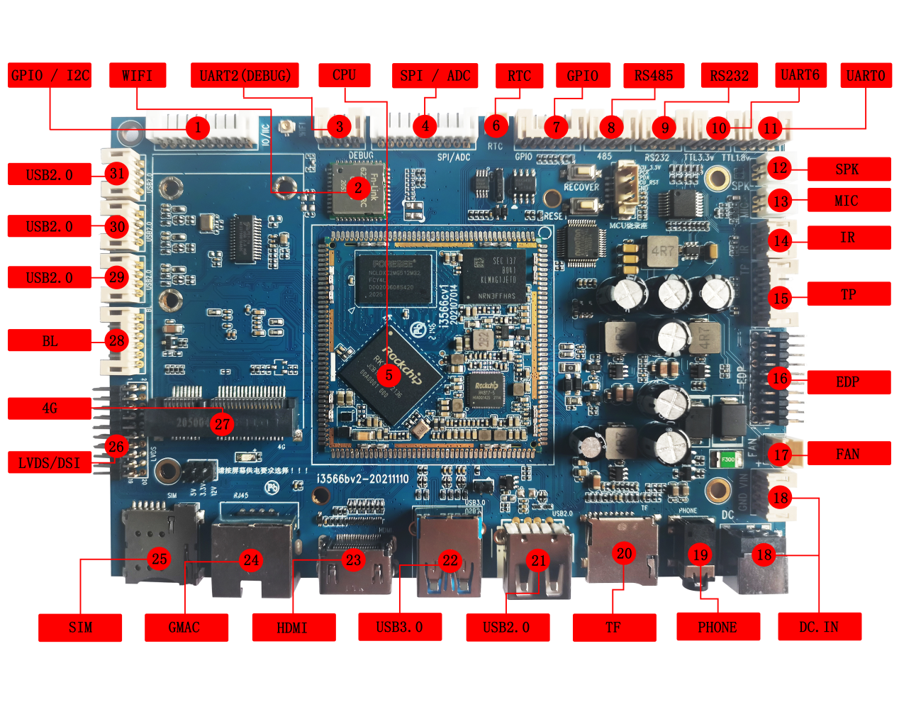

# 硬件资源

本页整理 I3566 主板接口位置和硬件资源。接口使用说明见[接口说明](./i3566-interface-details)，核心板完整 172PIN 定义见[核心板引脚定义](./i3566-pin-definition)，板端 PH 座和扩展接口定义见[扩展接口定义](./i3566-expansion-connectors)。

## 硬件接口介绍

| 标号 | 名称 | 说明 |
| --- | --- | --- |
| 【1】 | GPIO/I2C | GPIO/I2C扩展接口 |
| 【2】 | Wi-Fi | 6221A-SRC双频Wi-Fi模块 |
| 【3】 | UART2 | UART2，TTL电平接口，默认为调试串口 |
| 【4】 | CIF | 并口摄像头接口 |
| 【5】 | RK3566核心模块 | i3566核心板 |
| 【6】 | RTC | 时钟保持电池座，3V供电 |
| 【7】 | GPIO | GPIO扩展接口 |
| 【8】 | RS485 | RS485接口 |
| 【9】 | RS232 | RS232接口 |
| 【10】 | UART6 | 3.3V TTL电平，UART6接口 |
| 【11】 | UART0 | 1.8V TTL电平，UART0接口 |
| 【12】 | 喇叭接口 | 外置双声道扬声器 |
| 【13】 | 麦克风接口 | 外接麦克风，拾音接口 |
| 【14】 | 红外接收头 | HS0038红外一体化接收头 |
| 【15】 | 触摸屏接口 | 6PIN PH座，外接电容触摸屏 |
| 【16】 | 显示接口 | EDP接口 |
| 【17】 | FAN | 散热器风扇电源接口 |
| 【18】 | DC插座 | 12V直流电源输入接口，DC座或4PIN PH座 |
| 【19】 | 耳机座 | 耳机输出 |
| 【20】 | TF卡 | TF卡座 |
| 【21】 | HOST 2.0 | USB HOST 2.0接口，复用OTG下载接口 |
| 【22】 | USB 3.0 | USB HOST 3.0接口 |
| 【23】 | HDMI | HDMI输出接口 |
| 【24】 | GMAC | 千兆以太网接口 |
| 【25】 | SIM卡 | 4G模块SIM卡接口 |
| 【26】 | 显示接口 | DSI0或LVDS接口 |
| 【27】 | 4G wireless | 接4G无线模块 |
| 【28】 | 屏背光接口 | 驱动大屏背光PH座 |
| 【29】 | HOST 2.0 | USB HOST 2.0接口，通过PH座引出 |
| 【30】 | HOST 2.0 | USB HOST 2.0接口，通过PH座引出 |
| 【31】 | HOST 2.0 | USB HOST 2.0接口，通过PH座引出 |

