# 接口说明

## 电源开关和插座

I3566 采用 12V 直流电源供电，DC 座和右侧 4PIN PH 座电气连接相同，任选其中一个供电即可。

## 调试串口

开发板默认使用 UART2 作为调试串口，用户可通过修改程序调整调试串口。

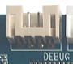

## HDMI 接口

主板采用标准 Type-A HDMI 接口，配合 HDMI 延长线，可将音视频信号输出到支持 HDMI 2.0 的电视机、显示器等终端。

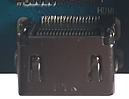

## 以太网接口

I3566 支持 1 路千兆有线以太网接口，板载 YT8521SC，可通过有线以太网接入网络。

## 音频接口

主板支持耳机输出、外置单路 2W 扬声器输出和麦克风输入。耳机接口也可接入功放输入，用于将主板音源送入外部音响系统。

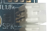

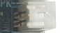

## TF 卡槽

主板引出外置 TF 卡接口，可用于 TF 卡升级或存放多媒体文件。

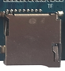

## 独立按键

I3566 有 2 个按键，包括一个独立按键和一个复位键。独立按键通过 ADC 采样获取键值，同时用作强制升级按钮。

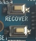

| 开关 | 功能 |
| --- | --- |
| VOL+ | 音量加键（升级用） |
| RESET | 复位键 |

## OTG 接口

I3566 的 OTG 接口通过标准 Type-A USB 座引出，可用于程序下载，也可作为 USB HOST 外接通用 USB 设备。左上脚 2PIN 插针通过跳线帽短接时为 HOST 功能，断开时为 OTG 功能。

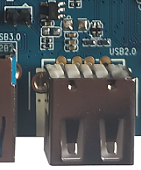

## HOST 2.0 接口

RK3566 自带两路 HOST 2.0，其中一路经过 HUB 扩展为四路 HOST 2.0，另一路 I3566 核心板未引出。扩展出的四路中，三路通过 PH 座引出，另一路预留给 4G PCIe 座。

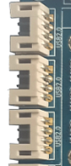

## HOST 3.0 接口

RK3566 自带 1 路 HOST 3.0，通过标准 HOST 3.0 座引出。

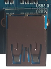

## 开机、复位和 Recovery

I3566 主板没有预留开机按钮，默认为上电开机。系统运行时轻按 Reset 键可硬复位。音量加按键在烧录时用作 Recovery 键，刷机时需要按下该键进入 Recovery 模式。

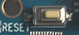

## LCD、背光和触摸接口

I3566 支持 DSI、LVDS、EDP 等显示接口。DSI0/LVDS 通过程序选择输出，EDP 用于连接 EDP 屏。背光接口可通过跳线帽选择 3.3V、5V 或 12V 背光供电。

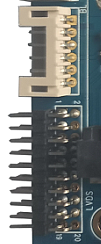

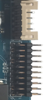

## 后备电池和红外

后备电池用于保证断电后 RTC 继续工作，默认 3V 供电。红外一体化接收头接口预留给用户按需求扩展。

## Wi-Fi / Bluetooth 模块

I3566 标配 2.4G / 5G 双频 Wi-Fi 的 SDIO 接口 Wi-Fi / BT 模块，默认型号为 6221A-SRC，同时兼容 AP6398S、AP6375S 以及欧飞信双频 Wi-Fi 模组。

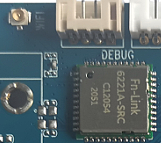

## 串口

RK3566 自带 10 路串口。I3566 默认通过 PH 座预留 2 路 TTL 串口，分别对应 UART6 和 UART0；另有调试串口 UART2；并通过串口扩展 RS485 和 RS232，分别对应 UART9 和 UART5。

## 预留 GPIO 接口

主板通过 3 个 PH 座预留 GPIO 接口，用于 GPIO 扩展。

## 风扇供电接口

主板预留风扇电源控制接口，用户在必要时可使用；多数场景下 RK3566 不需要主动散热。

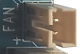
