# 接口说明

本章节整理主板硬件手册中的接口说明，去掉页眉、页脚、目录、版权和其他产品介绍等重复内容，并补充手册中的接口示意图片。

## 电源开关和插座

i3588 采用12V 直流电源供电，图中插座为12V 直流电源输入插座。

## 调试串口

主板默认使用UART2 作为调试串口，用户可以通过修改程序调节调试串口。

## HDMI 接口

主板采用标准TypeA 型HDMI 接口，默认支持2 路HDMI OUT 及1 路HDMI IN。上图中，中间为HDMI IN 座，两侧均为HDMI OUT 接口。

## camera 接口

I3588 有四个用于外接摄像头的FPC 座，其中两个为26PIN 接口，两个为30PIN 接口。26PIN 的FPC 座可外接4LANE 的单个摄像头，30PIN 的FPC 座除可外接4LANE 的单个摄像头外，还可以外接两个2LANE 的摄像头。以上四个FPC 座，可同时驱动六路CSI 摄像头。

## 以太网接口

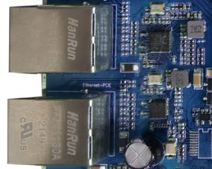

i3588 主板支持两路千兆有线以太网接口，其中一路采用RGMII 接口的RTL8211F-CG，另一路采用PCIE 接口的RTL8111HS，用户可以通过有线以太网上网，体验极速网络。

## 耳机接口

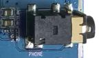

将耳机接入该接口，可以实现耳机输出。当然也可以直接通过该接口送到功放输入，如家庭影院的音频输入口，实现将主板的音源信号通过家庭影院展现出来。

## LINE IN 接口

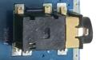

I3588 主板预留了一路LINE IN 接口，该接口有别于MIC 输入，可实现音频线性录制。

## 喇叭接口

主板直接支持单路0.5W 扬声器输出，将喇叭接到上图接口，可实扬声器输出。

## 录音接口

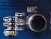

主板支持录音输入。耳麦已经直接载载到主板上，无须通过外置的耳麦输入了。

## TF 卡槽

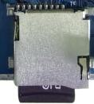

主板引出一个外置TF 卡，可以通过该通道进行TF 卡升级，或是存放一些多媒体文件。

## 独立按键

i3588 共有5 个按键，其中包括2 个独立的按键，一个强制升级键，一个PWRKEY 键和一个复位键。独立按键通过ADC 采样的方式获取键值。在原理图中，对应关系如下：开关功能VOL+(recovery)音量加键VOL-音量减键BOOT强制升级键PWRKEY电源键RESET复位键

| 开关 | 功能 |
|---|---|
| VOL+(recovery) | 音量加键 |
| VOL- | 音量减键 |
| BOOT | 强制升级键 |
| PWRKEY | 电源键 |
| RESET | 复位键 |

## TypeC 接口

RK3588 默认支持两路TypeC，其中一路通过TypeC 接口引出，可用于程序下载，或通过TypeC 接口扩展其他通用接口等。另一路TypeC 通过HOST3.0 接口引出。

## HOST2.0 接口

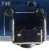

RK3588 自带两路HOST2.0 接口，主板通过两个HOST2.0 座子引出。

## 开机按钮

接上外部电源适配器后，长按POWRKEY 键开机。进入android 系统后，轻触POWRKEY键休眠，再次按POWRKEY 键实现唤醒。长按POWRKEY 键实现出现关机界面，按照屏幕提示关机。

## 复位按钮

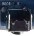

在系统运行时，轻按RESET 键主板重启，实现硬复位的功能。

## boot 按钮

RK3588 的强制升级方式相比以前的RK3288，RK3399 等有很大的改善。在maskrom模式，或是程序下载错误，导致主板变砖后，可通过按住boot 按钮强制升级。它有别于recovery 按钮。

## Recovery 按钮

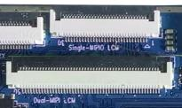

音量加按键在烧录时被用作Recovery 键，刷机时需要按下该键进入recovery 模式。

## LCD 接口

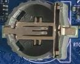

RK3588 支持单双路DSI、EDP 等显示接口，图中上侧为单路DSI 显示接口，下侧为双路DSI 显示接口。

## 后备电池

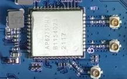

后备电池用于保证断电后RTC 仍然能够工作，确保系统时间不丢失。I3588 核心板自带有外置RTC 芯片，工作电流低于0.6uA 以下。

## WIFI 蓝牙模块

I3588 主板标配具有2.4G 和5G 双频WIFI6 的高速PCIE 接口WIFI/BT 模块。

## 串口

RK3588 自带10 路串口，考虑到串口复用情况，主板默认通过1.25 间距4PIN 贴片座预留3 路TTL 电平串口，分别对应UART2，UART6 以及UART7，可用于外接串口设备。其中UART2 默认为调试串口，如下图所示。

## PCIE 接口

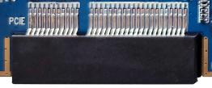

RK3588 相比RK3288，多了PCIE 接口总线，主板通过标准的PCIE3.0 接口座预留，用户可外接标准的PCIE 设备扩展。

## SATA 接口

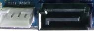

上图中左侧为SATA 设备供电接口，右侧为标准的SATA 座。

