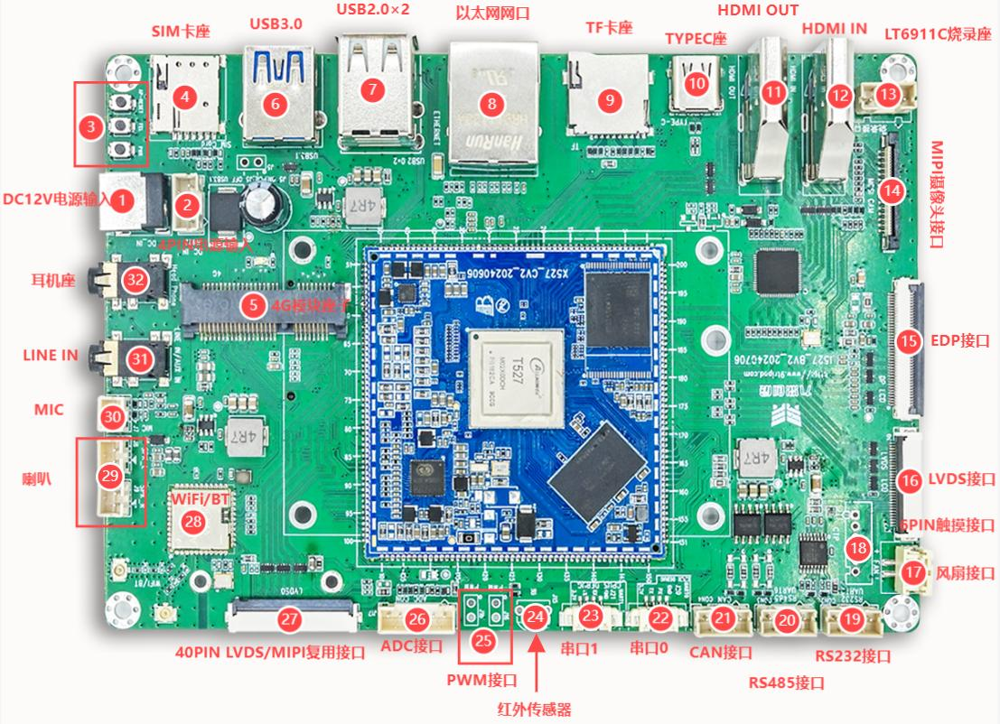
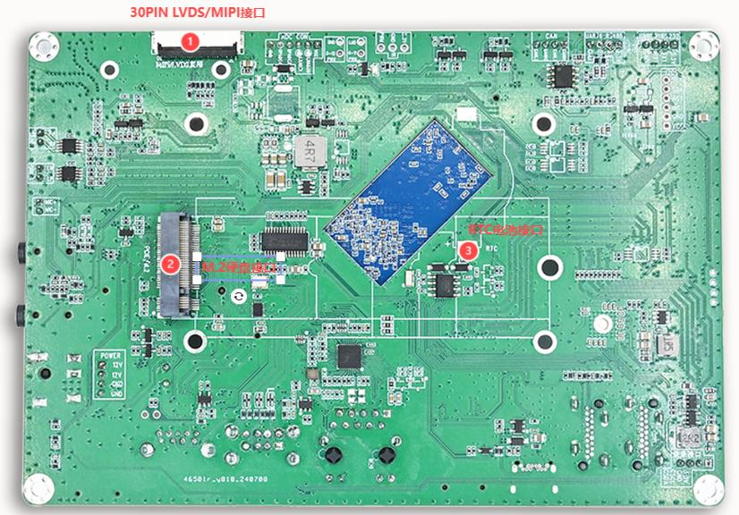

# 硬件资源

## 开发板规格

| 项目 | 规格 |
|---|---|
| 开发板型号 | I527BV3 |
| 处理器 | 全志 T527/A527 系列，Arm Cortex-A55 |
| 主频 | 最高约 2.0 GHz，具体取决于芯片型号和软件配置 |
| 内存 | 2 GB / 4 GB LPDDR4X |
| eMMC | 4 GB / 8 GB / 16 GB / 32 GB / 64 GB 等配置 |
| PMIC | AXP717B |
| 输入电源 | DC 12 V，建议 3 A |
| 尺寸 | 150 mm × 102 mm × 1.6 mm |
| 工作温度 | 取决于核心板和整机 BOM，可选工业级或商业级器件 |

## 接口资源

| 类别 | 资源 |
|---|---|
| 显示 | HDMI OUT ×1、eDP ×1、LVDS ×2、MIPI DSI（与部分 LVDS 通道复用） |
| 视频输入 | HDMI IN ×1，经 LT6911C 转为 MIPI CSI |
| 摄像头 | 4-Lane MIPI CSI ×1 |
| 触摸 | 6 PIN I2C 电容触摸接口，另在显示连接器中引出触摸信号 |
| 网络 | 千兆以太网 ×1；PCIe 4G/SIM 扩展 |
| USB | USB 3.0 Host ×1、USB 2.0 Host ×2、Type-C OTG/烧录 ×1 |
| 存储 | 板载 eMMC、TF 卡、M.2 扩展 |
| 通信 | CAN ×2、RS485 ×1、RS232 ×1、UART 调试口 ×2 |
| 音频 | 双路 0.5 W 喇叭、MIC、耳机、LINE IN |
| 其他 | PWM、ADC、红外、RTC 电池、12 V 风扇 |
| 无线 | AW869A，双频 Wi-Fi 6、Bluetooth 5.2 |

## 正反面接口分布

接口编号和详细定义见[接口详解](./i527-interface-details.md)。
