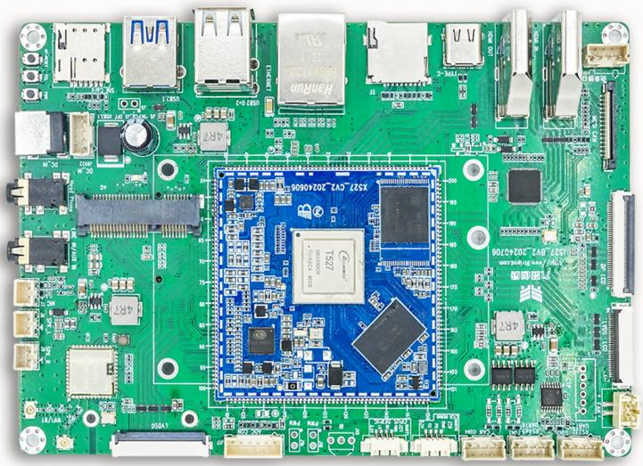

# I527BV3 开发板

I527BV3 是基于全志 T527/A527 系列处理器的开发板，板载 X527CV2 核心板，面向 AIoT、工业控制、商业显示、视频输入输出和边缘计算应用。文档包含硬件接口、核心板引脚、Android 与 Linux 编译烧录及常用调试方法。

## 文档导航

| 分类 | 文档 |
|---|---|
| 硬件 | [产品介绍](./i527-product-introduction.md) · [硬件资源](./i527-hardware-resources.md) · [接口详解](./i527-interface-details.md) |
| 设计 | [核心板引脚定义](./i527-pin-definition.md) · [硬件设计](./i527-hardware-design.md) · [配置清单](./i527-configuration-list.md) |
| Android | [编译与烧录](./i527-android-build-flash.md) · [用户指南](./i527-android-user-guide.md) · [测试与驱动](./i527-android-test-driver.md) |
| Linux | [编译与烧录](./i527-linux-build-flash.md) · [应用示例](./i527-linux-examples.md) · [Linux/Qt 文件系统](./i527-linux-qt-filesystem.md) |

## 快速信息

- 源码板型名称：`i527bv3`
- 处理器：T527/T527N/A527 系列，八核 Arm Cortex-A55
- 核心板：X527CV2，200 PIN 邮票孔，55 mm × 55 mm
- 开发板：150 mm × 102 mm × 1.6 mm
- 主电源：12 V DC，建议 3 A
- 内存：2 GB / 4 GB LPDDR4X
- 存储：板载 eMMC、TF 卡、M.2 扩展接口
- 显示：HDMI OUT、HDMI IN、eDP、LVDS、MIPI DSI
- 系统：Android 13/14、Linux，以实际 SDK 发布包为准
