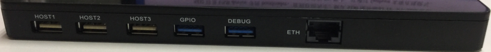
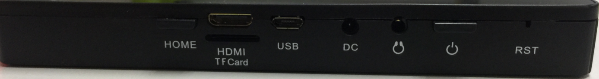

# 硬件资源

本页整理 i6818 开发板硬件接口位置和接口功能。完整核心板与扩展口引脚表见[引脚定义](./i6818-pin-definition)，各接口使用说明见[接口说明](./i6818-interface-details)。

## 硬件接口介绍

| 标号 | 名称 | 说明 |
| --- | --- | --- |
| 【1】 | 电池存放区域 | 开发板装成成品后，该区域存放锂电池 |
| 【2】 | Wi-Fi/BT | RT8723 Wi-Fi蓝牙模块 |
| 【3】 | USB HOST 2.0 | USB HOST 2.0接口 |
| 【4】 | USB HOST 2.0 | USB HOST 2.0接口 |
| 【5】 | USB HOST 2.0 | USB HOST 2.0接口 |
| 【6】 | GPIO扩展口 | 通过USB HOST 3.0座子外扩GPIO 接口 |
| 【7】 | GPIO扩展口 | 通过USB 3.0座子外扩GPIO，调试串口即从这里引出 |
| 【8】 | 红外接收头 | 红外接收头接口，默认空焊 |
| 【9】 | 千兆以太网接口 | 有线以太网接口 |
| 【10】 | 摄像头 | 500W像素MIPI 摄像头 |
| 【11】 | 触摸屏接口 | 电容触摸屏接口 |
| 【12】 | HDMI接口 | mini HDMI接口 |
| 【13】 | TF 卡座 | TF 卡接口座 |
| 【14】 | OTG座 | 程序烧录，电脑连接OTG接口 |
| 【15】 | 核心板 | 板对板核心板，支持i4418cv3，i6818cv3 |
| 【16】 | 电源座 | 5V细头DC 座 |
| 【17】 | 耳机座 | 耳机输出接口 |
| 【18】 | MIC | 耳麦输入 |
| 【19】 | SPEAKER | 扬声器输出接口 |
| 【20】 | UART | 调试串口，默认为TTL电平 |
| 【21】 | SPEAKER | 扬声器输出接口 |
| 【22】 | BATTERY | 单节锂电池接口 |
| 【23】 | LCD | 液晶屏接口 |

## 顶部接口

顶部自左向右依次为三个 HOST 2.0 座、两个 HOST 3.0 外观的 GPIO 扩展座以及以太网座。HOST 2.0 用于外接鼠标、键盘、U 盘等 USB 设备。HOST 3.0 外观座并不是 USB 3.0 接口，而是通过该座子外扩 GPIO，可引出多路 UART、I2C、GPIO、PWM 等。DEBUG 口可通过串口调试板查看打印信息。以太网接口用于外接网线，可支持千兆网。

## 侧面接口

侧面留有 HOME 和开关机两个物理按键，并引出 HDMI 座、TF 卡座、USB OTG 座、5V 直流电源座、耳机座和复位孔。
