# 接口说明

## 电源开关和插座

ibox3568 采用 12V 直流电源供电，图中插座为 12V 直流电源输入插座。

## 调试串口

ibox3568 默认使用 UART2 作为调试串口，用户可通过修改程序调整调试串口。

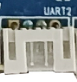

## HDMI 接口

ibox3568 预留两个 Mini HDMI 接口，左侧为 HDMI OUT，右侧为 HDMI IN。HDMI IN 电路支持将输入音源通过喇叭座回放。

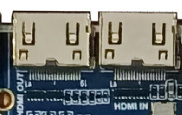

## Camera 接口

该接口为通用 30PIN 摄像头接口，支持 OV 系列摄像头，可减少 Camera 转接板使用。针对不同型号摄像头，只需按摄像头规格调整输出电压。

## CAN 接口

主板右下角提供一个 3PIN PH 座，用于外接 CAN 总线设备。

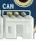

## 以太网接口

ibox3568 支持两路千兆有线以太网，网口芯片采用裕太微电子 YT8521CA。

## SATA 接口

右侧 SATA 区域有两个座子，上方 4PIN PH 座为 SATA 设备供电接口，下方为 SATA 电气信号连接座，可用于外接硬盘等 SATA 设备。

## 音频接口

耳机接口可实现耳机输出，也可送到功放输入。喇叭录音接口支持单路 2W 扬声器输出，右侧咪头用于外部拾音。

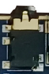

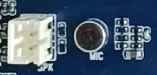

## TF 卡槽

ibox3568 引出外置 TF 卡，可用于 TF 卡升级或存放多媒体文件。

## 独立按键

ibox3568 共有 4 个按键，包括 2 个独立按键、1 个 PWRKEY 键和 1 个复位键。独立按键通过 ADC 采样获取键值。主板下方还预留 6PIN 开关机及独立按键 PH 座，便于用户通过延长线引出到外壳。

| 开关 | 功能 |
| --- | --- |
| VOL+ | 音量加键 |
| VOL- | 音量减键 |
| PWRKEY | 电源键 |
| RESET | 复位键 |

## OTG 接口

RK3568 的 OTG 接口和其中一路 USB 3.0 接口复用，ibox3568 通过硬件拨码开关切换。拨到上侧时，OTG 信号作为 HOST；拨到下侧时，OTG 信号作为 Device，用于程序下载，此时靠近 OTG 的一路 USB 3.0 接口对应 USB 2.0 功能无法使用。

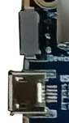

## HOST 2.0 接口

RK3568 自带两路标准 Type-A HOST 2.0 接口，ibox3568 通过两个 4PIN PH 座引出。

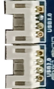

## HOST 3.0 接口

RK3568 自带两路 HOST 3.0 接口，主板通过两个 HOST 3.0 座引出。左侧 HOST 3.0 接口的 HOST 2.0 功能和 OTG 复用，只有 OTG 右侧拨码开关拨到上侧时，该 HOST 3.0 接口的 HOST 2.0 功能才完整。

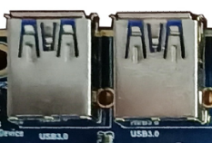

## 开机、复位和 Recovery

接上外部电源适配器后，机器自动开机。进入 Android 系统后，轻触 PWRKEY 休眠，再次按 PWRKEY 唤醒，长按 PWRKEY 出现关机界面。系统运行时轻按 RESET 键可硬复位。音量加按键在烧录时用作 Recovery 键。

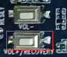

## LCD 接口

RK3568 支持双路 DSI、LVDS、EDP 等显示接口。图中左侧为 DSI0 / LVDS 显示接口，通过程序切换 DSI 或 LVDS；右侧为 DSI1 / EDP 显示接口，通过 0R 电阻硬件分配 DSI 或 EDP 信号。

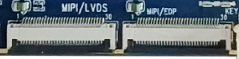

## 后备电池和红外

后备电池用于保证断电后 RTC 继续工作，确保系统时间不丢失。ibox3568 自带外置 RTC 芯片，工作电流低于 0.6uA。红外接口预留 3PIN PH 座，可外接 HS0038B 一体化接收头。

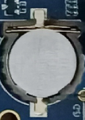

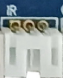

## Wi-Fi / Bluetooth 模块

ibox3568 标配 2.4G / 5G 双频 Wi-Fi 6 的 SDIO 接口 Wi-Fi / BT 模块，同时兼容 AP6398S、AP6375S 以及欧飞信双频 Wi-Fi 模组。

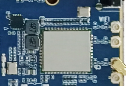

## 串口

RK3568 自带 10 路串口。ibox3568 默认通过 PH 座预留 4 路 TTL 电平串口，分别对应 UART2、UART3、UART4 和 UART9，可用于外接串口设备，其中 UART2 默认为调试串口。

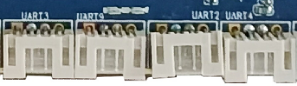

## PCIe 接口

RK3568 相比 RK3288 增加 PCIe 接口总线，ibox3568 通过贴片式 PCIe 接口座预留，可外接标准 PCIe 设备扩展。

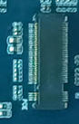

## 预留 GPIO 接口

ibox3568 通过 8PIN PH 座预留 GPIO 接口，用于 GPIO 扩展。

