# 接口说明

本章节整理主板硬件手册中的接口说明，去掉页眉、页脚、目录、版权和其他产品介绍等重复内容，并补充手册中的接口示意图片与接口定义表。

## 电源开关和插座

IBOX3576主板采用12V直流电源供电，图中插座为12V直流电源输 入插座，建议使用12V/3A的电源适配器。4PIN座子接口定义如下

| Pin | Signal |
|---|---|
| 1 | 12V |
| 2 | 12V |
| 3 | GND |
| 4 | GND |

## HDMI IN 接口

主板采用标准TypeA型HDMI接口，支持1路HDMIIN， 此路HDMIIN是使用LT6911C将HDMI信号转换为MIPI信 号。LT6911C的烧录座接口定义如下

| Pin | Signal |
|---|---|
| 1 | CSDA |
| 2 | CSCL |
| 3 | GND |
| 4 | 3.3V |

## HDMI OUT 接口

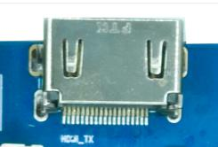

主板采用标准TypeA型HDMI接口，支持1路HDMIOUT， 此路HDMIOUT是RK3576原生接口，直接由CPU引出。

## USB3.0 接口

主板支持1路USB3.0接口，可用于接U盘鼠标等外设。

## USB2.0 接口

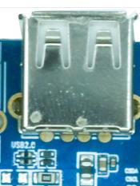

主板上有1个USB2.0TypeA接口和2个USB2.0 1.25mm间距 4PIN接口，这两个接口由HUB芯片转换而来，TypeA接口可用来接 U盘鼠标等外设，4PIN接口可用来接USB触摸屏等外设。4PIN座子 接口定义如下

| Pin | Signal |
|---|---|
| 1 | 5V |
| 2 | USB_DM |
| 3 | USB_DP |
| 4 | GND |

## 以太网接口

主板支持双路千兆有线以太网接口，采用GMAC接口的 RTL8211F，用户可以通过有线以太网上网，体验极速网络。

## WIFI/BT

板载 WIFI 模块，WIFI 模块型号为支持 WIFI5，蓝牙 4.2 的 RTL8821CS，可以连接WIFI实现无线上网俞蓝牙互联。

## RTC电池

3V纽扣电池座，后备电池用于保证断电后RTC仍然能够工作， 确保系统时间不丢失。

## LVDS接口

支持1路标准LVDS显示接口，用于连接LVDS接口的显示屏幕，此接 口与MIPIDSI复用，即LVDS接口与MIPIDSI接口只能使用1路。

| Pin | Signal | Pin | Signal |
|---|---|---|---|
| 1 | LVDS_VCC | 2 | LVDS_VCC |
| 3 | LVDS_VCC | 4 | GND |
| 5 | GND | 6 | GND |
| 7 | RXO0- | 8 | RXO0+ |
| 9 | RXO1- | 10 | RXO1+ |
| 11 | RXO2- | 12 | RXO2+ |
| 13 | GND | 14 | GND |
| 15 | RXOC- | 16 | RXOC+ |
| 17 | RXO3- | 18 | RXO3+ |
| 19 | RXE0- | 20 | RXE0+ |
| 21 | RXE1- | 22 | RXE1+ |
| 23 | RXE2- | 24 | RXE2+ |
| 25 | GND | 26 | GND |
| 27 | RXEC- | 28 | RXEC+ |
| 29 | RXE3- | 30 | RXE3+ |

## MIC接口

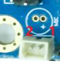

主板支持录音输入。通过2PIN1.25mm座子引出接口

| Pin | Signal |
|---|---|
| 1 | MIC |
| 2 | GND |

## 耳机接口

将耳机接入该接口，可以实现耳机输出。当然也可以直接通过 该接口送到功放输入，如家庭影院的音频输入口，实现将开发 板的音源信号通过家庭影院展现出来。

## 喇叭接口

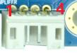

主板使用NTP8918功放，支持2×15双声道，接口定义如下

| Pin | Signal |
|---|---|
| 1 | OUT1A |
| 2 | OUT1B |
| 3 | OUT2A |
| 4 | OUT2B |

## MIPI DSI接口

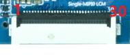

支持1路MIPI显示接口，用于连接MIPI接口的显示屏幕。此 接口与LVDS复用，即MIPIDSI接口与LVDS接口只能使用1 路。

| Pin | Signal | Pin | Signal |
|---|---|---|---|
| 1 | VCC_5V0 | 16 | GND |
| 2 | VCC_5V0 | 17 | MIPI_DPHY_DSI_TX_D3N |
| 3 | VCC_5V0 | 18 | MIPI_DPHY_DSI_TX_D3P |
| 4 | VCC3V3_S3 | 19 | GND |
| 5 | VCC3V3_S3 | 20 | MIPI_DPHY_DSI_TX_D2N |
| 6 | I2C0_SCL_M1_TP | 21 | MIPI_DPHY_DSI_TX_D2P |
| 7 | I2C0_SDA_M1_TP | 22 | GND |
| 8 | TP_INT_L | 23 | MIPI_DPHY_DSI_TX_CLKN |
| 9 | TP_RST_L | 24 | MIPI_DPHY_DSI_TX_CLKP |
| 10 | VCC3V3_S3 | 25 | GND |
| 11 | VCC3V3_S3 | 26 | MIPI_DPHY_DSI_TX_D1N |
| 12 | LCD_BL_PWM1_CH1_M0 | 27 | MIPI_DPHY_DSI_TX_D1P |
| 13 | MIPI_DSI_RST | 28 | GND |
| 14 | NC | 29 | MIPI_DPHY_DSI_TX_D0N |
| 15 | LCD_PWREN_H | 30 | MIPI_DPHY_DSI_TX_D0P |

## UART与 I2C拓展接口

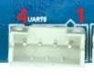

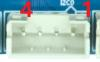

主板引出两路UART接口，分别为UART6与UART8，接口 定义如下

### UART 接口定义

| Pin | Signal |
|---|---|
| 1 | 3.3V |
| 2 | UART_RX |
| 3 | UART_TX |
| 4 | GND |

主板引出两路I2C接口，分别为I2C0与I2C5，接口定义如 下

### I2C 接口定义

| Pin | Signal |
|---|---|
| 1 | 3.3V |
| 2 | I2C_SCL |
| 3 | I2C_SDA |
| 4 | GND |

## TYPE-C 接口

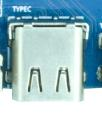

OTG使用的是TypeC接口，主要用于下载程序与ADB调试。

## DEBUG 接口

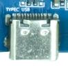

此TypeC接口是调试串口，用于查看系统打印信息以及系统调 试使用

## LCD电源接口

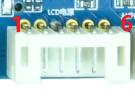

此接口为LCD背光电源接口，可以给LCD提供背光电源，定 义如下

| Pin | Signal |
|---|---|
| 1 | GND |
| 2 | GND |
| 3 | LVDS_BL_PWM |
| 4 | LVDS_BL_EN |
| 5 | 12V |
| 6 | 12V |

## 按键

主板引出了3个独立按键，分别为复位按键、电源按键以及 烧录按键，同时，主板还引出了一个6PIN1.25mm座子，用 于拓展按键接口，用户也可用于自定义功能，6PIN接口定义如 下

| Pin | Signal |
|---|---|
| 1 | PWRKEY |
| 2 | V+_KEY |
| 3 | V-_KEY |
| 4 | MENU_KEY |
| 5 | ESC_KEY |
| 6 | GND |

## 电池接口

主板预留了双节锂电池供电接口，可以使用电池给主板供电， 同时也可通过DC接口给电池充电

| Pin | Signal | Pin | Signal |
|---|---|---|---|
| 1 | SCL | 5 | GND |
| 2 | SDA | 6 | VBAT |
| 3 | GND | 7 | VBAT |
| 4 | GND | 8 | VBAT |

## 风扇接口

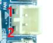

此接口为风扇接口，主要用于CPU散热。

| Pin | Signal |
|---|---|
| 1 | GND |
| 2 | 12V |

## MCU烧录接口

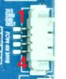

此接口是给MCU烧录程序使用，MCU主要功能是控制系统的 开关机

| Pin | Signal |
|---|---|
| 1 | 3.3V |
| 2 | SWIM |
| 3 | GND |
| 4 | NRST |

## 红外传感器接口

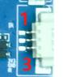

此接口为红外传感器接口，接上传感器就可以使用红外遥控对 主板进行远程开机了

| Pin | Signal |
|---|---|
| 1 | 3.3V |
| 2 | GND |
| 3 | IR |

## IO拓展接口

此接口为IO的拓展接口，用户可以自定义IO功能，接口定义 如下

| Pin | Signal | Pin | Signal |
|---|---|---|---|
| 1 | 3.3V | 4 | IO4_B0_D33 |
| 2 | IO3_A2_D33 | 5 | IO3_D6_D18 |
| 3 | IO1_D5_D33 | 6 | GND |

## TF卡接口

主板引出一个外置TF卡，可以通过该通道进行TF卡启动， 或是存放一些多媒体文件。

## MIPI CSI接口

主板引出两路MIPICSI接口，用于连接MIPI接口的摄像头， 接口定义如下

| Pin | Signal | Pin | Signal |
|---|---|---|---|
| 1 | GND | 16 | GND |
| 2 | MIPI_DPHY_CSI0_RX_CLKP | 17 | NC |
| 3 | MIPI_DPHY_CSI0_RX_CLKN | 18 | NC |
| 4 | GND | 19 | MIPI_AF |
| 5 | MIPI_DPHY_CSI0_RX_D0P | 20 | I2C4_SCL_M3_MIPI_CAM0/2 |
| 6 | MIPI_DPHY_CSI0_RX_D0N | 21 | I2C4_SDA_M3_MIPI_CAM0/2 |
| 7 | GND | 22 | MIPI_DPHY_CSI_CAM2_CLKOUT |
| 8 | MIPI_DPHY_CSI0_RX_D1P | 23 | MIPI_DCPHY_CSI_CAM0_CLKOUT |
| 9 | MIPI_DPHY_CSI0_RX_D1N | 24 | MIPI_DPHY_CSI_CAM2_PDN_H |
| 10 | GND | 25 | MIPI_DCPHY_CSI_CAM0_PDN_H |
| 11 | MIPI_DPHY_CSI0_RX_D2P | 26 | MIPI_DPHY_CSI_CAM2_RST_H |
| 12 | MIPI_DPHY_CSI0_RX_D2N | 27 | MIPI_DCPHY_CSI_CAM0_RST_H |
| 13 | GND | 28 | VCC1V8_CAM3 |
| 14 | MIPI_DPHY_CSI0_RX_D3P | 29 | VCC2V8_CAM3 |
| 15 | MIPI_DPHY_CSI0_RX_D3N | 30 | MIPI_1.2V_CAM3 |

## LED接口

此接口为LED接口，用于外接LED使用，用户可自定义该接 口功能，接口定义如下

| Pin | Signal |
|---|---|
| 1 | 3.3V |
| 2 | 3.3V |
| 3 | GND |
| 4 | GND |
| 5 | LED_R |
| 6 | LED_R |
| 7 | LED_G |
| 8 | LED_G |

## M.2接口

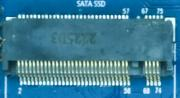

主板引出一个M.2硬盘接口，可以存放一些多媒体文件，或 做内存拓展。

## EDP接口

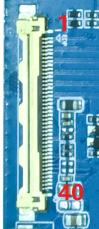

此接口为40PINEDP接口，可以外接EDP接口屏幕，此接口与HDMI 接口为复用接口，因此，EDP接口与HDMI接口只能二选一使用， 40PIN座子定义如下

| Pin | Signal | Pin | Signal |
|---|---|---|---|
| 1 | TP_RST | 21 | VCC_3V3_S3 |
| 2 | GND | 22 | BITSET |
| 3 | EDP_TX3N | 23 | GND |
| 4 | EDP_TX3P | 24 | GND |
| 5 | GND | 25 | GND |
| 6 | EDP_TX2N | 26 | GND |
| 7 | EDP_TX2P | 27 | EDP_HPD |
| 8 | GND | 28 | GND |
| 9 | EDP_TX1N | 29 | GND |
| 10 | EDP_TX1P | 30 | GND |
| 11 | GND | 31 | GND |
| 12 | EDP_TX0N | 32 | LCD_EN |
| 13 | EDP_TX0P | 33 | PWM2_CH3_M3 |
| 14 | GND | 34 | I2C5_SCL_M3 |
| 15 | EDP_AUXP | 35 | I2C5_SDA_M3 |
| 16 | EDP_AUXN | 36 | VCC12V_IN |
| 17 | GND | 37 | VCC12V_IN |
| 18 | VCC_3V3_S3 | 38 | VCC12V_IN |
| 19 | VCC_3V3_S3 | 39 | VCC12V_IN |
| 20 | VCC_3V3_S3 | 40 | TP_INT |

