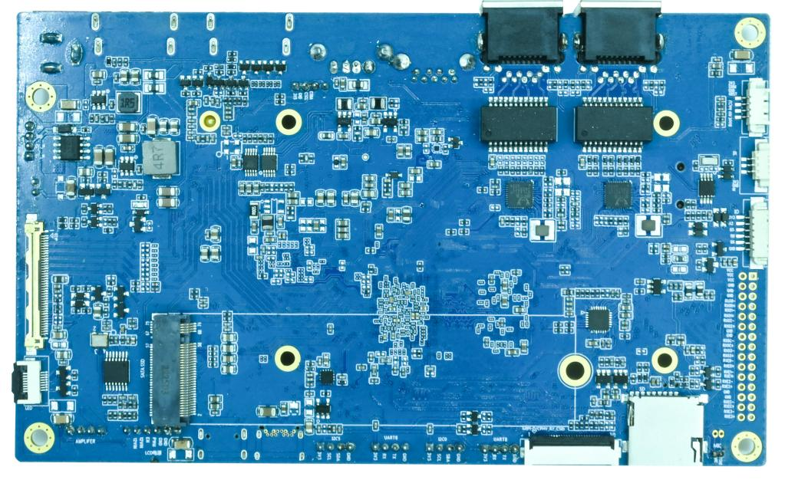
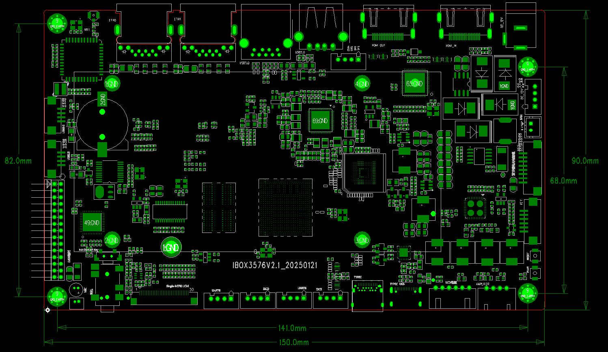

# 产品介绍

## 产品简介

IBOX3576 是基于瑞芯微 RK3576 CPU 的一体主板，由深圳市九鼎创展科技有限公司自主研发、生产并销售。

## 产品外观

## 主板尺寸

## 特性参数

### 系统配置

| 项目 | 说明 |
|---|---|
| CPU | RK3576(QuadA72+QuadA53) |
| 主频 | 1.8GHz |
| RAM | 2GB 或 4GB 或 8GB |
| ROM | 4GB 或 8GB 或 16GB 或 32GB 或 64GB |
| 电源IC | 使用RK806-S，支持动态调频 |

### 接口参数

| 项目 | 说明 |
|---|---|
| 电源 | DC输入，12V/3A |
| LCD接口 | 1路MIPI-DSI/LVDS复用，1路EDP/HDMI复用 |
| Touch接口 | 电容触摸，I2C接口 |
| Camera接口 | 1路MIPI-CSI输入 |
| SD卡接口 | 1路SDIO输出通道 |
| emmc接口 | 板载emmc接口，管脚不另外引出 |
| USB接口 | 3路USB2.0，1路USB3.0，1路TYPE-C |
| HDMI接口 | 1路HDMI2.0TX，1路HDMIOUT |
| 以太网接口 | 支持2路千兆以太网接口 |
| UART接口 | 2路 |
| I2C接口 | 2路 |
| 音频接口 | 1路MIC，1路耳机输出，双声道喇叭 |
| PCIE接口 | 1路PCIE2.0 |

### 软件资源

| 项目 | 说明 |
|---|---|
| 操作系统 | Android14 |
| 底层驱动 |  |

## 相关章节

- [硬件资源](./ibox3576-hardware-resources)
- [接口说明](./ibox3576-interface-details)
- [开发环境](./ibox3576-development-environment)
- [Android 编译与烧录](./ibox3576-android-build-flash)
