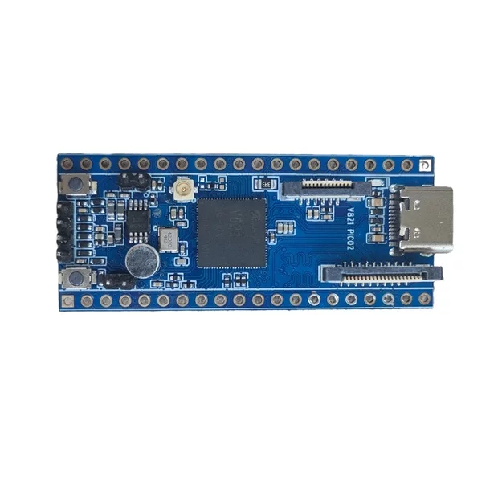
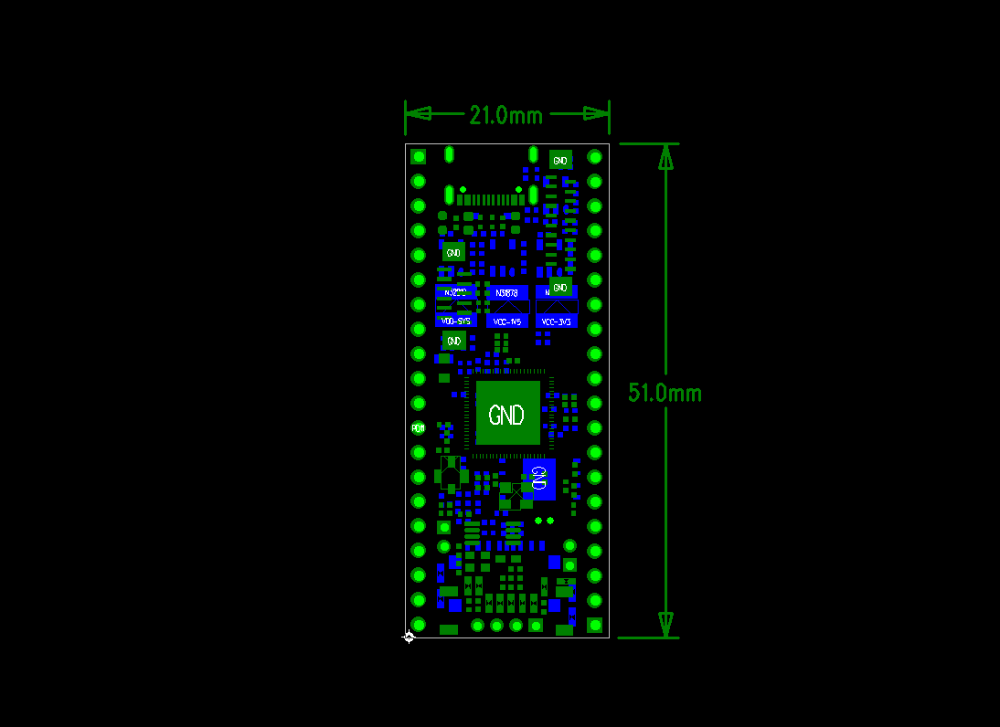

# 产品介绍

PICO2 是基于全志 V821 系列处理器设计的小型智能视觉开发板，面向电池门铃、智能门锁、考勤门禁、网络摄像头和轻量级 AI 视觉设备。

## 处理器与多媒体能力

- RISC-V 大核 CPU0，最高主频 1.2 GHz。
- RISC-V 小核 CPU1，最高主频 600 MHz，可运行 RTOS 并参与 AMP 异构处理。
- 集成 16-bit DDR2，工作速率最高约 533 MHz。
- 板载 128 MB SPI NOR Flash。
- Smart 视频引擎支持最高 2M@25fps H.265 编码及 2M@60fps JPEG 编解码。
- 集成 ISP，支持 2D/3D 降噪、HDR、边缘增强等图像处理。
- 支持 DVP 与 2-lane MIPI CSI 摄像输入。
- 支持 Serial RGB、MCU 和 DBI 类显示输出。

## 外设资源

V821 提供 TWI、UART、SPI、GPADC、USB 2.0、SDIO、I2S、DMIC、PWM 等外设。PICO2 将常用接口通过 FPC、排针和板载器件引出，适合摄像头、SPI LCD、音频和 GPIO 扩展。

## 基本规格

| 项目 | 参数 |
| --- | --- |
| CPU | V821 系列 RISC-V SoC |
| CPU 主频 | 最高 1.2 GHz |
| RAM | 板内 DDR2，最高约 533 MHz |
| ROM | 128 MB SPI NOR Flash |
| 尺寸 | 21 mm × 51 mm × 1.6 mm |
| 工作温度 | 0～70 ℃ |
| 存储温度 | -10～50 ℃ |
| 电源 | USB Type-C，5 V / 3 A |
| 操作系统 | Tina Linux |

硬件手册版本为 Rev.01，Linux 平台手册版本为 Rev.01。
