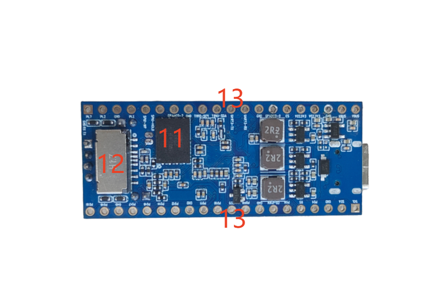

# 硬件资源

## 正反面接口分布

| 标号 | 名称 | 说明 |
| ---: | --- | --- |
| 1 | 16P Type-C | 供电、固件烧录和 USB 通信 |
| 2 | 摄像头接口 | 20Pin、0.5 mm、单侧触点 MIPI CSI FPC |
| 3 | 屏幕接口 | 12Pin、0.5 mm、单侧触点 SPI/DBI LCD FPC |
| 4 | 天线接口 | IPEX 一代外接天线座 |
| 5 | 喇叭接口 | 2Pin、2.0 mm PH，连接外部喇叭 |
| 6 | 板载咪头 | 模拟录音输入 |
| 7 | MIC 接口 | 外接麦克风输入 |
| 8 | 用户按键 | 接到 PD13 的轻触按键 |
| 9 | FEL 按键 | 强制进入烧录模式 |
| 10 | DEBUG | 4Pin UART0 调试接口 |
| 11 | SPI NOR Flash | 128 MB 固件存储 |
| 12 | TF 卡座 | 启动介质或多媒体存储 |
| 13 | 2×20 排针 | 电源、地和 28 路 GPIO/复用信号 |

## 使用注意

- Type-C 既用于供电，也承担固件烧录功能；烧录异常时优先检查线材是否支持数据。
- 摄像头、LCD 和排针上的信号存在复用关系，配置前应同时核对原理图、设备树和 `sys_config.fex`。
- GPIO 为 3.3 V 逻辑电平，不可直接连接 5 V 信号。
- 使用 FEL 按键烧录时，应先按住 FEL，再连接 USB 或复位上电。
