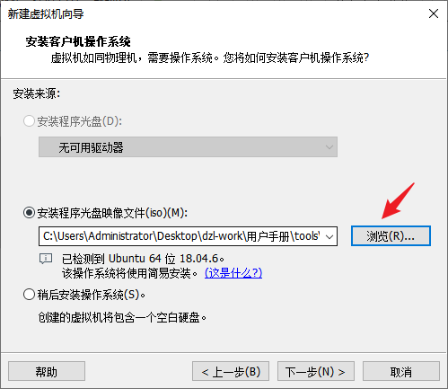
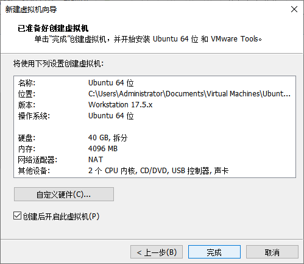

# 开发环境与源码获取

PICO2 Linux SDK 基于 Tina Linux。编译环境推荐使用 Ubuntu 20.04 64 位，并根据 SDK 实际依赖安装软件包。

## 资料下载

- 虚拟机搭建工具：[Virtual Machine Tools](https://pan.baidu.com/s/1fBd--CaDgS18s0UzGsW7xw?pwd=m5g6)，提取码 `m5g6`
- PICO2 Linux 源码：[百度网盘](https://pan.baidu.com/s/12bxLPTdhfPLIRAbgoBP41w?pwd=frqa)，提取码 `frqa`

## 虚拟机建议配置

| 项目 | 建议 |
| --- | --- |
| CPU | 8 核以上 |
| 内存 | 16 GB 起，推荐 32 GB |
| SDK 磁盘 | 300 GB 起，推荐 500 GB 以上 |
| 存储 | SSD |
| 网络 | NAT 或桥接 |

原手册中的 4 GB 内存和 40 GB 虚拟磁盘只适合安装演示，不适合完整 SDK 编译。





## Ubuntu 基础工具

```bash
sudo apt-get update
sudo apt-get install -y     git git-lfs make gcc g++     python3 python3-pip     net-tools openssh-server vim     unzip zip file rsync bc
```

日常编译使用普通用户，管理员操作使用 `sudo`。没有必要开放 SSH root 登录。

```bash
sudo systemctl enable --now ssh
ip -4 addr
```

Windows 端可使用 FileZilla、WinSCP 或 `scp` 传输源码和固件。
