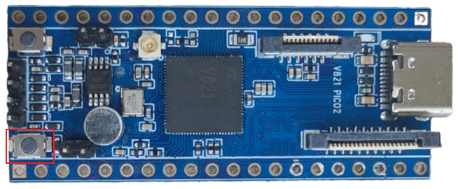

# 编译与烧录

## 解压源码

大型 SDK 建议解压到 Linux 原生文件系统，不要放在 NTFS 共享目录中。

```bash
mkdir -p ~/workspace/pico2
cd ~/workspace/pico2
tar -xf <PICO2-SDK>.tar.*
```

检查分卷包和压缩包完整性后再解压。

## 选择方案并编译

```bash
cd <SDK>
source build/envsetup.sh

lunch
m
pack
```

部分版本会在 `lunch` 中提供 `v821-perf2`、`v821-aitoy` 等方案。应选择与当前硬件、存储介质和业务场景一致的板级方案。


整体流程：

```text
初始化环境
  → 选择板型
  → 编译 Boot/BSP/Kernel/OpenWrt/RTOS
  → 生成 rootfs
  → pack 打包
  → 得到 .img 固件
```

## 单独编译

```bash
m kernel
m openwrt
m rtos
```

不同 SDK 的模块命令可能不同，可执行：

```bash
m help
```

或查看根目录构建脚本。

## 烧录

1. Windows 安装全志 USB 烧录驱动。
2. 打开烧录工具并选择 `.img` 固件。
3. 开发板断电。
4. 按住 FEL 按键并连接 Type-C，或按住 FEL 后复位。
5. 工具识别设备后开始烧录。




烧录失败时检查：

```text
USB线是否支持数据
FEL按键时序
Windows驱动
固件是否与存储介质匹配
Type-C供电是否稳定
```
