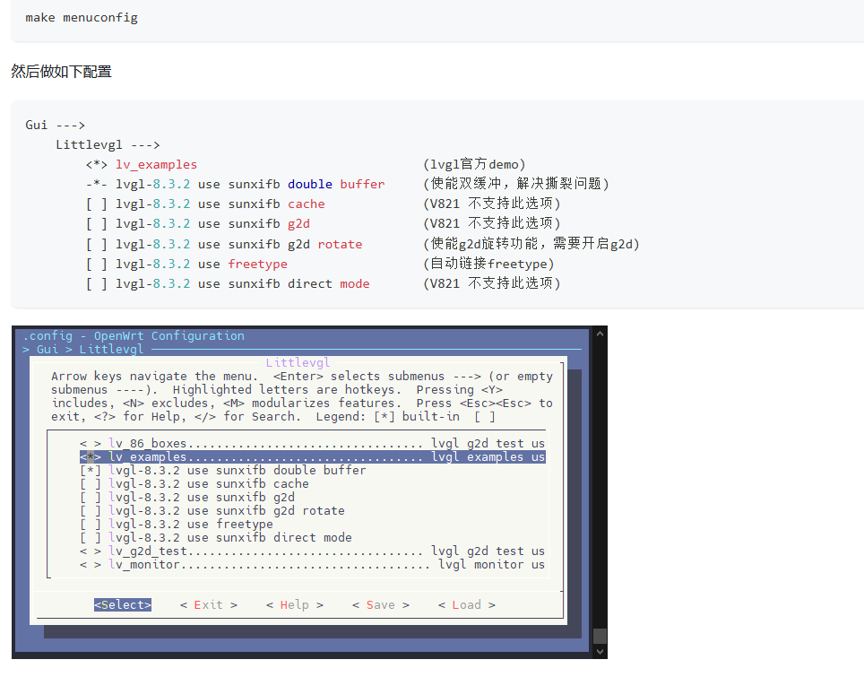

# LVGL、G2D与MPP

## LVGL

LVGL 可运行在 framebuffer、DRM 或厂商显示接口之上。部署前确认：

```text
显示设备节点
像素格式
屏幕方向
刷新策略
输入设备
字体和图片资源
```



## G2D

G2D 用于缩放、旋转、镜像、格式转换和图像合成。

主要限制：

- 输入和输出地址需要满足硬件对齐。
- 宽度、Stride 和格式需要满足驱动限制。
- 极小图像尺寸可能不受支持。
- 旋转后的宽高和内存大小必须重新计算。
- Cache 与 DMA-BUF 同步错误会造成花屏或旧帧。


## MPP 软件结构

```text
应用/Sample
  → Middleware组件
  → MPI接口
  → VIN/ISP/VENC/VDEC/AIO/G2D/CE/UVC
  → Kernel驱动
```

MPP 提供智能 IPC、采集预览、编码封装、解码回放、音频采集播放、G2D、CE、UVC 等 Sample。

## 编译和运行流程

```text
menuconfig启用MPP和Sample
  → 编译MPP
  → 编译Sample
  → 打包进rootfs或复制到TF卡
  → 准备配置文件
  → 板端运行
  → PC端检查码流/日志
```

常用检查：

```bash
ps | grep sample
dmesg | grep -iE "vin|isp|venc|vdec|g2d|audio"
ls -l /dev/video* /dev/snd
```

视频问题优先确认采集格式、分辨率、码率、缓冲区和媒体内存；音频问题优先确认声卡节点、采样率、通道数和增益。
