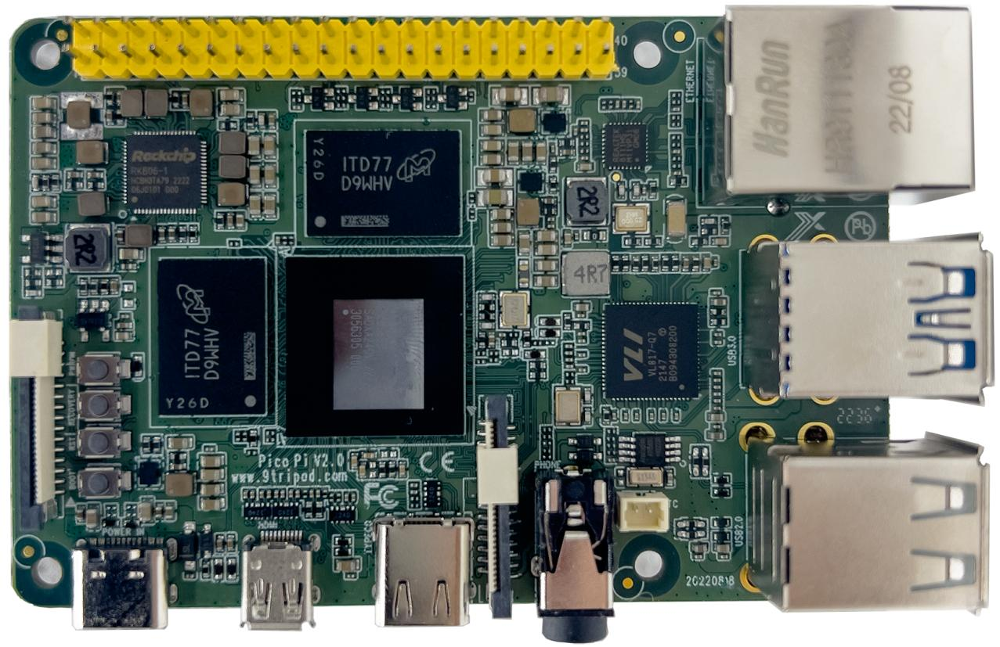

# 产品介绍

## 产品简介

Pico PC RK3588S 主板基于瑞芯微 RK3588S 平台设计，采用标准树莓派尺寸，集成显示、摄像头、网络、音频、USB、Type-C、GPIO 扩展等接口，适合用于嵌入式开发、边缘计算、视觉应用和多媒体场景。

## 产品外观

## 功能特性

## 特性参数

### 基本参数

| 项目 | 说明 |
|---|---|
| SOC | RockChipRK3588S |
| CPU | 八核64位（4×Cortex-A76+4×Cortex-A55）, 8nm先进工艺，主频高达2.4GHz |
| GPU | ARM Mali-G610 MP4 四 核 GPU 支 持 OpenGL ES3.2 / OpenCL 2.2 / Vulkan1.1, 450 GFLOPS |
| NPU | NPU 算 力 高 达 6TOPS ， 支 持 INT4/INT8/INT16 混合运算， 可 实 现 基 于 TensorFlow/MXNet/PyTorch/ Caffe等系列框架的网络模型转换 |
| ISP | 集成48MPISPwithHDR&amp;3DNR |
| 编解码 | 视频解码： 8K@60fpsH.265/VP9/AVS2 8K@30fpsH.264AVC/MVC 4K@60fpsAV1 1080P@60fpsMPEG-2/-1/VC-1/VP8 视频编码： 8K@30fps编码，支持H.265/H.264 *最高可实现 32 路 1080P@30fps 解码和 16 |
|  | 路1080P@30fps编码 |
| 内存 | 4GB/8GB/16GB64bitLPDDR4/LPDDR4x（最 高可配 32GB） |
| 存储 | 16GB/32GBeMMC |

### 硬件参数

| 项目 | 说明 |
|---|---|
| 以太网 | 千兆以太网 |
| 无线网络 | 2.4G/5G双频WIFI，支持扩展4G无线模块 |
| 视频 | 1 × HDMI2.1（8K@60fps 或 4K@120fps） 1 × MIPI-DSI（4K@60fps） |
| 音频 | 1 × Phone 输出（带MIC） 1 × MicroHDMI 音频输出 |
| USB | 2 × USB3.0 1 × TypeC 2 × USB2.0 |
| 电源 | DC5V输入(TypeC接口) |
| 其他接口 | 1×CSI、1×DSI、1×UART、1×Debug、28 ×GPIO |

### 系统软件

| 项目 | 说明 |
|---|---|
| 系统 | Android：Android12.0 Linux：Ubuntu、Debian11、Buildroot |

### 其他参数

| 项目 | 说明 |
|---|---|
| 尺寸 | 85mm×56mm（标准树莓派尺寸） |
| 重量 | 约50克 |
| 散热 | 散热器安装孔距：参考树莓派 |
| 功耗 | 待机功耗：约0.375W(5V/75mA) 典型功耗：约1W(5V/200mA) 最大功耗：约9W(5V/1800mA) |
| 环境 | 工作温度：-10℃-70℃ 存储温度：-20℃-70℃ 存储湿度：10%～80% |

### 驱动支持列表

| system driver | linux+ android12 | linux+ debain10 | linux+ ubuntu | linux+QT |
|---|---|---|---|---|
| 寸 屏 7 MIPI (1024*600) | ● | ● | ● | ● |
| 背光驱动 | ● | ● | ● | ● |
| 驱动 PMIC (RK806) | ● | ● | ● | ● |
| 电容触摸 | ● | ● | ● | ● |
| 驱动 EMMC | ● | ● | ● | ● |
| 卡驱动 SD | ● | ● | ● | ● |
| ADC驱动 | ● | ● | ● | ● |
| 开关机 | ● | ● | ● | ● |
| 休眠唤醒 | ● |  |  |  |
| 两路USB HOST2.0驱动 | ● | ● | ● | ● |
| 两路USB HOST3.0驱动 | ● | ● | ● | ● |
| 一路TypeC驱动 | ● | ● | ● | ● |
| RTC驱动 | ● | ● | ● | ● |
| 音频 | ● | ● | ● | ● |
| 录音 | ● | 不支持 | 不支持 | 不支持 |
| WIFI/BT | ● | ● | ● | ● |
| CSI摄相头驱动 | ● | 不支持 | 不支持 | ● |
| USB口摄相头驱动 | ● | ● | ● | ● |
| 串口 | ● | ● | ● | ● |
| HDMI OUT | ● | ● | ● | ● |
| 千兆以太网 | ● | ● | ● | ● |
| USB鼠标键盘 | ● | ● | ● | ● |

## 相关章节

- [硬件资源](./pcio-pc-hardware-resources)
- [开发环境](./pcio-pc-development-environment)
- [Android 编译与烧录](./pcio-pc-android-build-flash)
- [Linux 编译与烧录](./pcio-pc-linux-build-flash)
