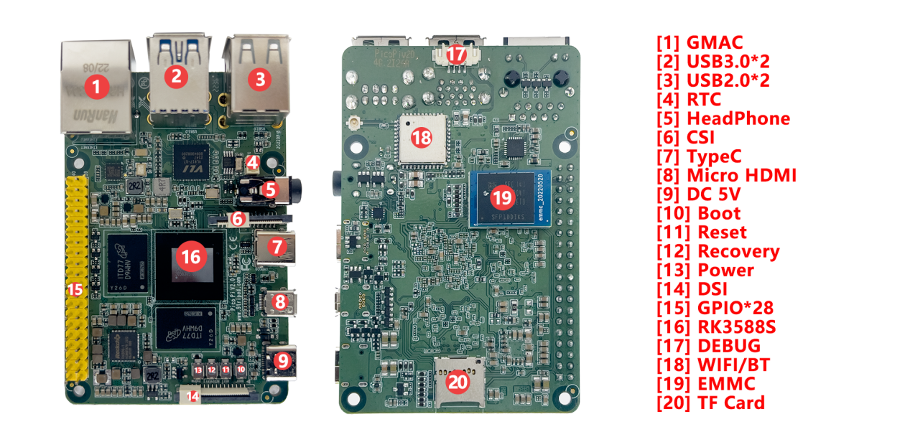

# 硬件资源

本页整理 Pico PC RK3588S 的主要硬件接口位置和接口用途。主板接口图中标出了 GMAC、USB 3.0、USB 2.0、RTC、耳机座、MIPI CSI、Type-C、Micro HDMI、DC 5V、Boot、Reset、Recovery、Power、DSI、GPIO、RK3588S、Debug、Wi-Fi/BT、eMMC 和 TF Card 等资源。

## 硬件接口介绍

| 标号 | 名称 | 说明 |
| --- | --- | --- |
| 【1】 | GMAC | 千兆以太网接口，PCIE接口 |
| 【2】 | HOST 3.0 | 双层USB HOST 3.0接口 |
| 【3】 | HOST 2.0 | 双层USB HOST 2.0接口 |
| 【4】 | RTC | RTC钮扣电池 |
| 【5】 | 耳机座 | 4级带MIC耳机座 |
| 【6】 | MIPI CSI | MIPI摄像头接口 |
| 【7】 | Type-C接口 | 标准Type-C接口，用于程序下载等 |
| 【8】 | HDMI OUT | Micro HDMI输出接口 |
| 【9】 | 5V IN | 5V直流电源输入，标准Type-C电源输入接口 |
| 【10】 | 独立按键 | boot按键，用于MaskRom或强制升级 |
| 【11】 | 独立按键 | 复位按键 |
| 【12】 | 独立按键 | 在升级时用作Recovery键 |
| 【13】 | 独立按键 | PWRKEY |
| 【14】 | 显示接口 | DSI接口 |
| 【15】 | GPIO扩展口 | 约28个GPIO扩展口 |
| 【16】 | RK3588S | 主控芯片 |
| 【17】 | UART2 | UART2，TTL电平接口，默认为调试串口 |
| 【18】 | Wi-Fi-BT | 双频Wi-Fi5.0、BT模块 |
| 【19】 | eMMC | 存储ROM，可插拨，默认16G或32G可选 |
| 【20】 | TF卡 | TF卡座 |

## 产品尺寸

- 主板尺寸：85mm × 56mm。
- 图纸中给出的主要安装/接口参考尺寸包含 84.990mm、56.030mm、58.000mm、49.000mm 等。
