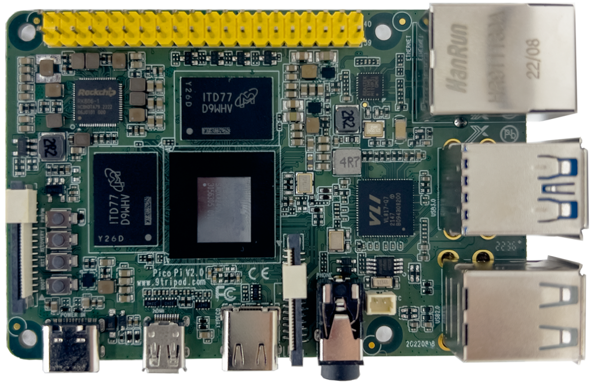

# 产品介绍

Pico PC RK3588S 是基于 Rockchip RK3588S 的树莓派尺寸主板，板卡尺寸为 85mm × 56mm。平台提供 Android 12、Linux、Ubuntu、Debian、Buildroot 等系统资源，适合高性能边缘计算、多媒体、AI 推理、显示控制、网络通信、工业控制和通用嵌入式开发。

## 功能特性

- ARM Cortex-A76 四核 + Cortex-A55 四核，主频最高 2.4GHz。
- 标配 4GB 或 8GB LPDDR4 / LPDDR4X，其他配置可按需订货。
- 16GB / 32GB eMMC 可插拔。
- 2 路 USB HOST 2.0、2 路 USB HOST 3.0、1 路全功能 Type-C、1 路 Type-C 供电口。
- 2 路 3.3V TTL 串口接口，其中 1 路默认为调试串口。
- 1 路 TF 卡接口，1 个复位按钮、1 个开关机按钮、1 个强制升级按钮。
- 1 路 Micro HDMI 输出、1 路 DSI 显示、1 路 CSI 摄像头输入。
- 耳机输出接口，支持电容触摸。
- 板载高速双频 Wi-Fi / Bluetooth 模块。
- 支持 RTC 时钟实时保存、千兆有线以太网和多路 GPIO 扩展。

## 规格概览

| 项目 | 参数 |
| --- | --- |
| SoC | Rockchip RK3588S |
| CPU | 4 × Cortex-A76 + 4 × Cortex-A55，8nm，最高 2.4GHz |
| GPU | ARM Mali-G610 MP4，支持 OpenGL ES 3.2 / OpenCL 2.2 / Vulkan 1.1 |
| NPU | 最高 6TOPS，支持 INT4 / INT8 / INT16 混合运算 |
| 内存 | 4GB / 8GB / 16GB 64bit LPDDR4 / LPDDR4X，最高可配 32GB |
| 存储 | 16GB / 32GB eMMC |
| 显示 | HDMI 2.1，MIPI-DSI |
| USB | 2 × USB 3.0，2 × USB 2.0，1 × Type-C |
| 系统 | Android 12.0，Ubuntu，Debian 11，Buildroot |
| 尺寸 | 85mm × 56mm，标准树莓派尺寸 |
| 功耗 | 待机约 0.375W，典型约 1W，最大约 9W |

## 版本信息

| 版本号 | 日期 | 作者 | 描述 |
| --- | --- | --- | --- |
| Rev.01 | 2022-10-8 | lqm | 原始版本 |

