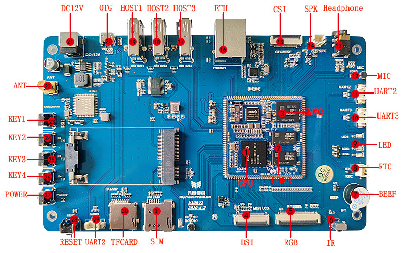

# 接口说明

## CPU / 内存 / eMMC

开发板核心平台为 PX30，四核 Cortex-A35，主频 1.3GHz。X30CV1 默认 1GB DDR3 和 8GB eMMC，X30CV2 使用 LPDDR3。

## DSI / LVDS / RGB 显示

X30 预留两个显示接口，一个用于 MIPI 或 LVDS 屏，另一个用于 RGB 屏。MIPI 与 LVDS 复用一组管脚，不能同时使用。PX30 本身没有 HDMI 输出，如需 HDMI 需外扩转换芯片。

## CSI 摄像头

PX30 支持 MIPI 摄像头和并口摄像头。X30 开发板仅预留 MIPI 摄像头接口，并口摄像头口被用作百兆以太网。

## 百兆以太网

开发板支持 100M RMII 有线网口。由于 PX30 部分并口摄像头 IO 与以太网复用，不使用以太网时可按产品需求重新分配。

## USB HOST / OTG

开发板提供 3 路 USB USB HOST2.0 和 1 路 OTG。OTG 可用于程序下载，OTG 功能时也可作为 HOST 使用。

## 串口

开发板提供 UART3、UART2_M1、UART2_M0 等 TTL 串口。默认 UART2_M1 用作调试串口；UART2_M0 与 TF 卡 D0/D1 复用，可通过程序配置。

## TF 卡

TF 卡用于外部存储或升级。需要注意 SDMMC0 的 D0/D1 与 UART2 复用，任何时候只能选择一路 UART2 使用。

## 音频

PX30 配套 RK809 PMU，自带音频 codec，可通过耳机、外置喇叭和 MIC 实现录放音。

## 按键 / LED / BEEP / IR

开发板提供 4 路独立按键、复位键、电源键、4 路可编程 LED、蜂鸣器和红外一体化接收头。

## Wi-Fi / BT / 3G / 4G

板载 AP6212 Wi-Fi/BT 二合一模块；外置移动通信可通过 USB 3G 模块或 PCIe 接口模块扩展。

## RTC

开发板提供 RTC 电池座。硬件手册特别强调 RTC 供电不能晚于主电源输入，否则可能损坏 PMU、CPU 等核心器件。

