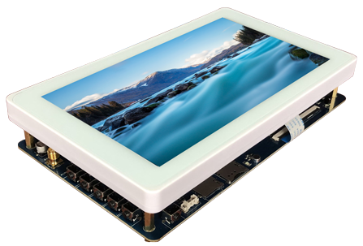

# 产品介绍

X30 开发板基于 Rockchip PX30 平台，核心板型号包含 X30CV1 和 X30CV2。开发板由邮票孔核心板、底板和液晶板组成，可用于平板电脑、车机、学习机、POS 机、游戏机、行业监控、广告机、PDA、教学实验平台和多媒体终端等场景。

PX30 是 Rockchip 面向行业应用的四核 Cortex-A35 应用处理器，支持 RGB/LVDS/MIPI-DSI 显示输出、MIPI CSI 与 DVP Sensor 输入、100M RMII、SDIO3.0、USB2.0 HOST/OTG、I2C、UART、SPI、PWM 等接口。

## PX30 规格

| CPU | 四核Cortex-A35 |
| --- | --- |
| GPU | Mali-G31GPU，支持OpenGL ES3.2, Vulkan 1.0, OpenCL 2.0 |
| GPU | 内嵌高性能2D 加速硬件 |
| 多媒体 | 多格式1080P 60fps视频解码 (H.265,H.264,VC-1, MPEG-1/2/4, VP8) |
| 多媒体 | 1080P 视频编码，支持H.264,VP8 |
| 显示 | 支持RGB/LVDS/MIPI-DSI，分辨率最高1920x1080 |
| 显示 | 支持双屏异显 |
| 内存 | 32bits DDR4-1600/DDR3-1600/DDR3L-1600/LPDDR3-1600/LPDDR2-1066 |
| 内存 | 支持MLC NAND, eMMC 4.51，Serial Nor FLASH |
| 接口 | 支持MIPI CSI及DVP Sensor接口，内置8M ISP |
| 接口 | 支持1x8ch I2S/TDM，1x8ch PDM，2x2ch I2S/PCM |
| 接口 | 支持100M RMII |
| 接口 | 支持SDIO3.0，USB2.0 HOST&OTG，4路I2C，6路UART，2路SPI，8路PWM |

## 功能特性

- 内核：ARM Cortex-A35 四核。
- 主频：1.3GHz × 4。
- 内存：1GB/2GB DDR3/DDR4，标配 1GB DDR3。
- Flash：支持 4GB/8GB/16GB/32GB/64GB eMMC 可选，标配 8GB eMMC。
- 3 路 USB USB HOST2.0 接口，1 路 OTG 接口。
- 3 路 TTL 串口，其中 UART2 用于调试。
- 1 路 TF 卡接口，TF 卡 D0/D1 与 UART0 复用。
- 复位按钮、软件开关机按钮、4 路独立按键。
- 外置扬声器接口、MIC 输入、耳机输出接口。
- 支持背光无级调节和多点电容触摸。
- 板载 AP6212 Wi-Fi/BT。
- 支持 G-sensor。
- 支持 MPEG-4、H.264、H.265/HEVC、VC-1、VP8 视频解码。
- 支持 H.264 视频编码。
- 支持 2D/3D 高性能图形加速。
- 支持 RTC 时钟实时保存。
- 支持百兆有线以太网。
- 支持 CSI 摄像头接口。
- 支持外置 USB 3G 模块及 PCIe 接口模块。
- 支持 USB 鼠标、键盘和红外一体化接收头。

## 核心板特性

- X30CV1 核心板尺寸为 45mm × 45mm，引出 144PIN 管脚。
- X30CV1 使用 DDR3，默认 1GB，可定制 2GB；X30CV2 使用 LPDDR3，适合大容量内存客户。
- X30CV1 与 X30CV2 除内存颗粒不同外，管脚、尺寸和硬件电气连接完全兼容。
- 使用 RK809 PMU，支持动态调频、电源管理、休眠唤醒。
- 支持 Android 8.1、Linux、Debian 9、Ubuntu 等操作系统。
- 支持百兆以太网。
- 产品经过高低温、反复重启、Android 稳定性测试、安兔兔测试和长时间拷机等可靠性验证。

## 系统配置与接口参数

| CPU | PX30 |
| --- | --- |
| 主频 | 四核A35 1.3GHz |
| 内存 | X30CV1使用DDR3，X30CV2使用LPDDR3 |
| 存储器 | 4GB/8GB/16GB eMMC可选，标配8GB |
| 电源IC | 使用RT809，支持动态调频等 |
| 接口参数 |  |
| LCD接口 | 支持MIPI、LVDS、RGB接口 |
| Touch接口 | 电容触摸，可使用USB或串口扩展电阻触摸 |
| 音频接口 | AC97/IIS接口，支持录放音 |
| SD卡接口 | 1路SDIO输出通道 |
| eMMC接口 | 板载eMMC接口，管脚不另外引出 |
| 以太网接口 | 支持百兆以太网 |
| USB USB HOST2.0接口 | 3路USB HOST2.0 |
| UART接口 | 6路串口，支持带流控串口 |
| PWM接口 | 8路PWM输出 |
| I2C接口 | 4路I2C输出 |
| SPI接口 | 2路SPI输出 |
| ADC接口 | 3路ADC输出 |
| Camera接口 | 1路CSI输入 |

## 电气特性

| 5V电源输入 | 5V/1A |
| --- | --- |
| RTC输入电压 | 5V/30uA |
| 输出电压 | 1.8V、3V、3.3V、5V |
| 工作温度 | -20~80度 |
| 储存温度 | -10~50度 |

## 软件资源

X30 开发板支持 Android 8.1、QT5.9、Debian 9 和 Ubuntu 16.04 等系统。驱动支持情况如下：

| system / driver | linux4.4+ / Android 8.1 | linux4.4+ / QT5.9 | linux4.4+ / debian9 | linux4.4+ / ubuntu16.04 |
| --- | --- | --- | --- | --- |
| 四路可编程LED灯 | ● | ● | Coming soon | Coming soon |
| 7寸MIPI屏(1024*600) | ● | ● | ● | ● |
| 背光驱动 | ● | ● | ● | ● |
| PMIC驱动(RK808) | ● | ● | ● | ● |
| 电容触摸 | ● | ● | ● | ● |
| eMMC驱动 | ● | ● | ● | ● |
| SD卡驱动 | ● | ● | ● | ● |
| 独立按键 | ● | ● | ● | ● |
| ADC驱动 | ● | ● | ● | ● |
| Gsensor | ● | No need | No need | No need |
| 蜂鸣器驱动 | ● | ● | ● | ● |
| 红外遥控 | ● | ● | ● | ● |
| 开关机 | ● | ● | ● | ● |
| 休眠唤醒 | ● | ● | Coming soon | Coming soon |
| 三路USB USB HOST2.0驱动 | ● | ● | ● | ● |
| 一路OTG驱动 | ● | ● | ● | ● |
| 音频(RK809) | ● | ● | ● | ● |
| 录音(RK809) | ● | No need | Coming soon | Coming soon |
| SDIOWIFI/BT | ● | ● | Coming soon | Coming soon |
| CSI摄像头驱动 | ● | Coming soon | Coming soon | Coming soon |
| USB口摄像头驱动 | ● | ● | ● | ● |
| 串口 | ● | ● | ● | ● |
| 4G模块(PCIE接口) | ● | No need | No need | No need |
| GPS模块 | ● | ● | ● | ● |
| 百兆以太网 | ● | ● | ● | ● |
| USB鼠标键盘 | ● | ● | ● | ● |
| uboot | ● | ● | ● | ● |
| SD卡脱机更新映像 | ● | ● | ● | ● |

