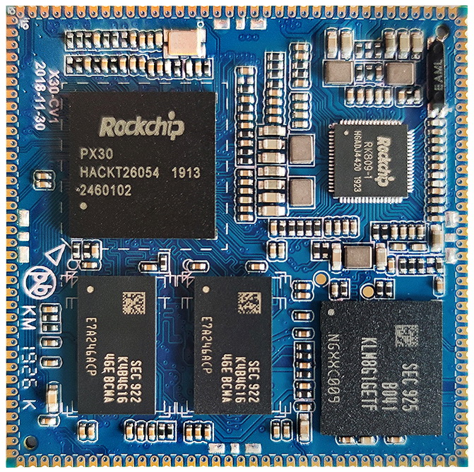
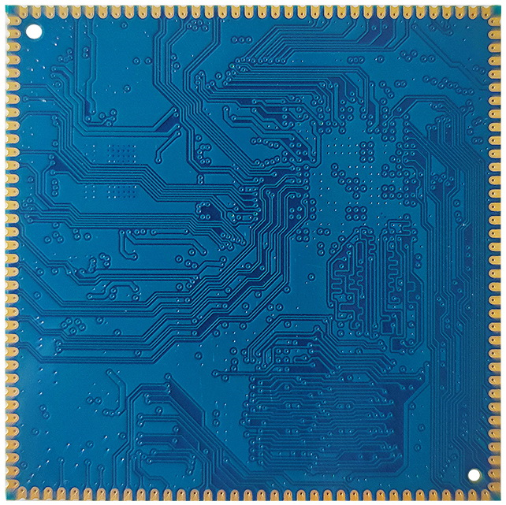
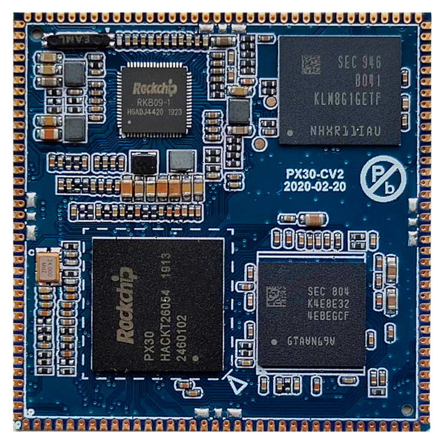
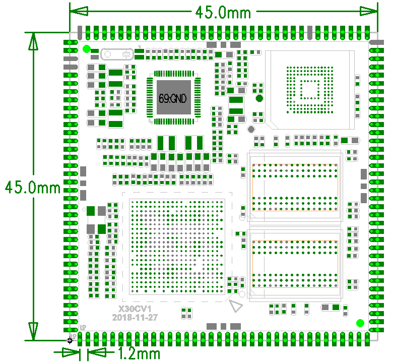

# 尺寸与规格

## X30CV1 核心板外观

## X30CV2 核心板外观

## 核心板结构图

## 结构参数

| 外观 | 邮票孔方式 |
| --- | --- |
| 核心板尺寸 | 45mm*45mm*2.6mm |
| 引脚间距 | 1.2mm |
| 引脚焊盘尺寸 | 2.0mm*0.7mm |
| 引脚数量 | 144PIN |
| 板层 | 8层 |
| 翘曲度 | 小于0.5% |

## 规格汇总

| CPU | PX30 |
| --- | --- |
| 主频 | 四核A35 1.3GHz |
| 内存 | X30CV1使用DDR3，X30CV2使用LPDDR3 |
| 存储器 | 4GB/8GB/16GB eMMC可选，标配8GB |
| 电源IC | 使用RT809，支持动态调频等 |
| 接口参数 |  |
| LCD接口 | 支持MIPI、LVDS、RGB接口 |
| Touch接口 | 电容触摸，可使用USB或串口扩展电阻触摸 |
| 音频接口 | AC97/IIS接口，支持录放音 |
| SD卡接口 | 1路SDIO输出通道 |
| eMMC接口 | 板载eMMC接口，管脚不另外引出 |
| 以太网接口 | 支持百兆以太网 |
| USB USB HOST2.0接口 | 3路USB HOST2.0 |
| UART接口 | 6路串口，支持带流控串口 |
| PWM接口 | 8路PWM输出 |
| I2C接口 | 4路I2C输出 |
| SPI接口 | 2路SPI输出 |
| ADC接口 | 3路ADC输出 |
| Camera接口 | 1路CSI输入 |

| 5V电源输入 | 5V/1A |
| --- | --- |
| RTC输入电压 | 5V/30uA |
| 输出电压 | 1.8V、3V、3.3V、5V |
| 工作温度 | -20~80度 |
| 储存温度 | -10~50度 |

