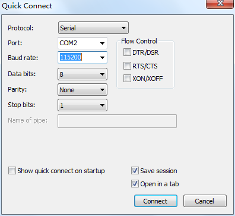
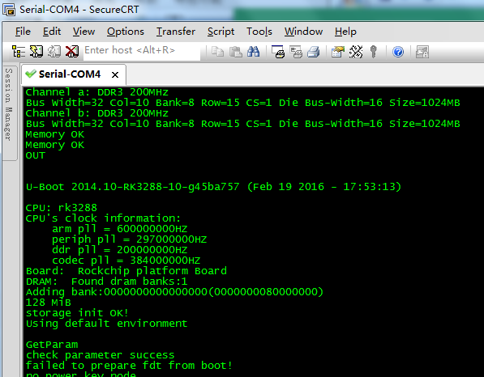

# 开发环境

本页整理 X3128 Android 开发所需的基础环境和常用工具。原手册以 Ubuntu 14.04 64 位系统为例，建议源码编译使用实体 Linux 主机，不建议使用虚拟机。

## Ubuntu 开发环境

常用工具安装：

```bash
sudo apt-get update
sudo apt-get install meld
sudo apt-get install minicom
sudo apt-get install picocom
```

## minicom 串口配置

使用 USB 转串口时，常见设备节点为 `/dev/ttyUSB0`。配置 minicom：

```bash
sudo minicom -s
```

常用串口参数：

```text
Serial device: /dev/ttyUSB0
Baud rate: 115200
Data bits: 8
Parity: None
Stop bits: 1
Hardware flow control: No
Software flow control: No
```

查看 USB 转串口驱动是否加载：

```bash
lsmod | grep pl2303
dmesg | tail -f
```

## picocom 串口调试

picocom 比 minicom 更轻量，适合直接查看串口日志：

```bash
sudo picocom -b 115200 /dev/ttyUSB0
```

## ADB 工具

Windows 下可将 `adb.exe`、`AdbWinApi.dll`、`AdbWinUsbApi.dll`、`fastboot.exe` 放到系统路径中。开发板进入 Android 后，打开 USB debugging，再执行：

```bat
adb devices
adb shell
```

如果提示 `more than one device and emulator`，可结束 `adb.exe` 进程后重新执行 ADB 命令。

## 串口工具 SecureCRT

SecureCRT 使用 Serial 协议连接，波特率设置为 115200，数据位 8，停止位 1，无校验，右侧三个流控选项不要勾选。



连接调试串口后，可查看 U-Boot 和 Android 启动日志。


