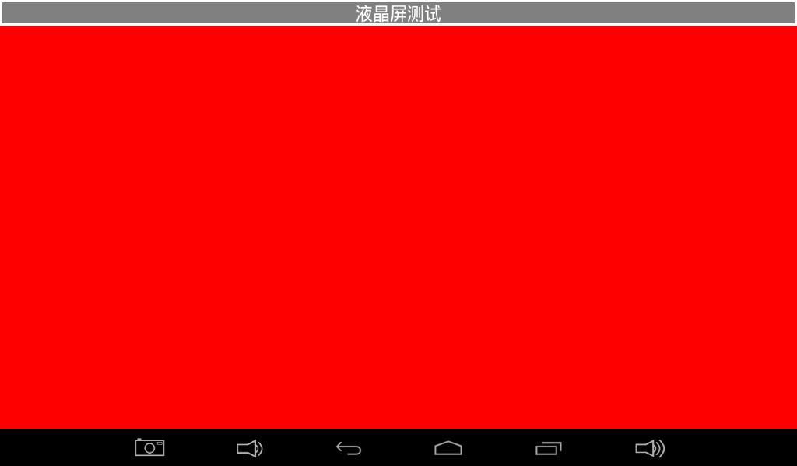
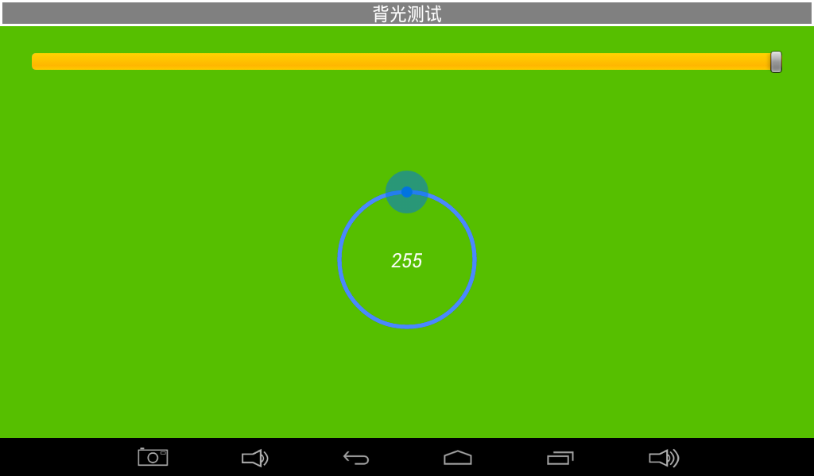
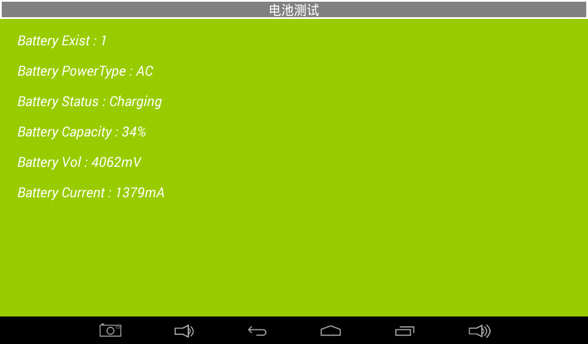
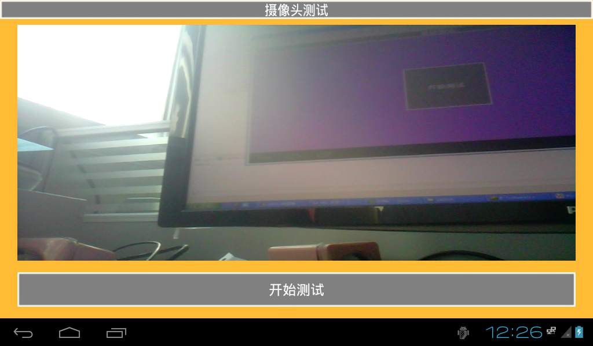

# 测试程序

X3128 Android 系统内置测试程序，可用于生产测试和硬件功能验证。在 APP 界面点击“Android 测试”进入测试界面，使用触摸屏左右滑动或鼠标滑动可切换测试项。

## 液晶屏测试

点击屏幕中间任意纯色区域，可切换不同颜色，用于观察 LCD 是否存在丢色、坏点等问题。

## 触摸屏测试

点击“开始测试”后，可在屏幕上任意手写。量产测试时通常通过画对角线验证触摸电路是否正常。

## LED 测试

点击界面中的灯图标，为红色时对应开发板 LED 点亮，为灰色时对应 LED 熄灭。

## 蜂鸣器、背光和按键测试

- 蜂鸣器测试：按住开始测试键蜂鸣器鸣叫，松开后停止。
- 背光测试：拖动滑块或圆圈调节背光亮度。
- 按键测试：按下或抬起开发板上的独立按键，界面显示对应状态。

## 电池、ADC 和 G-sensor 测试

- 电池测试：显示开发板连接电池后的电量信息。
- ADC 测试：监测四路 ADC 电压。
- G-sensor 测试：旋转开发板时，X、Y、Z 轴数值随之变化。

## 音频和摄像头测试

- 音频测试：点击开始测试，可听到测试音。
- 摄像头测试：安装摄像头后点击开始测试，可显示摄像头预览画面。

## 网络和串口测试

- 无线网络测试：Wi-Fi 连接后，测试界面会搜索并列出附近网络。
- 网络连接测试：有线或无线网络正常连接时，可在测试界面浏览网页。
- 串口测试：将待测串口 TXD 和 RXD 对接后，可验证串口收发功能。

