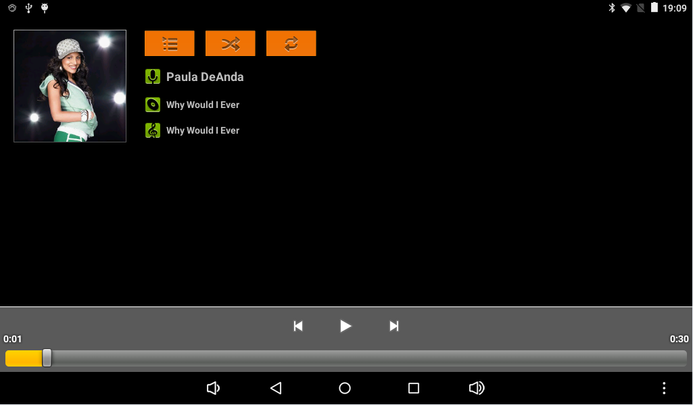
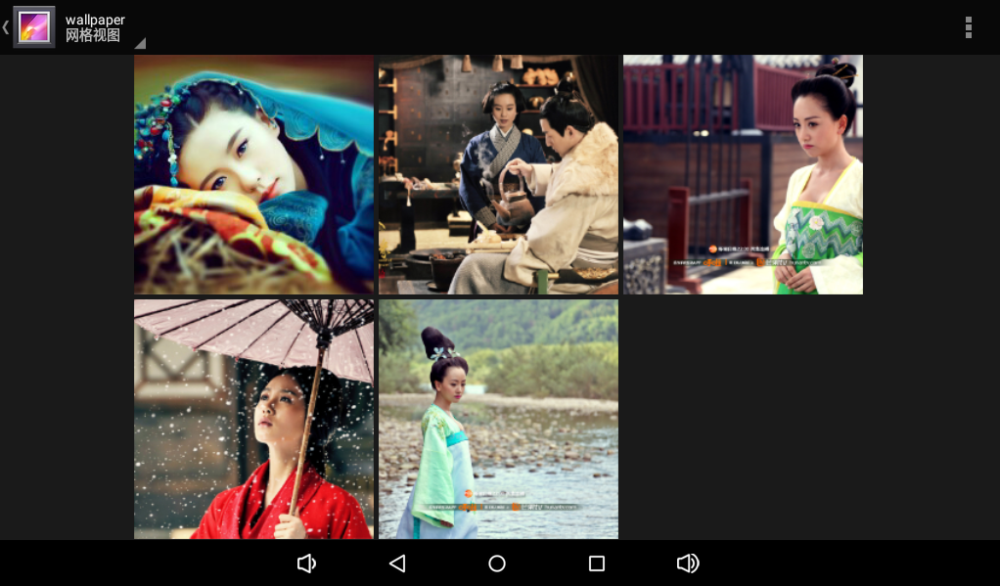
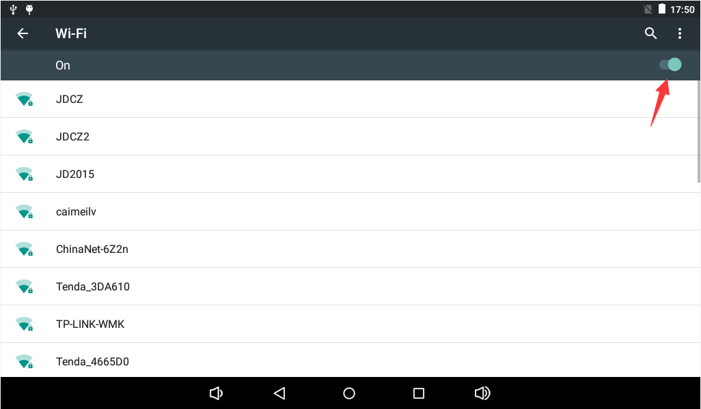
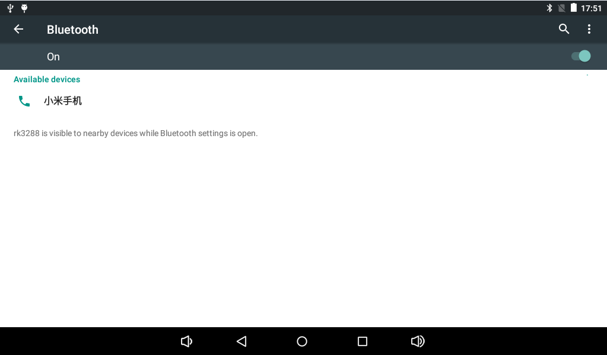
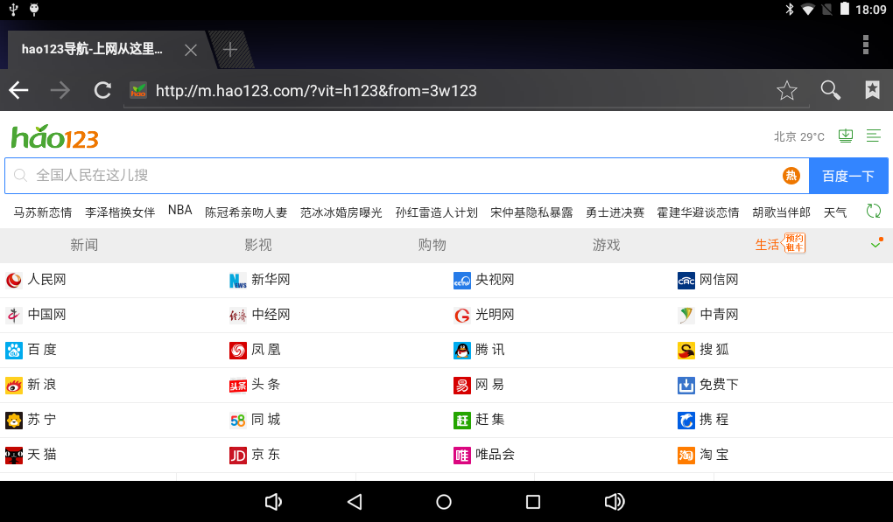
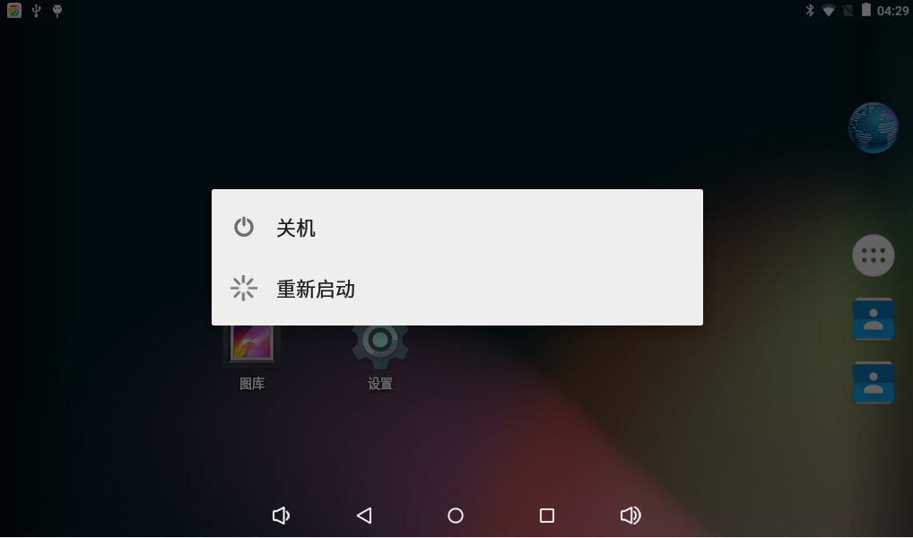

# Android 使用指南

## 命令终端

将串口连接到开发板调试串口，进入 Android 系统后，可通过串口查看 Android 终端和系统日志。

## 播放音频和视频

将 MP3 或视频文件放入外置 SD 卡，系统音乐播放器和图库会自动识别对应文件。视频文件可通过图库播放；对于系统图库不支持的格式，可使用第三方播放器，例如 RockPlayer。





播放视频时，如果属于 RK3128 支持的硬解码格式，可选择硬解模式；如果是 RMVB、RM 等格式，可选择软解模式。


## Wi-Fi 上网

X3128 开发板板载 Wi-Fi / BT 二合一模组。进入设置，打开 Wi-Fi，选择无线网络并输入密码即可连接。




## 蓝牙传输和蓝牙音箱

进入设置中的蓝牙页面，打开蓝牙并搜索设备。配对成功后，可以共享图片等文件，也可以连接蓝牙音箱播放音乐。




## USB 鼠标键盘

将 USB 鼠标或 USB 无线键鼠接到 USB HOST 接口，即可操作 Android 界面。

## TF 卡和 U 盘

系统启动后会自动挂载 TF 卡。插入 U 盘后，系统会将 U 盘挂载到 `/storage` 目录。

```bash
ls /storage
```

## 屏幕旋转

开发板集成重力传感器，旋转开发板时界面会随方向变化。部分应用可能不支持自动旋转。

## 摄像头

点击 Android 相机应用可进入预览模式，点击拍照按钮即可拍照。默认 X3128 开发板支持 30 万像素并口摄像头 GC0308。


## 有线以太网

将可正常上网的网线连接到开发板网口，网口指示灯闪烁后即可使用有线网络。



## HDMI 显示

HDMI 可将 LCD 上的画面输出到带 HDMI 接口的电视或显示器，支持 1080P，兼容 720P、576P、480P。需要注意，RK3128 方案下 HDMI 显示时 LCD 无法同时正常显示。


## 开关机和休眠唤醒

接入 12V 电源后开发板会自动开机。进入系统后长按开机键会弹出关机确认对话框。轻按开机键可熄屏并进入休眠，再次轻按开机键可唤醒。


